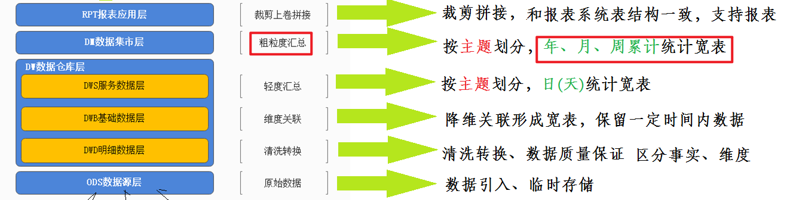
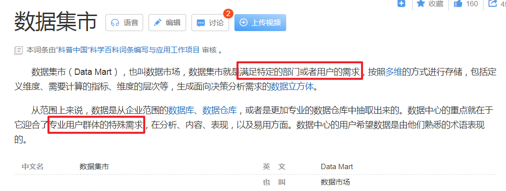
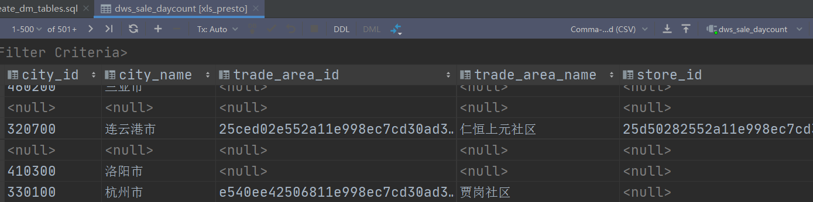
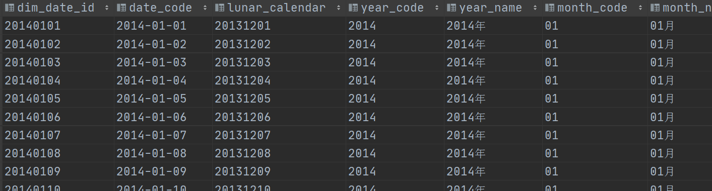
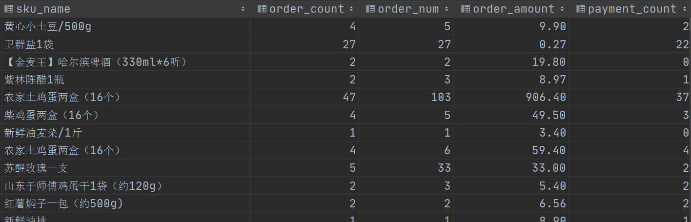
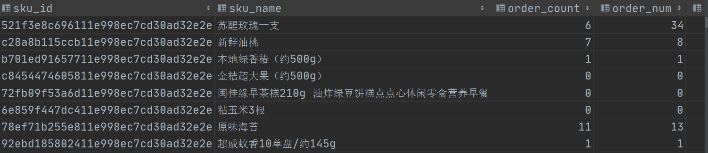
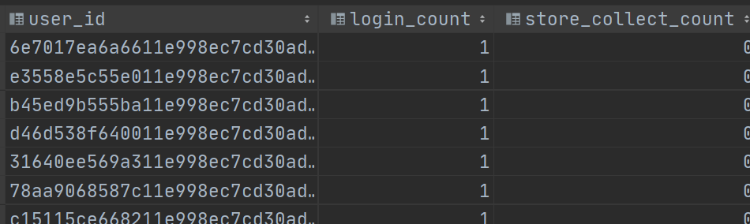
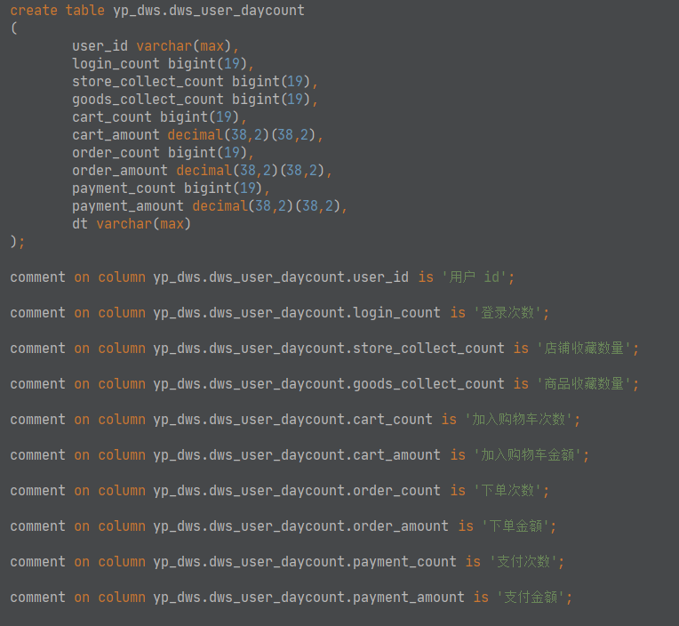

# DM层建设实战

> 数据集市层

---

## 1. 目标与需求

- 新零售数仓分层图

  

- DM

  - 名称：数据集市层 Data Market

  - 功能：基于DWS层日统计宽表，==上卷==出周、月、年等统计宽表，即==粗粒度汇总==。

  - 解释
    - 从理论层面来说，数据集市是一个小型的部门或工作组级别的数据仓库。
    - 一些公司早期的数据集市后期可能会演变成为数仓系统。
    - 本项目中在数据集市层面主要进行粗粒度汇总，也可以将这些功能下放至DWS层完成。抛弃DM.
    
    百科数据集市：https://baike.baidu.com/item/%E6%95%B0%E6%8D%AE%E9%9B%86%E5%B8%82/607135?fr=aladdin
    
    

- 使用DataGrip在Hive中创建dm层

  > 注意，==**对于建库建表操作，需直接使用Hive**==，因为Presto只是一个数据分析的引擎，其语法不一定支持直接在Hive中建库建表。

  ```sql
  create database if not exists yp_dm;
  ```

---

## 2. 销售主题统计宽表

**销售主题上卷细节图解**


### 1. 建模

- 概述

  > DM层销售主题宽表，基于DWS层销售主题日统计宽表的值，**上卷统计出年、月、周的数据**。
  >
  > 指标和DWS一致。

- 指标

  ```properties
  销售收入、平台收入、配送成交额、小程序成交额、安卓APP成交额、苹果APP成交额、PC商城成交额、订单量、参评单量、差评单量、配送单量、退款单量、小程序订单量、安卓APP订单量、苹果APP订单量、PC商城订单量
  ```

- 维度

  ```properties
  日期:天(已经统计过), 周,  月, 年
  日期+城市
  日期+商圈
  日期+店铺
  日期+品牌
  日期+大类
  日期+中类
  日期+小类
  ```

- dm层:在dws的基础上，保持维度和指标不变，计算不同时间粒度的数据，由天变成了，周，月，年

- 建表

  > 整个表和DWS层销售主题统计宽表dws_sale_daycount的区别就在于==多了开头的时间粒度字段==。
  >
  > 用于标识后面的指标是哪个时间粒度统计出来的指标。
  >
  > 建表语句跟dws层的相差无几，就是多了几个标记时间的字段
  
  **图示结构**
  
  
  
  > 在dms层表中，其他字段都保留，维度dt这个时间字段需要改变，因为这个时候的时间已经不能只代表天
  >
  > 了。要代表年月周等，我们从细粒度的天上卷到这个粗粒度的年月周。所以加了很多我们需要的时间维度
  >
  > 来计算不同日期维度组合的指标数据。
  >
  > 
  >
  > 因为dm层的时间维度有很多，所以我们也需要加上一个标记时间维度的字段
  >
  > 
  >
  > 时间粒度多了，我们就要加上时间维度的标记，因为我们把年月周等等的数据放在同一张表中来保存，我
  >
  > 们要拿出每月的销售额，或者每周的销售额等，我们只要通过这个字段过滤一下就能找出来像对应的数据
  >
  > 了
  >
  > 额外加入的字段统计日期来标记这个是你哪天干活产生的数据，也就是这些数据是哪一天干活产生的，例
  >
  > 子，比如说我们在公司上班，现在7号，老板发现5号的报表有问题，这时候你在7号就要，重新去做5号
  >
  > 的活了，统计日期这个时候就派上用场了
  
  
  
  ==dm层建表的格式==
  
  ```properties
  -------------------------------------------------------------------------------
  1. 统计日期 标记这个数据是你哪一天干活产生的
  2. 不同的时间粒度字段
  3. dws层表中原有的维度字段
  4. 分组的标记
  5. 指标
  --------------------------------------------------------------------------------
  ```
  
  
  
  **代码**
  
  -- 为什么起名就只有dm_sale 没有daycount类型的后缀，因为我们把年统计，月统计，周统计等所有时间粒
  
  度的统计都放在一张表中记录，所以这个表直接叫销售维度表即可
  
  ```sql
  CREATE TABLE yp_dm.dm_sale(
     date_time string COMMENT '统计日期,用来标记你哪天干活的',
      
     time_type string COMMENT '统计时间维度：year、month、week、date(就是天day)',
     year_code string COMMENT '年,如2014',
     year_month string COMMENT '年月,如201401',
     month_code string COMMENT '月份,如01', 
     day_month_num string COMMENT '每月第几天', 
     dim_date_id string COMMENT '日期主键,如20140224',
     year_week_name_cn string COMMENT '每年第几周',
     
     group_type string COMMENT '分组类型：store，trade_area，city，brand，min_class，mid_class，max_class，all',
     city_id string COMMENT '城市id',
     city_name string COMMENT '城市name',
     trade_area_id string COMMENT '商圈id',
     trade_area_name string COMMENT '商圈名称',
     store_id string COMMENT '店铺的id',
     store_name string COMMENT '店铺名称',
     brand_id string COMMENT '品牌id',
     brand_name string COMMENT '品牌名称',
     max_class_id string COMMENT '商品大类id',
     max_class_name string COMMENT '大类名称',
     mid_class_id string COMMENT '中类id', 
     mid_class_name string COMMENT '中类名称',
     min_class_id string COMMENT '小类id', 
     min_class_name string COMMENT '小类名称',
     --   =======统计=======
     --   销售收入
     sale_amt DECIMAL(38,2) COMMENT '销售收入',
     --   平台收入
     plat_amt DECIMAL(38,2) COMMENT '平台收入',
     -- 配送成交额
     deliver_sale_amt DECIMAL(38,2) COMMENT '配送成交额',
     -- 小程序成交额
     mini_app_sale_amt DECIMAL(38,2) COMMENT '小程序成交额',
     -- 安卓APP成交额
     android_sale_amt DECIMAL(38,2) COMMENT '安卓APP成交额',
     --  苹果APP成交额
     ios_sale_amt DECIMAL(38,2) COMMENT '苹果APP成交额',
     -- PC商城成交额
     pcweb_sale_amt DECIMAL(38,2) COMMENT 'PC商城成交额',
     -- 成交单量
     order_cnt BIGINT COMMENT '成交单量',
     -- 参评单量
     eva_order_cnt BIGINT COMMENT '参评单量comment=>cmt',
     -- 差评单量
     bad_eva_order_cnt BIGINT COMMENT '差评单量negtive-comment=>ncmt',
     -- 配送成交单量
     deliver_order_cnt BIGINT COMMENT '配送单量',
     -- 退款单量
     refund_order_cnt BIGINT COMMENT '退款单量',
     -- 小程序成交单量
     miniapp_order_cnt BIGINT COMMENT '小程序成交单量',
     -- 安卓APP订单量
     android_order_cnt BIGINT COMMENT '安卓APP订单量',
     -- 苹果APP订单量
     ios_order_cnt BIGINT COMMENT '苹果APP订单量',
     -- PC商城成交单量
     pcweb_order_cnt BIGINT COMMENT 'PC商城成交单量'
  )
  COMMENT '销售主题宽表' 
  ROW format delimited fields terminated BY '\t' 
  stored AS orc tblproperties ('orc.compress' = 'SNAPPY');
  ```

----

### 2. 表关系梳理

- 销售主题各种指标的数据支撑

  - ==**dws_sale_daycount**==

  - 在我们的sale_daycount表中只有一个字段dt，代表着具体的天，那么我们怎么知道这一天是属于哪一下

    星期，哪一月份，哪一年，那一季度等等呢？ 这时候我们就需要下面的时间维度表了，在使用的时，用

    左连接连接时间维度表，连接字段就是它们两表的天这个字段，之后我们就能够根据天来获取我们所需要

    的时间粒度了

  

- 时间粒度的数据支撑

  - ==**dwd.dim_date  时间维表**==

  > 企业中，时间维表数据是怎么维护的呢?
  >
  > 1、维护频率：一次性生成1年或者多年的时间数据。
  >
  > 2、使用java、Python代码实现数据的生成。
  
  
  
- 关联条件

  ```sql
  yp_dws.dws_sale_daycount dc
      left join yp_dwd.dim_date d on dc.dt = d.date_code
  ```

---

例子示范 根据天  查出这天所属的年份，月份，是这一年的第几周

```sql
select
     dc.dt,
     d.year_code,
     d.month_code,
     d.year_week_code
     -- 在这里因为只要销售日统计表中有时间记录dt字段能连接上的数据
     -- 所以就用左外连接来连接时间维度表
from hive.yp_dws.dws_sale_daycount dc
     left join yp_dwd.dim_date d
on dc.dt=d.date_code
-- 这样我们就根据dc表中的天 和 d表中的天把两张表连接
```

**图示**


### 3. 按年统计

> 在dws层已经统计出天的指标数据了，现在需要在其之上上卷计算出周、月、年的数据。
>
> 这里并不是简单的分组+sum求和即可，需要考虑到分组的类别。

- step1：确定分组字段

  > 年
  >
  > 年+城市
  >
  > 年+商圈
  >
  > 年+店铺
  >
  > 年+品牌
  >
  > 年+大类
  >
  > 年+中类
  >
  > 年+小类
  >
  > （对于销售主题 在DM层  分析的维度不变  时间的粒度改变）
  >
  > 根据哪个时间维度分组，算出来的具体指标就属于那个时间分组，比如说按年加维度分组，算出来的就是
  >
  > 年的指标，按月加维度分组，算出来的就是月的指标，依此类推
  >
  > 
  >
  > 要是我们所计算的指标与之前计算的指标毫无关系的话，那么这就不算上卷，真正的上卷需要我们基于上
  >
  > 一次算出来的指标，再进一步的深入计算，这才叫上卷，比如说我算出了天的指标，我根据天，来计算月，来计算周等等，这都叫上卷
  >
  > 
  >
  > 具体怎么实现？
  >
  > 我们知道这天属于哪一周，把他们分到同一组去，再sum求和计算，算出的就是周的指标
  >
  > 把所属同一个月下的天分到一起计算它的指标就是月的指标
  >
  > 我们知道这天属于哪一月，把他们分到一组去，再进行sum求和计算，算出的就是月的指标

  **为什么不能只根据年来分组，然乎在年内sum求和计算年的指标？**

  

  

  ==意思是这样的==：（这里的日期是天）（原来的销售日统计宽表里面的数据根据8个维度来分组聚合了）

  ​          （这里的全表相当于销售日统计宽表）（实际意义上是这个宽表去左连接时间维度表所得到的全表）

  ​                       全表的数据根据日期分组聚合然后会有一个结果，然后全表的数据根据日期加城市分组聚合会有

  一个结果，然后依此类推会有总共8个维度的分组聚合情况，grouping sets相当于给我们做了一个动作，将这

  些分组的结果集union合并起来，然后里面的单个的日期会有8个重复的（有数据的情况下理论最多的），我

  们再利用日期来分组聚合，把它们所有的指标都加起来得到年的指标，依靠上面是分析这样是十分不可取的，

  因为会有重复数据。所以我们在分组的时候需要增加上根据分组标记来分组，把日期下的同一分组标记 分到

  一组内，再进行聚合操作，那么这样就不会有数据重复的情况发生了

  ==举例代码==

  ```sql
  with tmp as(
  select
      *
  from hive.yp_dws.dws_sale_daycount dc
  left join hive.yp_dwd.dim_date d
  on dc.dt = d.date_code
  group by d.year_code, dc.group_type
      -- 根据年分组后，再根据分组类型分组了，接着我们能取出我们需要的分组进行计算，如下图所示
     
  )
  -- 算出年的指标
  -- 把旧的分组标记中 标记为日的数据取出来
  select * from tmp where group_type='all' -- 接着根据日的指标，计算年的指标这就是一个上卷的过程
  
  -- 依照这样也才只能算出年的指标
  
  ```

  ==图示==

  

  **不加分组标记分组就是一种放大指标的行为**

  只根据年分组的话，每个年里面都会有八个不同的维度分组聚合的结果指标，而我们只需要一个维度分组聚合

  的结果指标进行指标的计算

  

  同一指标在不同维度下都进行计算，然后又把它们再加起来 等价于下面的解释

  不同维度看一个指标的，再把这些维度的指标加起来，这就是放大指标的行为

  我今天有100块钱是一个指标

  我今天在大数据一班有100块钱也是个指标

  但是事实上我只有100块钱，但是算指标的维度变了，总不能说我现在有200块钱了，这是非常错误的

  ```sql
  group by
  grouping sets (
     (d.year_code,dc.group_type), -- 根据年来分组
      (d.year_code,dc.city_id,dc.city_name,dc.group_type),
      (d.year_code, city_id, city_name, trade_area_id, trade_area_name,dc.group_type),
      (d.year_code, city_id, city_name, trade_area_id, trade_area_name, store_id, store_name,dc.group_type),
      (d.year_code, brand_id, brand_name,dc.group_type),
      (d.year_code, max_class_id, max_class_name,dc.group_type),
      (d.year_code, max_class_id, max_class_name,mid_class_id, mid_class_name,dc.group_type),
      (d.year_code, max_class_id, max_class_name,mid_class_id, mid_class_name,min_class_id, min_class_name,dc.group_type)
  )
  ;
  -- 上面是把指标扩大了，还需要增加一个分组标记来分组  已经修改完成
  
  ```

- step2：分组聚合

  ```sql
  -- 统计值
      sum(dc.sale_amt) as sale_amt,
      sum(dc.plat_amt) as plat_amt,
      sum(dc.deliver_sale_amt) as deliver_sale_amt,
      sum(dc.mini_app_sale_amt) as mini_app_sale_amt,
      sum(dc.android_sale_amt) as android_sale_amt,
      sum(dc.ios_sale_amt) as ios_sale_amt,
      sum(dc.pcweb_sale_amt) as pcweb_sale_amt,
      sum(dc.order_cnt) as order_cnt,
      sum(dc.eva_order_cnt) as eva_order_cnt,
      sum(dc.bad_eva_order_cnt) as bad_eva_order_cnt,
      sum(dc.deliver_order_cnt) as deliver_order_cnt,
      sum(dc.refund_order_cnt) as refund_order_cnt,
      sum(dc.miniapp_order_cnt) as miniapp_order_cnt,
      sum(dc.android_order_cnt) as android_order_cnt,
      sum(dc.ios_order_cnt) as ios_order_cnt,
      sum(dc.pcweb_order_cnt) as pcweb_order_cnt
  ```

- step3：返回字段细节处理

  ```sql
      --统计日期，不是分组的日期 所谓统计就是记录你哪天干的这个活
      '2022-01-11' date_time,
      'year' time_type,
       year_code,
  --     year_month,
  --     month_code,
  --     day_month_num,
  --     dim_date_id,
  --     year_week_name_cn,
        group_type group_type_old,
      -- 产品维度类型：store，trade_area，city，brand，min_class，mid_class，max_class，all
     CASE WHEN grouping(dc.city_id, dc.trade_area_id, dc.store_id)=0
           THEN 'store'
           WHEN grouping(dc.city_id, dc.trade_area_id)=0
           THEN 'trade_area'
           WHEN grouping(dc.city_id)=0
           THEN 'city'
           WHEN grouping(dc.brand_id)=0
           THEN 'brand'
           WHEN grouping(dc.max_class_id, dc.mid_class_id, dc.min_class_id)=0
           THEN 'min_class'
           WHEN grouping(dc.max_class_id, dc.mid_class_id)=0
           THEN 'mid_class'
           WHEN grouping(dc.max_class_id)=0
           THEN 'max_class'
           WHEN grouping(d.year_code)=0
           THEN 'all'
           ELSE 'others'
           END as group_type_new,
  ```

  

- 判断新的分组指标后，如何将天的数据筛选出来进行累加求年的指标？

```properties
原本dws_sale_daycount表里面的数据是8种维度分组聚合union起来的结果集，每条数据后面都有旧的分组标记来标记 

它是哪种维度的分组聚合产生的结果，但是现在我们时间维度从天变到了年，这时候我们再去对分组标记的这个字段进行判

断,是对全表的数据进行根据年+维度的分组聚合，会产生新的分组聚合结果，就会出现上面的情况，新的分组标记里面出

现了原有的8个旧的分组标记，这是不对的，因为计算单纯年的指标数据，要把旧分组标记中天的分组聚合指标结果累加起

来才是年的指标数据  要计算年+维度的指标数据，那么就要把旧分组中日+维度的分组聚合指标结果累加在一起，这才是

年+维度的指标结果,经过上面的分析我们发现只要把旧的分组标记与新的分组标记相等，那么就能筛选出我们需要的各个

的日+维度的分组聚合结果，在此基础上累加指标数据，那么就得到了年+维度的指标数据
```

因为之前dws_sale_count表的数据是8个维度的数据组合在一起，所以不能直接分组求和算指标，因为数据里面只

有一个维度的数据是我们，现在计算的一个维度组合需要的数据。

==测试筛选所需分组数据代码==

```sql
with temp as (
select
       -- 旧分组标记
       group_type,

       -- 新的分组标记利用case when的特性进行操作，从小范围往大范围判断
       CASE WHEN grouping(dc.store_id)=0
         THEN 'store'
         WHEN grouping(dc.trade_area_id)=0
         THEN 'trade_area'
         WHEN grouping(dc.city_id)=0
         THEN 'city'
         WHEN grouping(dc.brand_id)=0
         THEN 'brand'
         WHEN grouping(dc.min_class_id)=0
         THEN 'min_class'
         WHEN grouping(dc.mid_class_id)=0
         THEN 'mid_class'
         WHEN grouping(dc.max_class_id)=0
         THEN 'max_class'
         WHEN grouping(d.year_code)=0
         THEN 'all' -- todo all这里表示是根据年分组的 就是年
         ELSE 'others'
         END as group_type_new

from hive.yp_dws.dws_sale_daycount dc
left join hive.yp_dwd.dim_date d
on dc.dt = d.date_code
group by
grouping sets (

   (d.year_code,dc.group_type), -- 根据年来分组
    (d.year_code,dc.city_id,dc.city_name,dc.group_type),
    (d.year_code, city_id, city_name, trade_area_id, trade_area_name,dc.group_type),
    (d.year_code, city_id, city_name, trade_area_id, trade_area_name, store_id, store_name,dc.group_type),
    (d.year_code, brand_id, brand_name,dc.group_type),
    (d.year_code, max_class_id, max_class_name,dc.group_type),
    (d.year_code, max_class_id, max_class_name,mid_class_id, mid_class_name,dc.group_type),
    (d.year_code, max_class_id, max_class_name,mid_class_id, mid_class_name,min_class_id, min_class_name,dc.group_type)
)
 )
 select * from temp where group_type=group_type_new;

```

==代码运行结果图示==


- step4：最终完整sql

  ```sql
  with temp as (
  select
  -- step3 查询返回的字段要与目标表dm的字段一致
        -- 日期维度标记 用来标记干活时间的
        --统计日期，不是分组的日期 所谓统计就是记录你哪天干的这个活
         '2022-10-09' date_time,
  
         -- 时间维度字段
         -- 时间粒度标记就不要写死，使用CASE WHEN 对字段进行判断
   case 
   when grouping(d.year_code, d.month_code, d.day_month_num, d.dim_date_id) = 0
        then 'date'
   when grouping(dt1.year_code, d.year_week_name_cn) = 0
        then 'week'
   when grouping(d.year_code, d.month_code, d.year_month) = 0
        then 'month'
   when grouping(dt1.year_code) = 0
        then 'year'
   end as time_type, -- 时间粒度标记
         
         d.year_code,
         d.year_month,
         d.month_code,
         d.day_month_num,
         d.dim_date_id,
         d.year_week_name_cn,
  
         group_type ,
  
         -- 新的分组标记利用case when的特性进行操作，从小范围往大范围判断
         CASE WHEN grouping(dc.store_id)=0
           THEN 'store'
           WHEN grouping(dc.trade_area_id)=0
           THEN 'trade_area'
           WHEN grouping(dc.city_id)=0
           THEN 'city'
           WHEN grouping(dc.brand_id)=0
           THEN 'brand'
           WHEN grouping(dc.min_class_id)=0
           THEN 'min_class'
           WHEN grouping(dc.mid_class_id)=0
           THEN 'mid_class'
           WHEN grouping(dc.max_class_id)=0
           THEN 'max_class'
           WHEN grouping(d.year_code)=0
           THEN 'all' -- todo all这里表示是根据年分组的 就是年
           ELSE 'others'
           END as group_type_new,
  
  --        -- 维度字段保持不变
         city_id,
         city_name,
         trade_area_id,
         trade_area_name,
         store_id,
         store_name,
         brand_id,
         brand_name,
         max_class_id,
         max_class_name,
         mid_class_id,
         mid_class_name,
         min_class_id,
         min_class_name,
  
  --        -- 指标字段
        sum(dc.sale_amt) as sale_amt,
        sum(dc.plat_amt) as plat_amt,
        sum(dc.deliver_sale_amt) as deliver_sale_amt,
        sum(dc.mini_app_sale_amt) as mini_app_sale_amt,
        sum(dc.android_sale_amt) as android_sale_amt,
        sum(dc.ios_sale_amt) as ios_sale_amt,
        sum(dc.pcweb_sale_amt) as pcweb_sale_amt,
  
        sum(dc.order_cnt) as order_cnt,
        sum(dc.eva_order_cnt) as eva_order_cnt,
        sum(dc.bad_eva_order_cnt) as bad_eva_order_cnt,
        sum(dc.deliver_order_cnt) as deliver_order_cnt,
        sum(dc.refund_order_cnt) as refund_order_cnt,
        sum(dc.miniapp_order_cnt) as miniapp_order_cnt,
        sum(dc.android_order_cnt) as android_order_cnt,
        sum(dc.ios_order_cnt) as ios_order_cnt,
        sum(dc.pcweb_order_cnt) as pcweb_order_cnt
  from hive.yp_dws.dws_sale_daycount dc
  left join hive.yp_dwd.dim_date d
  on dc.dt = d.date_code
  group by
  grouping sets (
  
     (d.year_code,dc.group_type), -- 根据年来分组
      (d.year_code,dc.city_id,dc.city_name,dc.group_type),
      (d.year_code, city_id, city_name, trade_area_id, trade_area_name,dc.group_type),
      (d.year_code, city_id, city_name, trade_area_id, trade_area_name, store_id, store_name,dc.group_type),
      (d.year_code, brand_id, brand_name,dc.group_type),
      (d.year_code, max_class_id, max_class_name,dc.group_type),
      (d.year_code, max_class_id, max_class_name,mid_class_id, mid_class_name,dc.group_type),
      (d.year_code, max_class_id, max_class_name,mid_class_id, mid_class_name,min_class_id, min_class_name,dc.group_type)
  )
   )
   select * from temp where group_type=group_type_new;
   
   -- 如果需要计算月的指标 就把year_code换成year_month_code就行
  
  ```

-----

```sql
--DM层销售主题的上卷操作
    --基于dws的日统计  上卷出周  月 年指标

--step1: 表关系梳理
    --dws 销售日统计表
    --dwd 时间维度表   通常由数仓平台统一集中维护
        --todo 如果公司没有提供时间维度表  如何基于年月日数据  计算出所属年月周季度等。

--step2: 基于关联的数据  分组计算出年月周的指标
    --课堂以年为例进行上卷  周月的操作一样
        --年
        --年+城市
        --年+商圈
        --年+店铺
        --年+品牌
        --年+大类
        --年+中类
        --年+小类

--为了大脑不紊乱  先一个维度卷起来 后面再使用grouping sets一起卷
    --  年
select
    *
from hive.yp_dws.dws_sale_daycount dc
left join hive.yp_dwd.dim_date d
on dc.dt = d.date_code
group by d.year_code,dc.group_type; --TODO 思考 这里仅根据年分组 结果是否正确？

with tmp as (select
*
from hive.yp_dws.dws_sale_daycount dc
left join hive.yp_dwd.dim_date d
on dc.dt = d.date_code
group by d.year_code,dc.group_type)
select * from tmp where group_type ='all'; --只把day的取出来 上卷 就是这一年的

---------------
--上述只是实现了每年的各个指标上卷操作  其他还有7个维度上卷操作
--基于分析发现 这几个维度都是基于同一份数据的上卷  因此可以使用增强聚合grouping sets
        --年                 all
        --年+城市   日+城市    city
        --年+商圈             trade_area
        --年+店铺             store
        --年+品牌             brand
        --年+大类             max_class
        --年+中类             mid_class
        --年+小类             min_class

with tmp as (select
    --step3 查询返回的字段  和dm目标表一致
    '2022-10-07' as date_time, --统计干活日期

    'year' as time_type,  --时间粒度标记

    d.year_code,
    null as year_month,
    null as month_code,
    null as day_month_num,
    null as dim_date_id,
    null as year_week_name_cn,
    group_type as group_type_old,

    --新的分组标记
    case when grouping(store_id) =0
              then 'store'
              when grouping(trade_area_id) =0
              then 'trade_area'
              when grouping(city_id) =0
              then 'city'
              when grouping(brand_id) =0
              then 'brand'
              when grouping(min_class_id)= 0
              then 'min_class'
              when grouping(mid_class_id)= 0
              then 'mid_class'
              when grouping(max_class_id)= 0
              then 'max_class'
              when grouping(d.year_code)= 0
              then 'all'  --todo  all代表的就是不同粒度的日期
              else 'others' end as group_type_new,
    --维度字段
    city_id,
    city_name,
    trade_area_id,
    trade_area_name,
    store_id,
    store_name,
    brand_id,
    brand_name,
    max_class_id,
    max_class_name,
    mid_class_id,
    mid_class_name,
    min_class_id,
    min_class_name,

    --指标字段
    sum(sale_amt),
    sum(plat_amt),
    sum(deliver_sale_amt),
    sum(mini_app_sale_amt),
    sum(android_sale_amt),
    sum(ios_sale_amt),
    sum(pcweb_sale_amt),
    sum(order_cnt),
    sum(eva_order_cnt),
    sum(bad_eva_order_cnt),
    sum(deliver_order_cnt),
    sum(refund_order_cnt),
    sum(miniapp_order_cnt),
    sum(android_order_cnt),
    sum(ios_order_cnt),
    sum(pcweb_order_cnt)
from hive.yp_dws.dws_sale_daycount dc
left join hive.yp_dwd.dim_date d
on dc.dt = d.date_code
group by grouping sets (

    --年上卷
    (d.year_code, dc.group_type), --年
    (d.year_code, city_id, city_name,dc.group_type), --年+城市
    (d.year_code, city_id, city_name, trade_area_id, trade_area_name,dc.group_type), --年+商圈
    (d.year_code, city_id, city_name, trade_area_id, trade_area_name, store_id, store_name,dc.group_type), --年+店铺
    (d.year_code, brand_id, brand_name,dc.group_type), --年+品牌
    (d.year_code, max_class_id, max_class_name,dc.group_type), --年+大类
    (d.year_code, max_class_id, max_class_name,mid_class_id, mid_class_name,dc.group_type), --年+中类
    (d.year_code, max_class_id, max_class_name,mid_class_id, mid_class_name,min_class_id, min_class_name,dc.group_type)), --年+小类

    --月上卷
    (d.month_code, dc.group_type), --月
    (d.month_code, city_id, city_name,dc.group_type), --月+城市
    (d.month_code, city_id, city_name, trade_area_id, trade_area_name,dc.group_type), --月+商圈
    (d.month_code, city_id, city_name, trade_area_id, trade_area_name, store_id, store_name,dc.group_type), --月+店铺
    (d.month_code, brand_id, brand_name,dc.group_type), --月+品牌
    (d.month_code, max_class_id, max_class_name,dc.group_type), --月+大类
    (d.month_code, max_class_id, max_class_name,mid_class_id, mid_class_name,dc.group_type), --月+中类
    (d.month_code, max_class_id, max_class_name,mid_class_id, mid_class_name,min_class_id, min_class_name,dc.group_type),--月+小类

    --周上卷
    (d.year_week_code, dc.group_type), --周
    (d.year_week_code, city_id, city_name,dc.group_type), --周+城市
    (d.year_week_code, city_id, city_name, trade_area_id, trade_area_name,dc.group_type), --周+商圈
    (d.year_week_code, city_id, city_name, trade_area_id, trade_area_name, store_id, store_name,dc.group_type), --周+店铺
    (d.year_week_code, brand_id, brand_name,dc.group_type), --周+品牌
    (d.year_week_code, max_class_id, max_class_name,dc.group_type), --周+大类
    (d.year_week_code, max_class_id, max_class_name,mid_class_id, mid_class_name,dc.group_type), --周+中类
    (d.year_week_code, max_class_id, max_class_name,mid_class_id, mid_class_name,min_class_id, min_class_name,dc.group_type)--周+小类
    )
select * from tmp where group_type_old=group_type_new;
```


### 4. 最终合并完整实现

- 下面的代码有错

- step0：针对时间维表数据进行查询  CTE引导为临时结果集

  > 原因是：并不是时间维表中的每一个字段在本次查询的时候都有用。

  ```sql
  -- 获取日期数据（周、月的环比/同比日期）
  with dt1 as (
    select
     dim_date_id, date_code
      ,date_id_mom -- 与本月环比的上月日期
      ,date_id_mym -- 与本月同比的上年日期
      ,year_code
      ,month_code
      ,year_month     --年月
      ,day_month_num --几号
      ,week_day_code --周几
      ,year_week_name_cn  --年周
  from yp_dwd.dim_date
  )
  ```

- step1：编写grouping sets

  > 提示：在==grouping sets中养成不管分组字段是一个还是多个，都使用小括号括起来的习惯==。
  >
  > 因为grouping sets认为只要是小括号，就是一个分组条件。

  ```sql
  from yp_dws.dws_sale_daycount dc
     left join dt1 on dc.dt = dt1.date_code
  group by
  -- 这后面都少了group_type一起进行分组
  grouping sets (
  -- 年
     (dt1.year_code),
     (dt1.year_code, city_id, city_name),
     (dt1.year_code, city_id, city_name, trade_area_id, trade_area_name),
     (dt1.year_code, city_id, city_name, trade_area_id, trade_area_name, store_id, store_name),
      (dt1.year_code, brand_id, brand_name),
      (dt1.year_code, max_class_id, max_class_name),
      (dt1.year_code, max_class_id, max_class_name,mid_class_id, mid_class_name),
      (dt1.year_code, max_class_id, max_class_name,mid_class_id, mid_class_name,min_class_id, min_class_name),
      
  --  月
     (dt1.year_code, dt1.month_code, dt1.year_month),
     (dt1.year_code, dt1.month_code, dt1.year_month, city_id, city_name),
     (dt1.year_code, dt1.month_code, dt1.year_month, city_id, city_name, trade_area_id, trade_area_name),
     (dt1.year_code, dt1.month_code, dt1.year_month, city_id, city_name, trade_area_id, trade_area_name, store_id, store_name),
      (dt1.year_code, dt1.month_code, dt1.year_month, brand_id, brand_name),
      (dt1.year_code, dt1.month_code, dt1.year_month, max_class_id, max_class_name),
      (dt1.year_code, dt1.month_code, dt1.year_month, max_class_id, max_class_name,mid_class_id, mid_class_name),
      (dt1.year_code, dt1.month_code, dt1.year_month, max_class_id, max_class_name,mid_class_id, mid_class_name,min_class_id, min_class_name),
      
  -- 日
     (dt1.year_code, dt1.month_code, dt1.day_month_num, dt1.dim_date_id),
     (dt1.year_code, dt1.month_code, dt1.day_month_num, dt1.dim_date_id, city_id, city_name),
     (dt1.year_code, dt1.month_code, dt1.day_month_num, dt1.dim_date_id, city_id, city_name, trade_area_id, trade_area_name),
     (dt1.year_code, dt1.month_code, dt1.day_month_num, dt1.dim_date_id, city_id, city_name, trade_area_id, trade_area_name, store_id, store_name),
      (dt1.year_code, dt1.month_code, dt1.day_month_num, dt1.dim_date_id, brand_id, brand_name),
      (dt1.year_code, dt1.month_code, dt1.day_month_num, dt1.dim_date_id, max_class_id, max_class_name),
      (dt1.year_code, dt1.month_code, dt1.day_month_num, dt1.dim_date_id, max_class_id, max_class_name,mid_class_id, mid_class_name),
      (dt1.year_code, dt1.month_code, dt1.day_month_num, dt1.dim_date_id, max_class_id, max_class_name,mid_class_id, mid_class_name,min_class_id, min_class_name),
  
  --  周
     (dt1.year_code, dt1.year_week_name_cn),
     (dt1.year_code, dt1.year_week_name_cn, city_id, city_name),
     (dt1.year_code, dt1.year_week_name_cn, city_id, city_name, trade_area_id, trade_area_name),
     (dt1.year_code, dt1.year_week_name_cn, city_id, city_name, trade_area_id, trade_area_name, store_id, store_name),
      (dt1.year_code, dt1.year_week_name_cn, brand_id, brand_name),
      (dt1.year_code, dt1.year_week_name_cn, max_class_id, max_class_name),
      (dt1.year_code, dt1.year_week_name_cn, max_class_id, max_class_name,mid_class_id, mid_class_name),
      (dt1.year_code, dt1.year_week_name_cn, max_class_id, max_class_name,mid_class_id, mid_class_name,min_class_id, min_class_name)
  )
  ;
  ```

- step2：查询返回维度字段的处理

  > 对照目标表，一个一个处理。

  ```sql
  -- 统计日期 你哪天干活的
     '2022-01-11' as date_time,
  -- 时间维度 year、month、date
  case 
   when grouping(dt1.year_code, dt1.month_code, dt1.day_month_num, dt1.dim_date_id) = 0
        then 'date'
   when grouping(dt1.year_code, dt1.year_week_name_cn) = 0
        then 'week'
   when grouping(dt1.year_code, dt1.month_code, dt1.year_month) = 0
        then 'month'
   when grouping(dt1.year_code) = 0
        then 'year'
   end as time_type,
     dt1.year_code,
     dt1.year_month,
     dt1.month_code,
     dt1.day_month_num, --几号
     dt1.dim_date_id,
      dt1.year_week_name_cn,  --第几周
  -- 产品维度类型：store，trade_area，city，brand，min_class，mid_class，max_class，all
     CASE WHEN grouping(dc.city_id, dc.trade_area_id, dc.store_id)=0
           THEN 'store'
           WHEN grouping(dc.city_id, dc.trade_area_id, dc.store_id)=1
           THEN 'trade_area'
           WHEN grouping(dc.city_id, dc.trade_area_id, dc.store_id)=3
           THEN 'city'
           WHEN grouping(dc.brand_id)=0
           THEN 'brand'
           WHEN grouping(dc.max_class_id, dc.mid_class_id, dc.min_class_id)=0
           THEN 'min_class'
           WHEN grouping(dc.max_class_id, dc.mid_class_id)=0
           THEN 'mid_class'
           WHEN grouping(dc.max_class_id)=0
           THEN 'max_class'
           ELSE 'all'
           END as group_type,
     dc.city_id,
     dc.city_name,
     dc.trade_area_id,
     dc.trade_area_name,
     dc.store_id,
     dc.store_name,
     dc.brand_id,
     dc.brand_name,
     dc.max_class_id,
     dc.max_class_name,
     dc.mid_class_id,
     dc.mid_class_name,
     dc.min_class_id,
     dc.min_class_name,
  ```
  
- step3：指标的聚合

  ```sql
  -- 统计值
     sum(dc.sale_amt) as sale_amt,
     sum(dc.plat_amt) as plat_amt,
     sum(dc.deliver_sale_amt) as deliver_sale_amt,
     sum(dc.mini_app_sale_amt) as mini_app_sale_amt,
     sum(dc.android_sale_amt) as android_sale_amt,
     sum(dc.ios_sale_amt) as ios_sale_amt,
     sum(dc.pcweb_sale_amt) as pcweb_sale_amt,
     sum(dc.order_cnt) as order_cnt,
     sum(dc.eva_order_cnt) as eva_order_cnt,
     sum(dc.bad_eva_order_cnt) as bad_eva_order_cnt,
     sum(dc.deliver_order_cnt) as deliver_order_cnt,
     sum(dc.refund_order_cnt) as refund_order_cnt,
     sum(dc.miniapp_order_cnt) as miniapp_order_cnt,
     sum(dc.android_order_cnt) as android_order_cnt,
     sum(dc.ios_order_cnt) as ios_order_cnt,
     sum(dc.pcweb_order_cnt) as pcweb_order_cnt
  ```

- 最终完整版sql

  ```sql
  insert into yp_dm.dm_sale
  -- 获取日期数据（周、月的环比/同比日期）
  with dt1 as (
    select
     dim_date_id, date_code
      ,date_id_mom -- 与本月环比的上月日期
      ,date_id_mym -- 与本月同比的上年日期
      ,year_code
      ,month_code
      ,year_month     --年月
      ,day_month_num --几号
      ,week_day_code --周几
      ,year_week_name_cn  --年周
  from yp_dwd.dim_date
  )
  -- 上面的意思是从时间维度表中，取出我们所需要的字段，作为一个临时的结果集，用它去进行表join
  -- 这样会加快代码的运行时间，避免了数据得到冗余
  select
  -- 统计日期
     '2022-01-11' as date_time,
  -- 时间维度      year、month、date
     case when grouping(dt1.year_code, dt1.month_code, dt1.day_month_num, dt1.dim_date_id) = 0
        then 'date'
         when grouping(dt1.year_code, dt1.year_week_name_cn) = 0
        then 'week'
        when grouping(dt1.year_code, dt1.month_code, dt1.year_month) = 0
        then 'month'
        when grouping(dt1.year_code) = 0
        then 'year'
     end
     as time_type,
     dt1.year_code,
     dt1.year_month,
     dt1.month_code,
     dt1.day_month_num, --几号
     dt1.dim_date_id,
      dt1.year_week_name_cn,  --第几周
  -- 产品维度类型：store，trade_area，city，brand，min_class，mid_class，max_class，all
     CASE WHEN grouping(dc.city_id, dc.trade_area_id, dc.store_id)=0
           THEN 'store'
           WHEN grouping(dc.city_id, dc.trade_area_id)=0
           THEN 'trade_area'
           WHEN grouping(dc.city_id)=0
           THEN 'city'
           WHEN grouping(dc.brand_id)=0
           THEN 'brand'
           WHEN grouping(dc.max_class_id, dc.mid_class_id, dc.min_class_id)=0
           THEN 'min_class'
           WHEN grouping(dc.max_class_id, dc.mid_class_id)=0
           THEN 'mid_class'
           WHEN grouping(dc.max_class_id)=0
           THEN 'max_class'
           ELSE 'all'
           END as group_type,
     dc.city_id,
     dc.city_name,
     dc.trade_area_id,
     dc.trade_area_name,
     dc.store_id,
     dc.store_name,
     dc.brand_id,
     dc.brand_name,
     dc.max_class_id,
     dc.max_class_name,
     dc.mid_class_id,
     dc.mid_class_name,
     dc.min_class_id,
     dc.min_class_name,
  -- 统计值
      sum(dc.sale_amt) as sale_amt,
     sum(dc.plat_amt) as plat_amt,
     sum(dc.deliver_sale_amt) as deliver_sale_amt,
     sum(dc.mini_app_sale_amt) as mini_app_sale_amt,
     sum(dc.android_sale_amt) as android_sale_amt,
     sum(dc.ios_sale_amt) as ios_sale_amt,
     sum(dc.pcweb_sale_amt) as pcweb_sale_amt,
  
     sum(dc.order_cnt) as order_cnt,
     sum(dc.eva_order_cnt) as eva_order_cnt,
     sum(dc.bad_eva_order_cnt) as bad_eva_order_cnt,
     sum(dc.deliver_order_cnt) as deliver_order_cnt,
     sum(dc.refund_order_cnt) as refund_order_cnt,
     sum(dc.miniapp_order_cnt) as miniapp_order_cnt,
     sum(dc.android_order_cnt) as android_order_cnt,
     sum(dc.ios_order_cnt) as ios_order_cnt,
     sum(dc.pcweb_order_cnt) as pcweb_order_cnt
  from yp_dws.dws_sale_daycount dc
     left join dt1 on dc.dt = dt1.date_code
  group by
  grouping sets (
  -- 年，注意养成加小括号的习惯
      -- 后面都少了分组标记的分组
     (dt1.year_code),
     (dt1.year_code, city_id, city_name),
     (dt1.year_code, city_id, city_name, trade_area_id, trade_area_name),
     (dt1.year_code, city_id, city_name, trade_area_id, trade_area_name, store_id, store_name),
      (dt1.year_code, brand_id, brand_name),
      (dt1.year_code, max_class_id, max_class_name),
      (dt1.year_code, max_class_id, max_class_name,mid_class_id, mid_class_name),
      (dt1.year_code, max_class_id, max_class_name,mid_class_id, mid_class_name,min_class_id, min_class_name),
  --  月
     (dt1.year_code, dt1.month_code, dt1.year_month),
     (dt1.year_code, dt1.month_code, dt1.year_month, city_id, city_name),
     (dt1.year_code, dt1.month_code, dt1.year_month, city_id, city_name, trade_area_id, trade_area_name),
     (dt1.year_code, dt1.month_code, dt1.year_month, city_id, city_name, trade_area_id, trade_area_name, store_id, store_name),
      (dt1.year_code, dt1.month_code, dt1.year_month, brand_id, brand_name),
      (dt1.year_code, dt1.month_code, dt1.year_month, max_class_id, max_class_name),
      (dt1.year_code, dt1.month_code, dt1.year_month, max_class_id, max_class_name,mid_class_id, mid_class_name),
      (dt1.year_code, dt1.month_code, dt1.year_month, max_class_id, max_class_name,mid_class_id, mid_class_name,min_class_id, min_class_name),
  -- 日
     (dt1.year_code, dt1.month_code, dt1.day_month_num, dt1.dim_date_id),
     (dt1.year_code, dt1.month_code, dt1.day_month_num, dt1.dim_date_id, city_id, city_name),
     (dt1.year_code, dt1.month_code, dt1.day_month_num, dt1.dim_date_id, city_id, city_name, trade_area_id, trade_area_name),
     (dt1.year_code, dt1.month_code, dt1.day_month_num, dt1.dim_date_id, city_id, city_name, trade_area_id, trade_area_name, store_id, store_name),
      (dt1.year_code, dt1.month_code, dt1.day_month_num, dt1.dim_date_id, brand_id, brand_name),
      (dt1.year_code, dt1.month_code, dt1.day_month_num, dt1.dim_date_id, max_class_id, max_class_name),
      (dt1.year_code, dt1.month_code, dt1.day_month_num, dt1.dim_date_id, max_class_id, max_class_name,mid_class_id, mid_class_name),
      (dt1.year_code, dt1.month_code, dt1.day_month_num, dt1.dim_date_id, max_class_id, max_class_name,mid_class_id, mid_class_name,min_class_id, min_class_name),
  --  周
     (dt1.year_code, dt1.year_week_name_cn),
     (dt1.year_code, dt1.year_week_name_cn, city_id, city_name),
     (dt1.year_code, dt1.year_week_name_cn, city_id, city_name, trade_area_id, trade_area_name),
     (dt1.year_code, dt1.year_week_name_cn, city_id, city_name, trade_area_id, trade_area_name, store_id, store_name),
      (dt1.year_code, dt1.year_week_name_cn, brand_id, brand_name),
      (dt1.year_code, dt1.year_week_name_cn, max_class_id, max_class_name),
      (dt1.year_code, dt1.year_week_name_cn, max_class_id, max_class_name,mid_class_id, mid_class_name),
      (dt1.year_code, dt1.year_week_name_cn, max_class_id, max_class_name,mid_class_id, mid_class_name,min_class_id, min_class_name)
  )
  -- order by time_type desc
  ;
  ```

----

### 5. grouping精准识别分组

- ==如何精准的识别该分组中到底有没有包含指定的分组字段，尤其是分组组合很多的时候。==

- 技术：使用强大的grouping方法来精准识别。

- 难点：多位二进制转换十进制的操作 ，可以借助一些工具实现。

  > https://tool.oschina.net/hexconvert/

```sql
--对于销售额来说，分为8个维度  日期我们设定为周这个粒度
	--每周总销售额  	 日期
	--每周每城市销售额  日期+城市
	--每周每商圈销售额  日期+商圈
	--每周每店铺销售额  日期+店铺
	--每周每品牌销售额  日期+品牌
	--每周每大类销售额  日期+大类
	--每周每中类销售额  日期+中类
	--每周每小类销售额  日期+小类
	
--如何判断分组中到底是根据谁分组的呢？重要的是如何实现精准判断呢？

把日期、城市、商圈、店铺、品牌、大类、中类、小类8个字段一起使用grouping进行判断

--这里的难点就是8位二进制的数据如何转换为十进制的数据
	
grouping(dt1.year_code,city_id,trade_area_id,store_id,brand_id,max_class_id,mid_class_id,min_class_id) --店铺 00001111 = 15

grouping(dt1.year_code,city_id,trade_area_id,store_id,brand_id,max_class_id,mid_class_id,min_class_id) --商圈 00011111 = 31

grouping(dt1.year_code,city_id,trade_area_id,store_id,brand_id,max_class_id,mid_class_id,min_class_id) --城市 00111111 = 63
 
grouping(dt1.year_code,city_id,trade_area_id,store_id,brand_id,max_class_id,mid_class_id,min_class_id) --品牌 01110111 =119

grouping(dt1.year_code,city_id,trade_area_id,store_id,brand_id,max_class_id,mid_class_id,min_class_id) --大类 01111011 = 123

grouping(dt1.year_code,city_id,trade_area_id,store_id,brand_id,max_class_id,mid_class_id,min_class_id) --中类 01111001 = 121
 
grouping(dt1.year_code,city_id,trade_area_id,store_id,brand_id,max_class_id,mid_class_id,min_class_id) --小类 01111000 = 120

grouping(dt1.year_code,city_id,trade_area_id,store_id,brand_id,max_class_id,mid_class_id,min_class_id) --日期  01111111 = 127
```

----

## 3. 商品主题统计宽表

**商品主题dw实现思路**


### 1. 建模

- 概述

  > 商品SKU主题宽表，需求指标和dws层一致，但不是每日统计数据，而是==总累积值== 和 ==最近30天累积值==
  >
  > 近30天累计值也叫月累积
  
  
  
  计算商品的==总累计值==时，不管这个商品是哪一天产生的记录，只要这个商品出现，那么我们就把它分到一组去
  
  计算sum指标，这就是总累计值

   

​        计算商品的==近30天累积值==时，因为是近30天的指标，所以这个时候要考虑上时间，时间是从今天往前30天内

​        的商品数据，将同一商品分到一组去，sum求和计算近30天的指标

​                                                                                                                    ---- 这是首次执行的总累积值与近30天累计值


- 建表

  ```sql
  create table yp_dm.dm_sku
  (
      sku_id string comment 'sku_id',
      --下单
      order_last_30d_count bigint comment '最近30日被下单次数',
      order_last_30d_num bigint comment '最近30日被下单件数',
      order_last_30d_amount decimal(38,2)  comment '最近30日被下单金额',
      order_count bigint comment '累积被下单次数',
      order_num bigint comment '累积被下单件数',
      order_amount decimal(38,2) comment '累积被下单金额',
      --支付
      payment_last_30d_count   bigint  comment '最近30日被支付次数',
      payment_last_30d_num bigint comment '最近30日被支付件数',
      payment_last_30d_amount  decimal(38,2) comment '最近30日被支付金额',
      payment_count   bigint  comment '累积被支付次数',
      payment_num bigint comment '累积被支付件数',
      payment_amount  decimal(38,2) comment '累积被支付金额',
     --退款
      refund_last_30d_count bigint comment '最近三十日退款次数',
      refund_last_30d_num bigint comment '最近三十日退款件数',
      refund_last_30d_amount decimal(38,2) comment '最近三十日退款金额',
      refund_count bigint comment '累积退款次数',
      refund_num bigint comment '累积退款件数',
      refund_amount decimal(38,2) comment '累积退款金额',
      --购物车
      cart_last_30d_count bigint comment '最近30日被加入购物车次数',
      cart_last_30d_num bigint comment '最近30日被加入购物车件数',
      cart_count bigint comment '累积被加入购物车次数',
      cart_num bigint comment '累积被加入购物车件数',
      --收藏
      favor_last_30d_count bigint comment '最近30日被收藏次数',
      favor_count bigint comment '累积被收藏次数',
      --好中差评
      evaluation_last_30d_good_count bigint comment '最近30日好评数',
      evaluation_last_30d_mid_count bigint comment '最近30日中评数',
      evaluation_last_30d_bad_count bigint comment '最近30日差评数',
      evaluation_good_count bigint comment '累积好评数',
      evaluation_mid_count bigint comment '累积中评数',
      evaluation_bad_count bigint comment '累积差评数'
  )
  COMMENT '商品主题宽表'
  ROW format delimited fields terminated BY '\t' 
  stored AS orc tblproperties ('orc.compress' = 'SNAPPY');
  ```

- 思路分析

  > 1、首次计算如何操作？
  >
  > 2、循环计算如何操作？间隔的时间与频率如何？1天计算一次还是一月计算一次？

  ```shell
  #在dws层，我们已经计算出每个商品每天的一些指标情况，如下
  dt		sku_id		sku_name	order_count	 order_num	 	order_amount
  day     商品ID       商品名称      被下单次数	   被下单件数	    被下单金额
  
  
  #首次计算，每件商品的总累积值和近30天累积值  这个简单
  	总累积值：把全部的数据根据商品分组，每个组内sum求和   也就是说忽略日期计算即可
  	近30天累积值：控制时间范围后进行分组聚合  (today -30d, today)
  	
  #循环计算  本项目采用的是T+1模式
  	总累积值：  旧的总累积值+新的增值 = 新的总累积值
  			  (当然如果不嫌弃慢，也可以把之前的全部数据再次重新计算一遍也可以得到  "可以没必要")
  	近30天累积值：控制时间范围后进行分组聚合  (today -30d, today)	
      
      
      
  #结论
  当主题需求计算历史累积值时，不推荐每次都采用全量计算。推荐采用历史累积+新增。
  ```

----

### 2. 首次执行

- step1：准备好DWS层==dws_sku_daycount==的统计数据。

  
  
- step2：计算总累积值

  ```sql
  select
     sku_id,sku_name,
     sum(order_count) as order_count,
     sum(order_num) as order_num,
     sum(order_amount) as order_amount,
     sum(payment_count) payment_count,
     sum(payment_num) payment_num,
     sum(payment_amount) payment_amount,
     sum(refund_count) refund_count,
     sum(refund_num) refund_num,
     sum(refund_amount) refund_amount,
     sum(cart_count) cart_count,
     sum(cart_num) cart_num,
     sum(favor_count) favor_count,
     sum(evaluation_good_count)   evaluation_good_count,
     sum(evaluation_mid_count)    evaluation_mid_count,
     sum(evaluation_bad_count)    evaluation_bad_count
  from yp_dws.dws_sku_daycount
  group by sku_id,sku_name;
  
  --如果要严谨、成熟一点的话 在处理数字类型字段的时候使用 coalesce()函数 null转为0
  
  ```

  

- step3：计算最近30天累积值

  ```sql
  --这里需要注意，项目中测试数据的日期范围不是最新的 范围选取不准可能没结果哦
  select
      sku_id,sku_name,
      sum(order_count) order_last_30d_count,
      sum(order_num) order_last_30d_num,
      sum(order_amount) as order_last_30d_amount,
      sum(payment_count) payment_last_30d_count,
      sum(payment_num) payment_last_30d_num,
      sum(payment_amount) payment_last_30d_amount,
      sum(refund_count) refund_last_30d_count,
      sum(refund_num) refund_last_30d_num,
      sum(refund_amount) refund_last_30d_amount,
      sum(cart_count) cart_last_30d_count,
      sum(cart_num) cart_last_30d_num,
      sum(favor_count) favor_last_30d_count,
      sum(evaluation_good_count) evaluation_last_30d_good_count,
      sum(evaluation_mid_count)  evaluation_last_30d_mid_count,
      sum(evaluation_bad_count)  evaluation_last_30d_bad_count
  from yp_dws.dws_sku_daycount
  where dt>=cast(date_add('day', -30, date '2020-05-08') as varchar)
  group by sku_id,sku_name;
  ```
  
- step4：最终完整sql

  > 使用CTE将上述查询合并，插入到目标表中。

  ```sql
  insert into yp_dm.dm_sku
  with all_count as (
  select
     sku_id,sku_name,
     sum(order_count) as order_count,
     sum(order_num) as order_num,
     sum(order_amount) as order_amount,
     sum(payment_count) payment_count,
     sum(payment_num) payment_num,
     sum(payment_amount) payment_amount,
     sum(refund_count) refund_count,
     sum(refund_num) refund_num,
     sum(refund_amount) refund_amount,
     sum(cart_count) cart_count,
     sum(cart_num) cart_num,
     sum(favor_count) favor_count,
     sum(evaluation_good_count)   evaluation_good_count,
     sum(evaluation_mid_count)    evaluation_mid_count,
     sum(evaluation_bad_count)    evaluation_bad_count
  from yp_dws.dws_sku_daycount
  group by sku_id,sku_name
  ),
  last_30d as (
  select
      sku_id,sku_name,
      sum(order_count) order_last_30d_count,
      sum(order_num) order_last_30d_num,
      sum(order_amount) as order_last_30d_amount,
      sum(payment_count) payment_last_30d_count,
      sum(payment_num) payment_last_30d_num,
      sum(payment_amount) payment_last_30d_amount,
      sum(refund_count) refund_last_30d_count,
      sum(refund_num) refund_last_30d_num,
      sum(refund_amount) refund_last_30d_amount,
      sum(cart_count) cart_last_30d_count,
      sum(cart_num) cart_last_30d_num,
      sum(favor_count) favor_last_30d_count,
      sum(evaluation_good_count) evaluation_last_30d_good_count,
      sum(evaluation_mid_count)  evaluation_last_30d_mid_count,
      sum(evaluation_bad_count)  evaluation_last_30d_bad_count
  from yp_dws.dws_sku_daycount
  where dt>=cast(date_add('day', -30, date '2020-05-08') as varchar)
  group by sku_id,sku_name
  )
  select
      ac.sku_id,
      l30.order_last_30d_count,
      l30.order_last_30d_num,
      l30.order_last_30d_amount,
      ac.order_count,
      ac.order_num,
      ac.order_amount,
      l30.payment_last_30d_count,
      l30.payment_last_30d_num,
      l30.payment_last_30d_amount,
      ac.payment_count,
      ac.payment_num,
      ac.payment_amount,
      l30.refund_last_30d_count,
      l30.refund_last_30d_num,
      l30.refund_last_30d_amount,
      ac.refund_count,
      ac.refund_num,
      ac.refund_amount,
      l30.cart_last_30d_count,
      l30.cart_last_30d_num,
      ac.cart_count,
      ac.cart_num,
      l30.favor_last_30d_count,
      ac.favor_count,
      l30.evaluation_last_30d_good_count,
      l30.evaluation_last_30d_mid_count,
      l30.evaluation_last_30d_bad_count,
      ac.evaluation_good_count,
      ac.evaluation_mid_count,
      ac.evaluation_bad_count
  from all_count ac
      left join last_30d l30 on ac.sku_id=l30.sku_id;
  ```

---

### 3. 循环操作

思路分析：


- 

- step1：建一个临时表

  ```sql
  drop table if exists yp_dm.dm_sku_tmp;
  create table yp_dm.dm_sku_tmp
  (
      sku_id string comment 'sku_id',
      order_last_30d_count bigint comment '最近30日被下单次数',
      order_last_30d_num bigint comment '最近30日被下单件数',
      order_last_30d_amount decimal(38,2)  comment '最近30日被下单金额',
      order_count bigint comment '累积被下单次数',
      order_num bigint comment '累积被下单件数',
      order_amount decimal(38,2) comment '累积被下单金额',
      payment_last_30d_count   bigint  comment '最近30日被支付次数',
      payment_last_30d_num bigint comment '最近30日被支付件数',
      payment_last_30d_amount  decimal(38,2) comment '最近30日被支付金额',
      payment_count   bigint  comment '累积被支付次数',
      payment_num bigint comment '累积被支付件数',
      payment_amount  decimal(38,2) comment '累积被支付金额',
      refund_last_30d_count bigint comment '最近三十日退款次数',
      refund_last_30d_num bigint comment '最近三十日退款件数',
      refund_last_30d_amount decimal(38,2) comment '最近三十日退款金额',
      refund_count bigint comment '累积退款次数',
      refund_num bigint comment '累积退款件数',
      refund_amount decimal(38,2) comment '累积退款金额',
      cart_last_30d_count bigint comment '最近30日被加入购物车次数',
      cart_last_30d_num bigint comment '最近30日被加入购物车件数',
      cart_count bigint comment '累积被加入购物车次数',
      cart_num bigint comment '累积被加入购物车件数',
      favor_last_30d_count bigint comment '最近30日被收藏次数',
      favor_count bigint comment '累积被收藏次数',
      evaluation_last_30d_good_count bigint comment '最近30日好评数',
      evaluation_last_30d_mid_count bigint comment '最近30日中评数',
      evaluation_last_30d_bad_count bigint comment '最近30日差评数',
      evaluation_good_count bigint comment '累积好评数',
      evaluation_mid_count bigint comment '累积中评数',
      evaluation_bad_count bigint comment '累积差评数'
  )
  COMMENT '商品主题宽表_临时存储表'
  ROW format delimited fields terminated BY '\t'
  stored AS orc tblproperties ('orc.compress' = 'SNAPPY');
  ```
  
- step2：查询出新统计的数据

  ```sql
  --注意，上次（首次）计算的的时间范围是
  where dt>=cast(date_add('day', -30, date '2020-05-08') as varchar)
  
  --因此，这次计算的应该是
  where dt>=cast(date_add('day', -30, date '2020-05-09') as varchar)
  
  
  --我们把2020-05-09向前30天的数据查询出来
  	--这30天数据之间sum求和的结果 就是新的最近30天累积值
  	--这30天数据中的最后一天也就是2020-05-09的数据 就是新的一天增加的数据  这个数据要和历史总累积数据进行合并 就是新的总累积值
  
  select
        sku_id,
          sum(if(dt='2020-05-09', order_count,0 )) order_count,
          sum(if(dt='2020-05-09',order_num ,0 ))  order_num,
          sum(if(dt='2020-05-09',order_amount,0 )) order_amount ,
          sum(if(dt='2020-05-09',payment_count,0 )) payment_count,
          sum(if(dt='2020-05-09',payment_num,0 )) payment_num,
          sum(if(dt='2020-05-09',payment_amount,0 )) payment_amount,
          sum(if(dt='2020-05-09',refund_count,0 )) refund_count,
          sum(if(dt='2020-05-09',refund_num,0 )) refund_num,
          sum(if(dt='2020-05-09',refund_amount,0 )) refund_amount,
          sum(if(dt='2020-05-09',cart_count,0 )) cart_count,
          sum(if(dt='2020-05-09',cart_num,0 )) cart_num,
          sum(if(dt='2020-05-09',favor_count,0 )) favor_count,
          sum(if(dt='2020-05-09',evaluation_good_count,0 )) evaluation_good_count,
          sum(if(dt='2020-05-09',evaluation_mid_count,0 ) ) evaluation_mid_count ,
          sum(if(dt='2020-05-09',evaluation_bad_count,0 )) evaluation_bad_count,
          sum(order_count) order_count30 ,
          sum(order_num) order_num30,
          sum(order_amount) order_amount30,
          sum(payment_count) payment_count30,
          sum(payment_num) payment_num30,
          sum(payment_amount) payment_amount30,
          sum(refund_count) refund_count30,
          sum(refund_num) refund_num30,
          sum(refund_amount) refund_amount30,
          sum(cart_count) cart_count30,
          sum(cart_num) cart_num30,
          sum(favor_count) favor_count30,
          sum(evaluation_good_count) evaluation_good_count30,
          sum(evaluation_mid_count) evaluation_mid_count30,
          sum(evaluation_bad_count) evaluation_bad_count30
      from yp_dws.dws_sku_daycount
      where dt >= cast(date_add('day', -30, date '2020-05-09') as varchar)
      group by sku_id
  ```
  
- step3：合并新旧数据

  ```sql
  --查询出当前yp_dm.dm_sku中保存的旧数据
  
  --新日期统计数据
  
  --新旧合并 full outer join 
  
  --30天数据(永远取新的)
      coalesce(new.order_count30,0) order_last_30d_count,
      coalesce(new.order_num30,0) order_last_30d_num,
      coalesce(new.order_amount30,0) order_last_30d_amount,
  --累积历史数据（旧的+新的）
      coalesce(old.order_count,0) + coalesce(new.order_count,0) order_count,
      coalesce(old.order_num,0) + coalesce(new.order_num,0) order_num,
      coalesce(old.order_amount,0) + coalesce(new.order_amount,0) order_amount,
      .....
  ```
  
- step4：最终完整sql

  ```sql
    
  - step3：最终完整sql
  
    insert into yp_dm.dm_sku_tmp
    select
        coalesce(new.sku_id,old.sku_id) sku_id,
    --        订单 30天数据
        coalesce(new.order_count30,0) order_last_30d_count,
        coalesce(new.order_num30,0) order_last_30d_num,
        coalesce(new.order_amount30,0) order_last_30d_amount,
    --        订单 累积历史数据
        coalesce(old.order_count,0) + coalesce(new.order_count,0) order_count,
        coalesce(old.order_num,0) + coalesce(new.order_num,0) order_num,
        coalesce(old.order_amount,0) + coalesce(new.order_amount,0) order_amount,
    --        支付单 30天数据
        coalesce(new.payment_count30,0) payment_last_30d_count,
        coalesce(new.payment_num30,0) payment_last_30d_num,
        coalesce(new.payment_amount30,0) payment_last_30d_amount,
    --        支付单 累积历史数据
        coalesce(old.payment_count,0) + coalesce(new.payment_count,0) payment_count,
        coalesce(old.payment_num,0) + coalesce(new.payment_count,0) payment_num,
        coalesce(old.payment_amount,0) + coalesce(new.payment_count,0) payment_amount,
    --        退款单 30天数据
        coalesce(new.refund_count30,0) refund_last_30d_count,
        coalesce(new.refund_num30,0) refund_last_30d_num,
        coalesce(new.refund_amount30,0) refund_last_30d_amount,
    --        退款单 累积历史数据
        coalesce(old.refund_count,0) + coalesce(new.refund_count,0) refund_count,
        coalesce(old.refund_num,0) + coalesce(new.refund_num,0) refund_num,
        coalesce(old.refund_amount,0) + coalesce(new.refund_amount,0) refund_amount,
    --        购物车 30天数据
        coalesce(new.cart_count30,0) cart_last_30d_count,
        coalesce(new.cart_num30,0) cart_last_30d_num,
    --        购物车 累积历史数据
        coalesce(old.cart_count,0) + coalesce(new.cart_count,0) cart_count,
        coalesce(old.cart_num,0) + coalesce(new.cart_num,0) cart_num,
    --        收藏 30天数据
        coalesce(new.favor_count30,0) favor_last_30d_count,
    --        收藏 累积历史数据
        coalesce(old.favor_count,0) + coalesce(new.favor_count,0) favor_count,
    --        评论 30天数据
        coalesce(new.evaluation_good_count30,0) evaluation_last_30d_good_count,
        coalesce(new.evaluation_mid_count30,0) evaluation_last_30d_mid_count,
        coalesce(new.evaluation_bad_count30,0) evaluation_last_30d_bad_count,
    --        评论 累积历史数据
        coalesce(old.evaluation_good_count,0) + coalesce(new.evaluation_good_count,0) evaluation_good_count,
        coalesce(old.evaluation_mid_count,0) + coalesce(new.evaluation_mid_count,0) evaluation_mid_count,
        coalesce(old.evaluation_bad_count,0) + coalesce(new.evaluation_bad_count,0) evaluation_bad_count
    from
    (
    --     dm旧数据
        select
            sku_id,
            order_last_30d_count,
            order_last_30d_num,
            order_last_30d_amount,
            order_count,
            order_num,
            order_amount  ,
            payment_last_30d_count,
            payment_last_30d_num,
            payment_last_30d_amount,
            payment_count,
            payment_num,
            payment_amount,
            refund_last_30d_count,
            refund_last_30d_num,
            refund_last_30d_amount,
            refund_count,
            refund_num,
            refund_amount,
            cart_last_30d_count,
            cart_last_30d_num,
            cart_count,
            cart_num,
            favor_last_30d_count,
            favor_count,
            evaluation_last_30d_good_count,
            evaluation_last_30d_mid_count,
            evaluation_last_30d_bad_count,
            evaluation_good_count,
            evaluation_mid_count,
            evaluation_bad_count
        from yp_dm.dm_sku
    )old
    full outer join
    (
    --     30天 和 昨天 的dws新数据
        select
            sku_id,
            sum(if(dt='2020-05-09', order_count,0 )) order_count,
            sum(if(dt='2020-05-09',order_num ,0 ))  order_num,
            sum(if(dt='2020-05-09',order_amount,0 )) order_amount ,
            sum(if(dt='2020-05-09',payment_count,0 )) payment_count,
            sum(if(dt='2020-05-09',payment_num,0 )) payment_num,
            sum(if(dt='2020-05-09',payment_amount,0 )) payment_amount,
            sum(if(dt='2020-05-09',refund_count,0 )) refund_count,
            sum(if(dt='2020-05-09',refund_num,0 )) refund_num,
            sum(if(dt='2020-05-09',refund_amount,0 )) refund_amount,
            sum(if(dt='2020-05-09',cart_count,0 )) cart_count,
            sum(if(dt='2020-05-09',cart_num,0 )) cart_num,
            sum(if(dt='2020-05-09',favor_count,0 )) favor_count,
            sum(if(dt='2020-05-09',evaluation_good_count,0 )) evaluation_good_count,
            sum(if(dt='2020-05-09',evaluation_mid_count,0 ) ) evaluation_mid_count ,
            sum(if(dt='2020-05-09',evaluation_bad_count,0 )) evaluation_bad_count,
            sum(order_count) order_count30 ,
            sum(order_num) order_num30,
            sum(order_amount) order_amount30,
            sum(payment_count) payment_count30,
            sum(payment_num) payment_num30,
            sum(payment_amount) payment_amount30,
            sum(refund_count) refund_count30,
            sum(refund_num) refund_num30,
            sum(refund_amount) refund_amount30,
            sum(cart_count) cart_count30,
            sum(cart_num) cart_num30,
            sum(favor_count) favor_count30,
            sum(evaluation_good_count) evaluation_good_count30,
            sum(evaluation_mid_count) evaluation_mid_count30,
            sum(evaluation_bad_count) evaluation_bad_count30
        from yp_dws.dws_sku_daycount
        where dt >= cast(date_add('day', -30, date '2020-05-09') as varchar)
        group by sku_id
    )new
    on new.sku_id = old.sku_id;
  ```
- step5：把数据从临时表中查询出来覆盖至最终目标中

  ```sql
  insert into yp_dm.dm_sku
  select * from yp_dm.dm_sku_tmp;
  
  --Presto中不支持insert overwrite语法，只能先delete，然后insert into。
  ```

-----

==自己理解并写的完整代码==

```sql
-- DM层商品主题上卷操作
          -- 基于dws层的日统计 上卷出每个指标的总累计值 和 近30天累计值（月累积值）

-- 表关系梳理
          -- dws sku日统计

--todo 首次执行

-- step1: 计算商品的总累计值
select

       sku_id, -- 商品

       sum(order_count) order_count,
       sum(order_num) order_num,
       sum(order_amt) order_amount,
       sum(pay_count) payment_count,
       sum(pay_num) payment_num,
       sum(pay_amt) payment_amount,
       sum(refund_count) refund_count,
       sum(refund_num) refund_num,
       sum(refund_amt) refund_amount,
       sum(shop_count) cart_count,
       sum(shop_num) cart_num,
       sum(collect_count) favor_count,
       sum(good_eva_count) evaluation_good_count,
       sum(mid_eva_count) evaluation_mid_count,
       sum(bad_eva_count) evaluation_bad_count
from hive.yp_dws.dws_sku_daycount
group by sku_id;


-- step2 计算商品近30天总累计值

select

       sku_id, -- 商品

       sum(order_count) order_last_30d_count,
       sum(order_num) order_last_30d_num,
       sum(order_amt) order_last_30d_amount,
       sum(pay_count) payment_last_30d_count,
       sum(pay_num) payment_last_30d_num,
       sum(pay_amt) payment_last_30d_amount,
       sum(refund_count) refund_last_30d_count,
       sum(refund_num) refund_last_30d_num,
       sum(refund_amt) refund_last_30d_amount,
       sum(shop_count) cart_last_30d_count,
       sum(shop_num) cart_last_30d_num,
       sum(collect_count) favor_last_30d_count,
       sum(good_eva_count) evaluation_last_30d_good_count,
       sum(mid_eva_count) evaluation_last_30d_mid_count,
       sum(bad_eva_count) evaluation_last_30d_bad_count
from hive.yp_dws.dws_sku_daycount
where dt >= cast(date_add('day',-30, date '2020-05-08') as varchar)
group by sku_id;

-- step3 将上述结果合并 共同插入到dm层中
-- union all
-- join 合并 连接字段为sku_id  join 方式 left join 总累积值一定有但是，近30天累积值不一定有
-- 所以使用 左外连接 以总累计值的表为主

-- step4 插入目标表中
insert into hive.yp_dm.dm_sku
with total as (select

       sku_id, -- 商品

       sum(order_count) order_count,
       sum(order_num) order_num,
       sum(order_amt) order_amount,
       sum(pay_count) payment_count,
       sum(pay_num) payment_num,
       sum(pay_amt) payment_amount,
       sum(refund_count) refund_count,
       sum(refund_num) refund_num,
       sum(refund_amt) refund_amount,
       sum(shop_count) cart_count,
       sum(shop_num) cart_num,
       sum(collect_count) favor_count,
       sum(good_eva_count) evaluation_good_count,
       sum(mid_eva_count) evaluation_mid_count,
       sum(bad_eva_count) evaluation_bad_count
from hive.yp_dws.dws_sku_daycount
group by sku_id ),
last_30d as ( select

       sku_id, -- 商品

       sum(order_count) order_last_30d_count,
       sum(order_num) order_last_30d_num,
       sum(order_amt) order_last_30d_amount,
       sum(pay_count) payment_last_30d_count,
       sum(pay_num) payment_last_30d_num,
       sum(pay_amt) payment_last_30d_amount,
       sum(refund_count) refund_last_30d_count,
       sum(refund_num) refund_last_30d_num,
       sum(refund_amt) refund_last_30d_amount,
       sum(shop_count) cart_last_30d_count,
       sum(shop_num) cart_last_30d_num,
       sum(collect_count) favor_last_30d_count,
       sum(good_eva_count) evaluation_last_30d_good_count,
       sum(mid_eva_count) evaluation_last_30d_mid_count,
       sum(bad_eva_count) evaluation_last_30d_bad_count
from hive.yp_dws.dws_sku_daycount
where dt >= cast(date_add('day',-30, date '2020-05-08') as varchar)
group by sku_id )
select
          t.sku_id,
          l3.order_last_30d_count,
          l3.order_last_30d_num,
          l3.order_last_30d_amount,
          t.order_count,
          t.order_num,
          t.order_amount,
          l3.payment_last_30d_count,
          l3.payment_last_30d_num,
          l3.payment_last_30d_amount,
          t.payment_count,
          t.payment_num,
          t.payment_amount,
          l3.refund_last_30d_count,
          l3.refund_last_30d_num,
          l3.refund_last_30d_amount,
          t.refund_count,
          t.refund_num,
          t.refund_amount,
          l3.cart_last_30d_count,
          l3.cart_last_30d_num,
          t.cart_count,
          t.cart_num,
          l3.favor_last_30d_count,
          t.favor_count,
          l3.evaluation_last_30d_good_count,
          l3.evaluation_last_30d_mid_count,
          l3.evaluation_last_30d_bad_count,
          t.evaluation_good_count,
          t.evaluation_mid_count,
          t.evaluation_bad_count

from total t left join last_30d l3 on t.sku_id=l3.sku_id;


-- todo 循环执行
-- step1: 计算新的近30天的累积值 和这30天中最后一天的值
-- 由于课程演示 上一次即首次计算是2020-05-08 所以根据T+1 循环 这次是2020-05-09
 -- 这个sql查询出了,近30天新的累积值，和这30天最后一天的值

 -- 目标表的字段分为两大部分 1.总累积值部分 2.近30天累积值部分
 -- 第一次全量插入目标表时 因为计算的是总累积值与近30天的累积值 所以我们在计算近30天累积值时 根据商品进行分组之前
 -- 以dt这个字段对数据进行过滤 筛选出今天往前30天的数据 对指标进行累加求出近30天的累积值的指标
 -- 总累积值计算只需要让数据根据商品分组 把同一商品分到一组，这样对指标进行计算 计算出来的就是总累积值
 -- 因为总累积值一定有 近30天累积值不一定有，所以采取左连接以总累积值表为主
 -- 查询值插入目标表时 我们现在就要使用到 todo 旧的总累积值，新的近30天的累积值，新的近30天的累积值的最后一天
 -- 所以我们以旧的累积值表与新的累积表左连接的结果作为数据源 来抽取字段

 -- todo 后续在计算新的一天的近30天累积值时，只需要更改时间即可 其他的代码不需要改动
-- insert into hive.yp_dm.dm_sku

-- 执行插入时，先删除原来表数据
delete from yp_dm.dm_sku;

insert into hive.yp_dm.dm_sku
select
 -- todo 在这里我们明确一件事情 根据插入表的字段 我们需要计算2个部分的子段
 --                  新近30天累积值与新的总累积值
 -- step4 合并数据 把旧的累计值＋新的最后一天值 = 新的总累积值

           -- 因为这里采取的是全连接的形式 所以连接的字段会有三种情况
           -- 1. 两表连接上了 sku_id都有值
           -- 2. 没连接上 old表的sku_id有值 而new表的sku_id被赋值为null
           -- 3. 没连接上 new表的sku_id有值 而old表的sku_id被赋值为null
           -- 因为我们计算的是商品的累积指标，所以不可能说返回的数据sku_id没有值
           -- 所以我们使用空值替换函数 coalsece返回第一个不为null的值

           coalesce(old.sku_id,new.sku_id) as sku_id,

           -- 新的近30天的累积值作为近30天累积值
           new.order_last_30d_count_new order_last_30d_count,
           new.order_last_30d_num_new order_last_30d_num,
           new.order_last_30d_amount_new order_last_30d_amount,
           COALESCE(old.order_count,0) + COALESCE(new.order_last_30d_count_new_one,0) order_count,
           COALESCE(old.order_num,0) + COALESCE(new.order_last_30d_num_new_one, 0) order_num,
           COALESCE(old.order_amount,0) + COALESCE(new.order_last_30d_amount_new_one,0) order_amount ,
           new.payment_last_30d_count_new payment_last_30d_count,
           new.payment_last_30d_num_new payment_last_30d_num,
           new.payment_last_30d_amount_new payment_last_30d_amount,
           -- 旧的总累积值+新的近30天累积值的最后一天 = 新的总累积值

           COALESCE(old.payment_count,0) + COALESCE(new.payment_last_30d_count_new_one,0) payment_count,
           COALESCE(old.payment_num,0) + COALESCE(new.payment_last_30d_num_new_one,0) payment_num,
           COALESCE(old.payment_amount,0) + COALESCE(new.order_last_30d_amount_new_one,0),
           new.refund_last_30d_count_new refund_last_30d_count,
           new.refund_last_30d_num_new refund_last_30d_num,
           new.refund_last_30d_amount_new refund_last_30d_amount,
           COALESCE(old.refund_count,0) + COALESCE(new.refund_last_30d_count_new_one,0) refund_count,
           COALESCE(old.refund_num,0) + COALESCE(new.refund_last_30d_num_new_one,0) refund_num,
           COALESCE(old.refund_amount,0) + COALESCE(new.refund_last_30d_amount_new_one,0) refund_amount,
           new.cart_last_30d_count_new cart_last_30d_count,
           new.cart_last_30d_num_new cart_last_30d_num,
           COALESCE(old.cart_count,0) + COALESCE(new.cart_last_30d_count_new_one,0) cart_count,
           COALESCE(old.cart_num,0) + COALESCE(new.cart_last_30d_num_new_one,0) cart_num,
           new.favor_last_30d_count_new favor_last_30d_count,
           COALESCE(old.favor_count,0) + COALESCE(new.favor_last_30d_count_new_one,0),
           new.evaluation_last_30d_good_count_new evaluation_last_30d_good_count,
           new.evaluation_last_30d_mid_count_new evaluation_last_30d_mid_count,
           new.evaluation_last_30d_bad_count_new evaluation_last_30d_bad_count,
           COALESCE(old.evaluation_good_count,0) + COALESCE(new.evaluation_last_30d_good_count_new_one,0) evaluation_good_count,
           COALESCE(old.evaluation_mid_count,0) + COALESCE(new.evaluation_last_30d_mid_count_new_one,0),
           COALESCE(old.evaluation_bad_count,0) + COALESCE(new.evaluation_last_30d_bad_count_new_one,0)

from

 (select

       sku_id, -- 商品
       -- 新的近30天累积值中的最后一天
       -- 字段中属于2020-05-09这一天的数据 都保留下来进行计算 不属于这一天的数据都给他赋值为0
       -- 这样计算出来的指标就是2020-05-09这一天的指标
       sum(if(dt = '2020-05-09',order_count,0) )as order_last_30d_count_new_one,
       sum(if(dt = '2020-05-09',order_num,0) )as order_last_30d_num_new_one,
       sum(if(dt = '2020-05-09',order_amt,0) )as order_last_30d_amount_new_one,
       sum(if(dt = '2020-05-09',pay_count,0) )as  payment_last_30d_count_new_one,
       sum(if(dt = '2020-05-09',pay_num,0) )as payment_last_30d_num_new_one,
       sum(if(dt = '2020-05-09',pay_amt,0) ) as  payment_last_30d_amount_new_one,
       sum(if(dt = '2020-05-09',refund_count,0) ) as refund_last_30d_count_new_one,
       sum(if(dt = '2020-05-09',refund_num,0) )as  refund_last_30d_num_new_one,
       sum(if(dt = '2020-05-09',refund_amt,0) )as refund_last_30d_amount_new_one,
       sum(if(dt = '2020-05-09',shop_count,0) ) as cart_last_30d_count_new_one,
       sum(if(dt = '2020-05-09',shop_num,0) )as cart_last_30d_num_new_one,
       sum(if(dt = '2020-05-09',collect_count,0) )as favor_last_30d_count_new_one,
       sum(if(dt = '2020-05-09',good_eva_count,0)) as evaluation_last_30d_good_count_new_one,
       sum(if(dt = '2020-05-09',mid_eva_count,0)) as evaluation_last_30d_mid_count_new_one,
       sum(if(dt = '2020-05-09',bad_eva_count,0)) as evaluation_last_30d_bad_count_new_one,

       -- 新的近30天累积值
       sum(order_count) order_last_30d_count_new,
       sum(order_num) order_last_30d_num_new,
       sum(order_amt) order_last_30d_amount_new,
       sum(pay_count) payment_last_30d_count_new,
       sum(pay_num) payment_last_30d_num_new,
       sum(pay_amt) payment_last_30d_amount_new,
       sum(refund_count) refund_last_30d_count_new,
       sum(refund_num) refund_last_30d_num_new,
       sum(refund_amt) refund_last_30d_amount_new,
       sum(shop_count) cart_last_30d_count_new,
       sum(shop_num) cart_last_30d_num_new,
       sum(collect_count) favor_last_30d_count_new,
       sum(good_eva_count) evaluation_last_30d_good_count_new,
       sum(mid_eva_count) evaluation_last_30d_mid_count_new,
       sum(bad_eva_count) evaluation_last_30d_bad_count_new
from hive.yp_dws.dws_sku_daycount
where dt >= cast(date_add('day',-30, date '2020-05-09') as varchar)
group by sku_id) as new
full join
-- step2: 查询出旧30天的指标 这里旧的30天的指标是总累积值 所以我们要算出它 等下与新的近30天累积值中的最后一天
-- 相加得出新的总累积值  然后用新的近30天累积值 替代 旧的近30天累积值
(select sku_id,
       order_last_30d_count,
       order_last_30d_num,
       order_last_30d_amount,
       order_count,
       order_num,
       order_amount,
       payment_last_30d_count,
       payment_last_30d_num,
       payment_last_30d_amount,
       payment_count,
       payment_num,
       payment_amount,
       refund_last_30d_count,
       refund_last_30d_num,
       refund_last_30d_amount,
       refund_count,
       refund_num,
       refund_amount,
       cart_last_30d_count,
       cart_last_30d_num,
       cart_count,
       cart_num,
       favor_last_30d_count,
       favor_count,
       evaluation_last_30d_good_count,
       evaluation_last_30d_mid_count,
       evaluation_last_30d_bad_count,
       evaluation_good_count,
       evaluation_mid_count,
       evaluation_bad_count
from hive.yp_dm.dm_sku) as old
on new.sku_id = old.sku_id;
-- 商品主题的上卷完成，辛苦了
```


## 4. 用户主题统计宽表

### 1. 建模

- 概述

  > 用户主题宽表，需求指标和dws层一致，但不是每日统计数据，而是总累积值 和 月份累积值，
  > 可以基于DWS日统计数据计算。

- 建表

  ```sql
  drop table if exists yp_dm.dm_user;
  create table yp_dm.dm_user
  (
     date_time string COMMENT '统计日期',
      user_id string  comment '用户id',
  	--登录
      login_date_first string  comment '首次登录时间',
      login_date_last string  comment '末次登录时间',
      login_count bigint comment '累积登录天数',
      login_last_30d_count bigint comment '最近30日登录天数',
   	--购物车
      cart_date_first string comment '首次加入购物车时间',
      cart_date_last string comment '末次加入购物车时间',
      cart_count bigint comment '累积加入购物车次数',
      cart_amount decimal(38,2) comment '累积加入购物车金额',
      cart_last_30d_count bigint comment '最近30日加入购物车次数',
      cart_last_30d_amount decimal(38,2) comment '最近30日加入购物车金额',
     --订单
      order_date_first string  comment '首次下单时间',
      order_date_last string  comment '末次下单时间',
      order_count bigint comment '累积下单次数',
      order_amount decimal(38,2) comment '累积下单金额',
      order_last_30d_count bigint comment '最近30日下单次数',
      order_last_30d_amount decimal(38,2) comment '最近30日下单金额',
     --支付
      payment_date_first string  comment '首次支付时间',
      payment_date_last string  comment '末次支付时间',
      payment_count bigint comment '累积支付次数',
      payment_amount decimal(38,2) comment '累积支付金额',
      payment_last_30d_count bigint comment '最近30日支付次数',
      payment_last_30d_amount decimal(38,2) comment '最近30日支付金额'
  )
  COMMENT '用户主题宽表'
  ROW format delimited fields terminated BY '\t' 
  stored AS orc tblproperties ('orc.compress' = 'SNAPPY');
  ```

-----

### 2. 首次执行、循环执行

- step1：准备好DWS层==dws_user_daycount==的统计数据。

  

  

- 首次执行

  ```sql
  with login_count as (
      select
          min(dt) as login_date_first,
          max (dt) as login_date_last,
          sum(login_count) as login_count,
         user_id
      from yp_dws.dws_user_daycount
      where login_count > 0
      group by user_id
  ),
  cart_count as (
      select
          min(dt) as cart_date_first,
          max(dt) as cart_date_last,
          sum(cart_count) as cart_count,
          sum(cart_amount) as cart_amount,
         user_id
      from yp_dws.dws_user_daycount
      where cart_count > 0
      group by user_id
  ),
  order_count as (
      select
          min(dt) as order_date_first,
          max(dt) as order_date_last,
          sum(order_count) as order_count,
          sum(order_amount) as order_amount,
         user_id
      from yp_dws.dws_user_daycount
      where order_count > 0
      group by user_id
  ),
  payment_count as (
      select
          min(dt) as payment_date_first,
          max(dt) as payment_date_last,
          sum(payment_count) as payment_count,
          sum(payment_amount) as payment_amount,
         user_id
      from yp_dws.dws_user_daycount
      where payment_count > 0
      group by user_id
  ),
  last_30d as (
      select
          user_id,
          sum(if(login_count>0,1,0)) login_last_30d_count,
          sum(cart_count) cart_last_30d_count,
          sum(cart_amount) cart_last_30d_amount,
          sum(order_count) order_last_30d_count,
          sum(order_amount) order_last_30d_amount,
          sum(payment_count) payment_last_30d_count,
          sum(payment_amount) payment_last_30d_amount
      from yp_dws.dws_user_daycount
      where dt>=cast(date_add('day', -30, date '2019-05-07') as varchar)
      group by user_id
  )
  select
      '2019-05-07' date_time,
      last30.user_id,
  --    登录
      l.login_date_first,
      l.login_date_last,
      l.login_count,
      last30.login_last_30d_count,
  --    购物车
      cc.cart_date_first,
      cc.cart_date_last,
      cc.cart_count,
      cc.cart_amount,
      last30.cart_last_30d_count,
      last30.cart_last_30d_amount,
  --    订单
      o.order_date_first,
      o.order_date_last,
      o.order_count,
      o.order_amount,
      last30.order_last_30d_count,
      last30.order_last_30d_amount,
  --    支付
      p.payment_date_first,
      p.payment_date_last,
      p.payment_count,
      p.payment_amount,
      last30.payment_last_30d_count,
      last30.payment_last_30d_amount
  from last_30d last30
  left join login_count l on last30.user_id=l.user_id
  left join order_count o on last30.user_id=o.user_id
  left join payment_count p on last30.user_id=p.user_id
  left join cart_count cc on last30.user_id=cc.user_id
  ;
  ```

  

- 循环执行

  ```sql
  --1.建立临时表
  drop table if exists yp_dm.dm_user_tmp;
  create table yp_dm.dm_user_tmp
  (
     date_time string COMMENT '统计日期',
      user_id string  comment '用户id',
  --    登录
      login_date_first string  comment '首次登录时间',
      login_date_last string  comment '末次登录时间',
      login_count bigint comment '累积登录天数',
      login_last_30d_count bigint comment '最近30日登录天数',
  
      --购物车
      cart_date_first string comment '首次加入购物车时间',
      cart_date_last string comment '末次加入购物车时间',
      cart_count bigint comment '累积加入购物车次数',
      cart_amount decimal(38,2) comment '累积加入购物车金额',
      cart_last_30d_count bigint comment '最近30日加入购物车次数',
      cart_last_30d_amount decimal(38,2) comment '最近30日加入购物车金额',
     --订单
      order_date_first string  comment '首次下单时间',
      order_date_last string  comment '末次下单时间',
      order_count bigint comment '累积下单次数',
      order_amount decimal(38,2) comment '累积下单金额',
      order_last_30d_count bigint comment '最近30日下单次数',
      order_last_30d_amount decimal(38,2) comment '最近30日下单金额',
     --支付
      payment_date_first string  comment '首次支付时间',
      payment_date_last string  comment '末次支付时间',
      payment_count bigint comment '累积支付次数',
      payment_amount decimal(38,2) comment '累积支付金额',
      payment_last_30d_count bigint comment '最近30日支付次数',
      payment_last_30d_amount decimal(38,2) comment '最近30日支付金额'
  )
  COMMENT '用户主题宽表'
  ROW format delimited fields terminated BY '\t'
  stored AS orc tblproperties ('orc.compress' = 'SNAPPY');
  
  
  --2.合并新旧数据
  insert into yp_dm.dm_user_tmp
  select
      '2019-05-08' date_time,
      coalesce(new.user_id,old.user_id) user_id,
  --     登录
      if(old.login_date_first is null and new.login_count>0,'2019-05-08',old.login_date_first) login_date_first,
      if(new.login_count>0,'2019-05-08',old.login_date_last) login_date_last,
      coalesce(old.login_count,0)+if(new.login_count>0,1,0) login_count,
      coalesce(new.login_last_30d_count,0) login_last_30d_count,
  --         购物车
      if(old.cart_date_first is null and new.cart_count>0,'2019-05-08',old.cart_date_first) cart_date_first,
      if(new.cart_count>0,'2019-05-08',old.cart_date_last) cart_date_last,
      coalesce(old.cart_count,0)+if(new.cart_count>0,1,0) cart_count,
      coalesce(old.cart_amount,0)+coalesce(new.cart_amount,0) cart_amount,
      coalesce(new.cart_last_30d_count,0) cart_last_30d_count,
      coalesce(new.cart_last_30d_amount,0) cart_last_30d_amount,
  --     订单
      if(old.order_date_first is null and new.order_count>0,'2019-05-08',old.order_date_first) order_date_first,
      if(new.order_count>0,'2019-05-08',old.order_date_last) order_date_last,
      coalesce(old.order_count,0)+coalesce(new.order_count,0) order_count,
      coalesce(old.order_amount,0)+coalesce(new.order_amount,0) order_amount,
      coalesce(new.order_last_30d_count,0) order_last_30d_count,
      coalesce(new.order_last_30d_amount,0) order_last_30d_amount,
  --     支付
      if(old.payment_date_first is null and new.payment_count>0,'2019-05-08',old.payment_date_first) payment_date_first,
      if(new.payment_count>0,'2019-05-08',old.payment_date_last) payment_date_last,
      coalesce(old.payment_count,0)+coalesce(new.payment_count,0) payment_count,
      coalesce(old.payment_amount,0)+coalesce(new.payment_amount,0) payment_amount,
      coalesce(new.payment_last_30d_count,0) payment_last_30d_count,
      coalesce(new.payment_last_30d_amount,0) payment_last_30d_amount
  from
  (
      select * from yp_dm.dm_user
      where date_time=cast((date '2019-05-08' - interval '1' day) as varchar)
  ) old
  full outer join
  (
      select
          user_id,
  --         登录次数
          sum(if(dt='2019-05-08',login_count,0)) login_count,
  --         收藏
          sum(if(dt='2019-05-08',store_collect_count,0)) store_collect_count,
          sum(if(dt='2019-05-08',goods_collect_count,0)) goods_collect_count,
  --         购物车
          sum(if(dt='2019-05-08',cart_count,0)) cart_count,
          sum(if(dt='2019-05-08',cart_amount,0)) cart_amount,
  --         订单
          sum(if(dt='2019-05-08',order_count,0)) order_count,
          sum(if(dt='2019-05-08',order_amount,0)) order_amount,
  --         支付
          sum(if(dt='2019-05-08',payment_count,0)) payment_count,
          sum(if(dt='2019-05-08',payment_amount,0)) payment_amount,
  --         30天
          sum(if(login_count>0,1,0)) login_last_30d_count,
          sum(store_collect_count) store_collect_last_30d_count,
          sum(goods_collect_count) goods_collect_last_30d_count,
          sum(cart_count) cart_last_30d_count,
          sum(cart_amount) cart_last_30d_amount,
          sum(order_count) order_last_30d_count,
          sum(order_amount) order_last_30d_amount,
          sum(payment_count) payment_last_30d_count,
          sum(payment_amount) payment_last_30d_amount
      from yp_dws.dws_user_daycount
      where dt>=cast(date_add('day', -30, date '2019-05-08') as varchar)
      group by user_id
  ) new
  on old.user_id=new.user_id;
  
  
  --3.临时表覆盖宽表
  delete from yp_dm.dm_user;
  insert into yp_dm.dm_user
  select * from yp_dm.dm_user_tmp;
  ```

