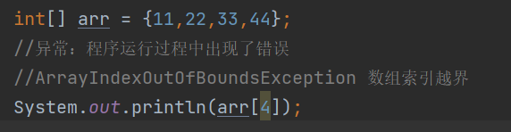
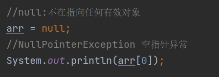

# 异常处理：

**数组越界异常：**



```java
Exception in thread "main" java.lang.ArrayIndexOutOfBoundsException ：访问的索引，超出了数组的范围
```

**空指针异常：**



```java
Exception in thread "main" java.lang.NullPointerException ：null:不在指向堆区的内存
```

