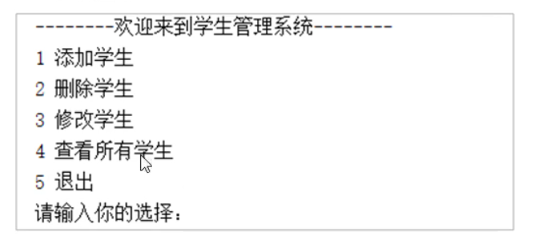
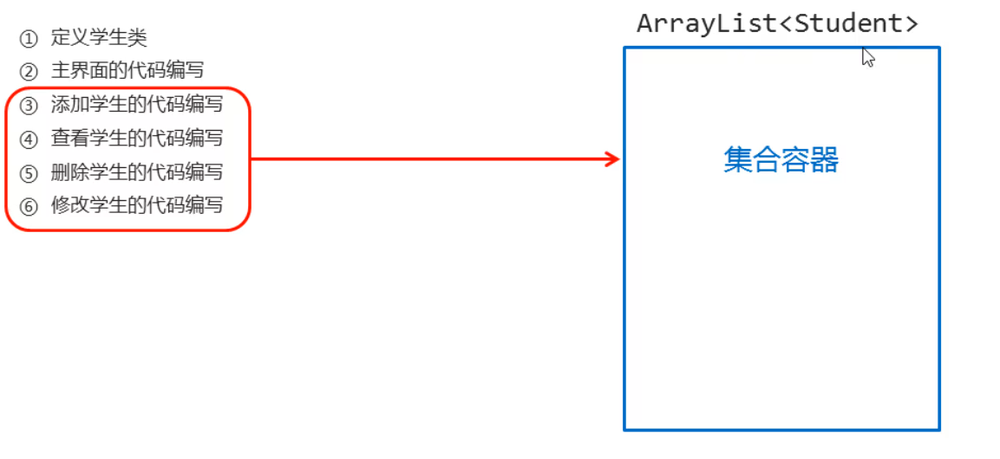
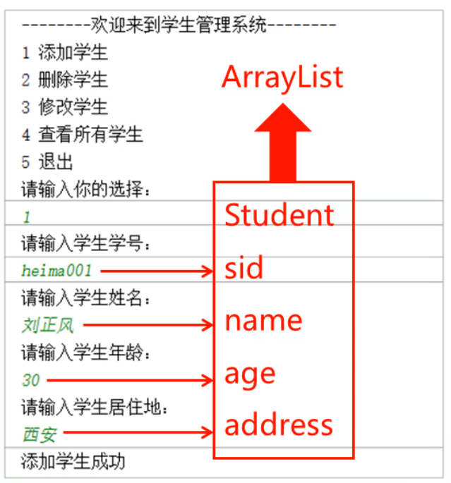

### 项目演示：



#### 学生管理系统实现思路：



#### 1.定义学生类

学生类：	Student

成员变量：

​					学号：sid

​					姓名：name

​					年龄：age

​					生日：brithday

构造方法：

​				无参构造

​				带四个参数的构造

成员方法：

​				每个成员变量对应给出get/set方法

##### 代码：

```java
package com.itheima.domain;

/*
    学生类
*/
public class Student {
    //成员变量
    private String sid;      //学号
    private String name;     //姓名
    private int age;         //年龄
    private String birthday; //学号


    //构造方法
    public Student() {
    }

    public Student(String sid, String name, int age, String birthday) {
        this.sid = sid;
        this.name = name;
        this.age = age;
        this.birthday = birthday;
    }

    //成员方法
    public void setSid(String sid) {
        this.sid = sid;
    }

    public void setName(String name) {
        this.name = name;
    }

    public void setAge(int age) {
        this.age = age;
    }

    public void setBirthday(String birthday) {
        this.birthday = birthday;
    }

    public String getSid() {
        return sid;
    }

    public String getName() {
        return name;
    }

    public int getAge() {
        return age;
    }

    public String getBirthday() {
        return birthday;
    }
}
```

#### 2.主界面代码编写


**思路：**

​	1.用输出语句完成主界面的编写

​	2.用Scanner实现键盘录入的数据

​	3.用switch语句完成操作的选择

​	4.用循环完成再次回到主界面

##### 代码：

```java
package com.itheima.test;

import java.util.Scanner;

public class StudentManager {
    public static void main(String[] args) {

        Scanner sc = new Scanner(System.in);
        boolean flag = true;
        while (flag){
            System.out.println("-------------欢迎来到学生管理系统------------");
            System.out.println("1 添加学生");
            System.out.println("2 删除学生");
            System.out.println("3 修改学生");
            System.out.println("4 查看所有学生");
            System.out.println("5 退出");
            System.out.println("请输入你的选择：");
            int choice = sc.nextInt();
            switch (choice){
                case 1:
                    System.out.println("添加学生");
                    break;
                case 2:
                    System.out.println("删除学生");
                    break;
                case 3:
                    System.out.println("修改学生");
                    break;
                case 4:
                    System.out.println("查看所有学生");
                    break;
                case 5:
                    System.out.println("感谢你的使用");
                    flag = false;
                    break;
                default:
                    System.out.println("你的输入有误！");
                    break;
            }
        }
    }
}
```

#### 3.添加学生的代码编写

**思路：**

​		1.用键盘录入选择添加学生

​		2.定义一个方法，用于添加学生

​				1.显示提示信息，提示要输入的何种信息

​				2.键盘录入学生对象所需要的数据赋值

​				3.创建学生对象，把键盘录入的数据赋值给学生对象的成员变量

​				4.将学生对象添加到集合中（保存）

​				5.给出添加成功提示

​		3.调用方法



##### 代码：

```java
//添加学生方法
public static void addStudent(ArrayList<Student> list){
    Scanner sc = new Scanner(System.in);
    //1.显示提示信息
    System.out.println("请输入学生学号：");
    String sid = sc.next();
    System.out.println("请输入学生姓名：");
    String name = sc.next();
    System.out.println("请输入学生年龄：");
    int age = sc.nextInt();
    System.out.println("请输入学生生日：");
    String birthday = sc.next();
    //2.将键盘录入的信息封装为学生对象
    Student  stu = new Student(sid,name,age,birthday);
    //3.将封装好的学生对象，添加到集合容器当中
    list.add(stu);
    //4. 给出添加成功的提示信息
    System.out.println("添加成功");
}
```

#### 4.查看学生的代码编写

**思路：**

​		1.用键盘录入选择查看所有学生信息

​		2.定义一个方法，用于查看 学生信息

​				1.判定集合中是否有数据，如果没有显示提示信息

​				2.显示表头信息

​				3.将集合中数据取出按照对应格式显示学生信息，年龄显示补充”岁“

​		3.调用方法

##### 代码：

```java	
    //查看所有学生信息
    public static void queryStudent(ArrayList<Student> list){
        //1.判断集合中是否存在数据，如果不存在直接给提示
        //2.存在：展示表头数据
        if (list.size() == 0){
            System.out.println("无信息，请先添加信息再查询！");
        }else {
            System.out.println("学号    姓名     年龄     居住地");
        }
        //3.遍历集合，获取每一个学生对的的信息，打印在控制台
        for (int i = 0; i < list.size(); i++) {
            System.out.println(list.get(i).getSid()+"   "+list.get(i).getName()+"     "+list.get(i).getAge()+"岁    "+list.get(i).getBirthday());
        }
    }
```

#### 5.删除/修改学生学号不存在问题

**思路：**

​	1.在删除/修改学生操作前，对学号是否存在进行判断

​			1.如果不存在，显示提示信息

​			2.如果存在，执行删除/修改操作

```java
//查找索引
public static int getIndex(ArrayList<Student> list,String sid){
    for (int i = 0; i < list.size(); i++) {
        if(list.get(i).getSid().equals(sid)){
            return i;	//学号存在 返回对应的索引
        }
    }
    return -1;		//学号不存在 返回-1
}
```

#### 6.删除学生

**思路：**

​	1.用键盘录入选择删除学生信息

​	2.定义一个方法，用于删除学生信息

​			1.显示提示信息

​			2.键盘录入要删除的学生学号

​			3.调用getIndex方法，查找该学号在集合的索引

​			4.如果索引为-1，提示信息不存在

​			5.如果索引不是-1，调用remove方法删除，并提示删除成功

​	3.调用方法

##### 代码：

```java
//根据索引删除学生
public static void deleteStudent(ArrayList<Student> list){
    //1.给出提示信息（请输入你要删除的学号）
    System.out.println("请输入你要删除学生的学号：");
    //2.键盘接收要删除的学号
    Scanner sc = new Scanner(System.in);
    String  sid = sc.next();
    //3.调用getIndex方法，查找该学号在集合中出现的索引位置
    int index = getIndex(list,sid);
    //4.根据索引判断，学号在集合中是否存在
    if (index == -1){   //不存在：给出提示
        System.out.println("该信息不存在，请重新输入！");
    }else {     //存在：删除
        list.remove(index);
        System.out.println("删除成功！");
    }
}
```

#### 7.修改学生的代码编写

**思路：**

​		1.用键盘录入选择修改学生信息

​		2.定义一个方法，用于修改学生信息

​				1.显示提示信息

​				2.键盘录入要修改的学生学号

​				3.调用getIndex()方法，查找该学号在集合的索引

​				4.如果索引为-1，提示信息不存在

​				5.如果索引不是-1，键盘录入要修改的学生信息

​				6.集合修改对应的学生信息

​				7.给出修改成功提示

​		3.调用方法

##### 代码：

```java
//根据索引修改学生信息
public static void updataStudent(ArrayList<Student> list){
    //1.给出提示信息（请输入你要修改信息的学号）
    System.out.println("请输入你要修改学生的学号：");
    //2.键盘接收要修改的学号
    Scanner sc = new Scanner(System.in);
    String  updataSid = sc.next();
    //3.调用getIndex方法，查找该学号在集合中出现的索引位置
    int index = getIndex(list,sid);
    //4.根据索引判断，学号在集合中是否存在
    if (index == -1){   //不存在：给出提示
        System.out.println("该信息不存在，请重新输入！");

    }else {     //存在：接收新的学生信息
        System.out.println("请输入学生姓名：");
        String updaName = sc.next();
        System.out.println("请输入学生年龄：");
        int updaAge = sc.nextInt();
        System.out.println("请输入学生生日：");
        String updaBirthday = sc.next();
        //封装为新的学生对象
        Student stu = new Student(updataSid,updaName,updaAge,updaBirthday);
        //调用集合的set方法，完成修改
        list.set(index,stu);
        System.out.println("修改成功！");
    }
}
```

#### 8.解决添加学生学号重复问题

**思路：**

​		1.在添加学生录入学号后，调用getIndex方法

​		2.根据方法的返回值，判断学号是否存在

​				返回值为-1：不存在，可以存储

​				返回值为正确索引：存在，给出提示，重新接收信息

##### 代码：

```java
//添加学生方法
public static void addStudent(ArrayList<Student> list){
    Scanner sc = new Scanner(System.in);
    //1.显示提示信息
    while (true){
        System.out.println("请输入学生学号：");
        String sid = sc.next();
        int index = getIndex(list,sid);
        if (index == -1){
            System.out.println("请输入学生姓名：");
            String name = sc.next();
            System.out.println("请输入学生年龄：");
            int age = sc.nextInt();
            System.out.println("请输入学生生日：");
            String birthday = sc.next();
            //2.将键盘录入的信息封装为学生对象
            Student  stu = new Student(sid,name,age,birthday);
            //3.将封装好的学生对象，添加到集合容器当中
            list.add(stu);
            //4. 给出添加成功的提示信息
            System.out.println("添加成功");
            return;
        }else {
            System.out.println("该学号已存在，请重新输入：");
        }
    }
}
```

### 学生管理系统：

```java
package com.itheima.domain;

/*
    学生类
*/
public class Student {
    //成员变量
    private String sid;      //学号
    private String name;     //姓名
    private int age;         //年龄
    private String birthday; //生日


    //构造方法
    public Student() {
    }

    public Student(String sid, String name, int age, String birthday) {
        this.sid = sid;
        this.name = name;
        this.age = age;
        this.birthday = birthday;
    }

    //成员方法
    public void setSid(String sid) {
        this.sid = sid;
    }

    public void setName(String name) {
        this.name = name;
    }

    public void setAge(int age) {
        this.age = age;
    }

    public void setBirthday(String birthday) {
        this.birthday = birthday;
    }

    public String getSid() {
        return sid;
    }

    public String getName() {
        return name;
    }

    public int getAge() {
        return age;
    }

    public String getBirthday() {
        return birthday;
    }

}
```

```java
package com.itheima.test;

import com.itheima.domain.Student;
import java.util.ArrayList;
import java.util.Scanner;

public class StudentManager {
    public static void main(String[] args) {
        Scanner sc = new Scanner(System.in);
        boolean flag = true;
        //创建集合容器
        ArrayList<Student> list = new ArrayList<>();
        while (flag){
            System.out.println("-------------欢迎来到学生管理系统------------");
            System.out.println("1 添加学生");
            System.out.println("2 删除学生");
            System.out.println("3 修改学生");
            System.out.println("4 查看所有学生");
            System.out.println("5 退出");
            System.out.println("请输入你的选择：");
            int choice = sc.nextInt();
            switch (choice){
                case 1:
                    addStudent(list);
                    break;
                case 2:
                    deleteStudent(list);
                    break;
                case 3:
                    updataStudent(list);
                    break;
                case 4:
                    queryStudent(list);
                    break;
                case 5:
                    System.out.println("感谢你的使用");
                    flag = false;
                    break;
                default:
                    System.out.println("你的输入有误！");
                    break;
            }
        }
    }
    //根据索引修改学生信息
    public static void updataStudent(ArrayList<Student> list){
        //1.给出提示信息（请输入你要修改信息的学号）
        System.out.println("请输入你要修改学生的学号：");
        //2.键盘接收要修改的学号
        Scanner sc = new Scanner(System.in);
        String  updataSid = sc.next();
        //3.调用getIndex方法，查找该学号在集合中出现的索引位置
        int index = getIndex(list,updataSid);
        //4.根据索引判断，学号在集合中是否存在
        if (index == -1){   //不存在：给出提示
            System.out.println("该信息不存在，请重新输入！");

        }else {     //存在：接收新的学生信息
            System.out.println("请输入学生姓名：");
            String updaName = sc.next();
            System.out.println("请输入学生年龄：");
            int updaAge = sc.nextInt();
            System.out.println("请输入学生生日：");
            String updaBirthday = sc.next();
            //封装为新的学生对象
            Student stu = new Student(updataSid,updaName,updaAge,updaBirthday);
            //调用集合的set方法，完成修改
            list.set(index,stu);
            System.out.println("修改成功！");
        }
    }
    //根据索引删除学生
    public static void deleteStudent(ArrayList<Student> list){
        //1.给出提示信息（请输入你要删除的学号）
        System.out.println("请输入你要删除学生的学号：");
        //2.键盘接收要删除的学号
        Scanner sc = new Scanner(System.in);
        String  sid = sc.next();
        //3.调用getIndex方法，查找该学号在集合中出现的索引位置
        int index = getIndex(list,sid);
        //4.根据索引判断，学号在集合中是否存在
        if (index == -1){   //不存在：给出提示
            System.out.println("该信息不存在，请重新输入！");

        }else {     //存在：删除
            list.remove(index);
            System.out.println("删除成功！");
        }
    }
    //查找索引
    public static int getIndex(ArrayList<Student> list,String sid){
        for (int i = 0; i < list.size(); i++) {
            if(list.get(i).getSid().equals(sid)){
                return i;
            }
        }
        return -1;
    }

    //添加学生方法 
    public static void addStudent(ArrayList<Student> list){
        Scanner sc = new Scanner(System.in);
        //1.显示提示信息
        while (true){
            System.out.println("请输入学生学号：");
            String sid = sc.next();
            int index = getIndex(list,sid);
            if (index == -1){
                System.out.println("请输入学生姓名：");
                String name = sc.next();
                System.out.println("请输入学生年龄：");
                int age = sc.nextInt();
                System.out.println("请输入学生生日：");
                String birthday = sc.next();
                //2.将键盘录入的信息封装为学生对象
                Student  stu = new Student(sid,name,age,birthday);
                //3.将封装好的学生对象，添加到集合容器当中
                list.add(stu);
                //4. 给出添加成功的提示信息
                System.out.println("添加成功");
                return;
            }else {
                System.out.println("该学号已存在，请重新输入：");
            }
        }
    }
    //查看所有学生信息
    public static void queryStudent(ArrayList<Student> list){
        //1.判断集合中是否存在数据，如果不存在直接给提示
        //2.存在：展示表头数据
        if (list.size() == 0){
            System.out.println("无信息，请先添加信息再查询！");
        }else {
            System.out.println("学号    姓名     年龄     生日");
             //3.遍历集合，获取每一个学生对的的信息，打印在控制台
        	for (int i = 0; i < list.size(); i++) {
            System.out.println(list.get(i).getSid()+"   "+list.get(i).getName()+"     "+list.get(i).getAge()+"岁    "+list.get(i).getBirthday());
        }
        }
       
    }
}
```
