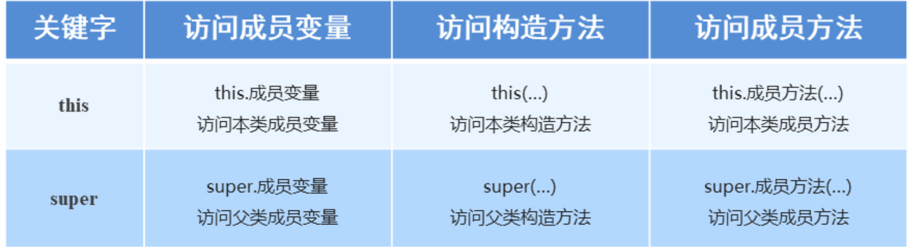

### 1.super关键字

##### 	super关键字的用法和this关键字的用法相似

**this：**代表调用该方法的对象（一般我们是在当前类中使用this，所以我们常说this代表本类对象的引用）

**super：**代表父类存储空间的表示（可以理解为父类对象的引用）



#### 示例代码：

```java
package com.itheima.Extends3;
/*
    父类
*/
public class Fu {
    public int age = 40;
}
```

```java
package com.itheima.Extends3;
/*
    子类
*/
public class Zi extends Fu{
    public int age = 20;
    public void show(){
        int age = 30;
        System.out.println(age);
        //访问本类中的成员变量age
        System.out.println(this.age);
        //访问父类中的成员变量age
        System.out.println(super.age);
    }
}
```

```java
package com.itheima.Extends3;
/*
    测试类
*/
public class Demo {
    public static void main(String[] args) {
        Zi z = new Zi();
        z.show();
    }
}
```