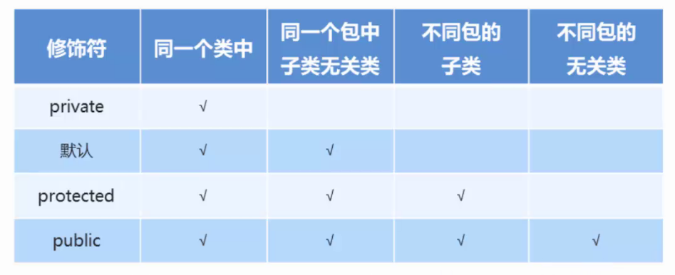

### 1.修饰符分类

​	权限修饰符

​	状态修饰符

#### 	权限修饰符：



#### 示例代码：

##### 同一个类中：

```java
package com.itheima2.domain;

public class Fu {
    private void show1(){
        System.out.println("private");
    }
    void show2(){
        System.out.println("默认");
    }
    protected void show3(){
        System.out.println("protected");

    }
    public void show4(){
        System.out.println("public");
    }

    public static void main(String[] args) {
        //创建Fu的对象，测试看看那些方法可以使用
        Fu f = new Fu();
        f.show1();
        f.show2();
        f.show3();
        f.show4();
    }

}
```

##### 同包子类：

```java
package com.itheima2.domain;

public class Zi extends Fu{
    public static void main(String[] args) {
        //创建Fu的对象，测试看看那些方法可以使用
        Fu f = new Fu();
        f.show2();
        f.show3();
        f.show4();
    }
}
```

##### 同包无关类：

```java
package com.itheima2.domain;

public class Demo {
    public static void main(String[] args) {
        //创建Fu的对象，测试看看那些方法可以使用
        Fu f = new Fu();
        f.show2();
        f.show3();
        f.show4();
    }
}
```

##### 不同包子类：

```java
package com.itheima2.test;

import com.itheima2.domain.Fu;

public class Zi {
    public static void main(String[] args) {
        //创建Fu的对象，测试看看那些方法可以使用
        Fu f = new Fu();
        f.show4();
    }
}

```

##### 不同包无关类：

```java
package com.itheima2.test;

import com.itheima2.domain.Fu;

public class Demo {
    public static void main(String[] args) {
        //创建Fu的对象，测试看看那些方法可以使用
        Fu f = new Fu();
        f.show4();
    }
}
```