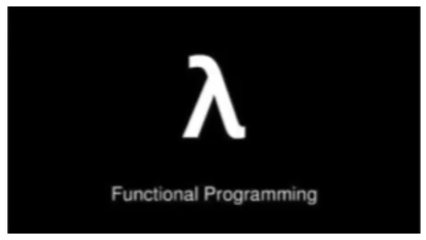

### 函数式编程思想概述：



在数学中，函数就是有输入量、输出量的一套计算方案，也就是 “拿数据做操作”

面向对象思想强调 “ 必须通过对象的形式来做事情 ”

函数式思想则尽量忽略面向对象的复杂语法：“ 强调做什么，而不是以什么形式去做”

我们要学习的Lambda表达式就是函数式思想的体现


##### 面向对象思想：匿名内部类实现

##### 函数式思想：Lambda表达式实现

#### 示例代码：

```java
package com.itheima_05;

public interface Inter {
    void show();
}
```

```java
package com.itheima_05;
/*
    测试类
*/
public class InterDemo {
    public static void main(String[] args) {
        //匿名内部类实现
        useInter(new Inter() {
            @Override
            public void show() {
                System.out.println("匿名内部类实现！");
            }
        });


        //Lambda表达式实现
        useInter(()->{
            System.out.println("Lambda表达式实现！");
        });


    }
    public static void useInter(Inter i ){
        i.show();
    }
}
```

##### 匿名内部类中重写show()方法的代码分析：

​	方法形参为空，说明调用方法时不需要传递参数

​	方法返回值类型为void，说明方法执行没有结果返回

​	方法体中的内容，是我们具体要做的事情

##### Lambda表达式的代码分析:

()：里面没有内容，可以看成是方法形式参数为空

->：用箭头指向后面要做的事情

{}：包含一段代码，我们称之为代码块，可以看成是方法体中的内容

组成Lambda表达式的三要素：形式参数 、箭头、代码块。


#### Lambda表达式的标准格式：