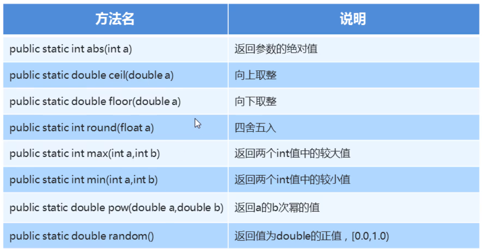

### 1.Math类概述

​	Math包含执行基本数字运算的方法

###  2.没有构造方法，如何使用类中的成员呢？

​	看类的成员是否都是静态的，如果是，通过类名就可以直接调用

### 3.Math类的常用方法



#### 示例代码：

```java
package com.itheima_01;

public class MyMath {
    public static void main(String[] args) {
        //绝对值
        int abs1 = Math.abs(10);
        System.out.println("Math.abs(10)的结果是：" + abs1);
        int abs2 = Math.abs(-10);
        System.out.println("Math.abs(-10)的结果是：" + abs2);

        //向上取整
        double ceil = Math.ceil(10.1);
        System.out.println("Math.ceil(10.1)的结果是：" + ceil);
        //向下取整
        double floor = Math.floor(10.9);
        System.out.println("Math.floor(10.9)的结果是：" + floor);
        //四舍五入
        long round = Math.round(10.1);
        System.out.println("Math.round(10.1)的结果是：" + round);
        long round1 = Math.round(1.9);
        System.out.println("Math.round(1.9)的结果是：" + round1);

        //最大值
        int max = Math.max(1, 2);
        System.out.println("Math.max(1,2的结果是：" + max);
        //最小值
        int min = Math.max(10, 22);
        System.out.println("Math.max(10,22的结果是：" + min);
        //A的B次方
        double pow = Math.pow(2, 3);
        System.out.println("Math.pow(2,3的结果是：" + pow);
        //随机数
        double random = Math.random();
        System.out.println(random);


    }
}
```