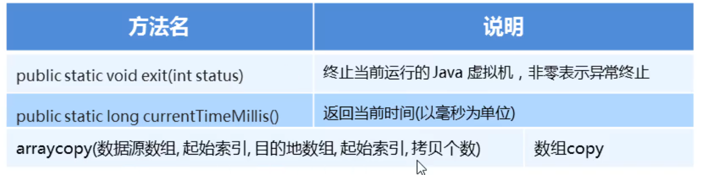

### 1.System类的概述

​		System不能被实例化

### 2.System类的常用方法



#### 示例代码：

```java
package com.itheima_01;

public class MySystem {
    public static void main(String[] args) {
        long start = System.currentTimeMillis();    //获取当前时间

        for (int i = 0; i < 10000; i++) {
            System.out.println(i);
        }
        long end = System.currentTimeMillis();    //获取当前时间
        System.out.println(end - start);    //程序运行的时间


        //arraycopy(数据源数组，源数组起始索引，目标数组,目标数组的起始索引,拷贝个数)
        int[] arr1 = {1,2,3,4,5,6};
        int[] arr2 = new int[10];
        //我要把arr1最后两个袁术，拷贝到arr2得最后两个索引上
        System.arraycopy(arr1,3,arr2,8,2);

        for (int i = 0; i < arr2.length; i++) {
            System.out.println(arr2[i]);
        }
    }
}
```