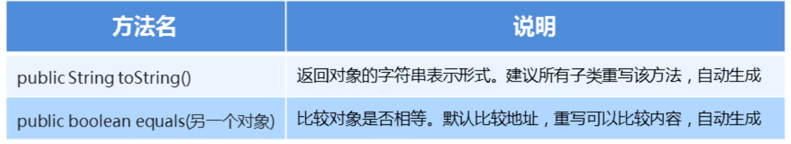
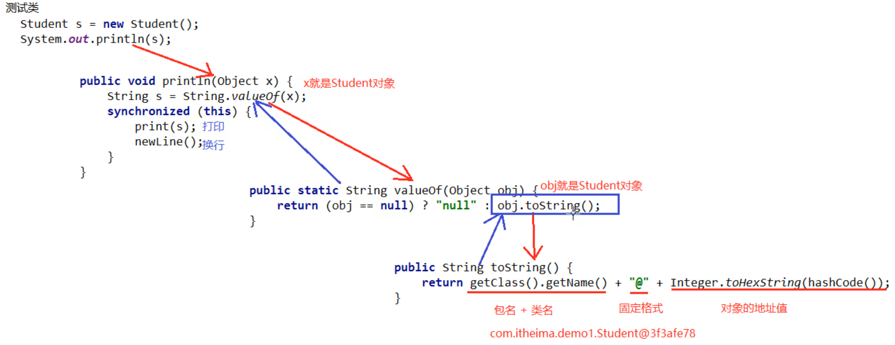

### 1.Object类的概述

​		每个类都可以将Object作为父类，所有类都直接或者间接的继承自该类

**构造方法：**public Object()

##### 回想面向对象中，为什么说子类的构造方法默认访问的是父类的无参构造方法？

​		因为它们的顶级父类只有无参构造方法

### 2.Object类的常用方法



#### toString 示例代码：

```java
package com.itheima_02;

public class Student {
    private String name;
    private int age;

    public Student() {
    }

    public Student(String name, int age) {
        this.name = name;
        this.age = age;
    }

    public String getName() {
        return name;
    }

    public void setName(String name) {
        this.name = name;
    }

    public int getAge() {
        return age;
    }

    public void setAge(int age) {
        this.age = age;
    }

    @Override		//重写toString方法
    public String toString() {
        return "Student{" +
                "name='" + name + '\'' +
                ", age=" + age +
                '}';
    }
}

```

```java
package com.itheima_02;

import java.util.ArrayList;

/*
    System.out.println方法使用：
        基本类型：打印的是值
        引用类型：
            重写了toString方法的类，打印的是内容
            没有重写了toString方法的类，打印地址
*/
public class StudentDemo {
    public static void main(String[] args) {
    /*
        Student stu = new Student("项羽",22);
        //没有重写toString方法
        //System.out.println(stu); // com.itheima_02.Student@3f3afe78

        //重写了toString方法
        System.out.println(stu);   //name:项羽   age:22


        String str = new String("aaa");
        System.out.println(str);        // aaa

        ArrayList al = new ArrayList();
        al.add(111);
        System.out.println(al);     // [111]
    */
        Student stu1 = new Student("东皇太一",33);
        Student stu2 = new Student("东皇太一",33);
        System.out.println(stu1 == stu2);   // false
        System.out.println(stu1.equals(stu2));  // 重写equals之前比较的是地址值：false  重写后比较的是内容: true
    }
}
```

##### 图解：



#### 总结：

1. Object类是所有类的直接或者间接父类
2. 直接打印一个对象就是打印这个对象的toSting方法的返回值
3. Object类的toString方法得到的是对象的地址值
4. 我们一般会对toString方法进行重写


#### euqals 示例代码：

```java
package com.itheima_05;

public class Student {
    private String name;
    private int age;

    public Student() {
    }

    public Student(String name, int age) {
        this.name = name;
        this.age = age;
    }

    public String getName() {
        return name;
    }

    public void setName(String name) {
        this.name = name;
    }

    public int getAge() {
        return age;
    }

    public void setAge(int age) {
        this.age = age;
    }

    @Override
    public String toString() {
        return "Student{" +
                "name='" + name + '\'' +
                ", age=" + age +
                '}';
    }

    @Override		//重写equals方法 
    public boolean equals(Object o) {
        if (this == o) return true;
        if (o == null || getClass() != o.getClass()) return false;

        Student student = (Student) o;

        if (age != student.age) return false;
        return name != null ? name.equals(student.name) : student.name == null;
    }
}
```

```java
package com.itheima_05;

public class StudentDemo {
    public static void main(String[] args) {
        Student stu1 = new Student("东皇太一", 22);
        Student stu2 = new Student("东皇太一", 22);

        System.out.println(stu1 == stu2);  //false
        //Object类中的equals方法，底层也是用==号比较地址值的
        //重写前 比较的是地址值
        //System.out.println(stu1.equals(stu2));  //false
        //重写后 比较的是内容
        System.out.println(stu1.equals(stu2));  //true
    }

}
```