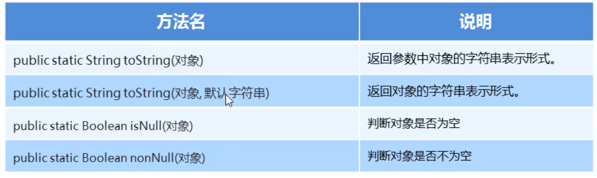

### 1.Objects类的常用方法



#### 示例代码：

```java
package com.itheima_05;

import java.util.Objects;

public class MyObjectsDemo {
    public static void main(String[] args) {

        //public static String toString(对象) 返回参数中对象的字符串表示形式
        Student stu = new Student("小明同学",18);
        System.out.println(stu);
        System.out.println(Objects.toString(stu));

        //public static String toString(对象,默认字符串)   返回对象的字符串表示形式,如果对象为null，返回第二个字符串
        Student stu1 = null;
        System.out.println(Objects.toString(stu1, "戴瑞年爱吃辣条！"));


        //public static String isNull(对象)   //判断对象是否为空
        Student s  = null;
        boolean result = Objects.isNull(s);
        System.out.println(result); //true

        //public static String nonNull(对象)  //判断对象是否不为空
        Student s1  = null;
        boolean result1 = Objects.isNull(s);
        System.out.println(result1); //true
    }
}
```