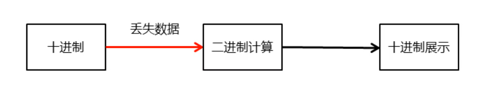
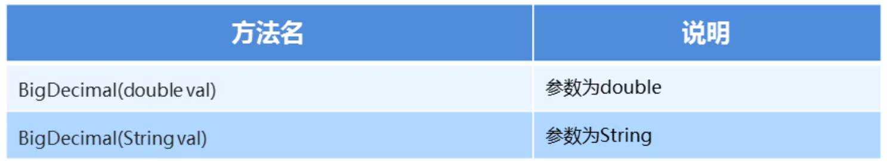

### 1.BigDecimal概述

​		Java在java.math包中提供的API类BigDecimal，用来对超过16位有效位的数进行精确的运算。双精度浮点型变量double可以处理16位有效数。在实际应用中，需要对更大或者更小的数进行运算和处理。float和double只能用来做科学计算或者是工程计算，在商业计算中要用java.math.BigDecimal。BigDecimal所创建的是对象，我们不能使用传统的+、-、*、/等算术运算符直接对其对象进行数学运算，而必须调用其相对应的方法。方法中的参数也必须是BigDecimal的对象。构造器是类的特殊方法，专门用来创建对象，特别是带有参数的对象

```java
public static void main(String[] args) {
    System.out.println(10.0 / 3.0);
}
```

#### console:

3.3333333333333335



### 2.BigDecimal类的构造方法



#### 示例代码：

```java
package com.MyBigDecimal;

import java.math.BigDecimal;

public class MyBigDecimal {
    public static void main(String[] args) {
        BigDecimal bd1 = new BigDecimal(10.0);
        BigDecimal bd2 = new BigDecimal("0.2");

        System.out.println(bd1);
        System.out.println(bd2);

    }
}
```

#### console:

10
0.2