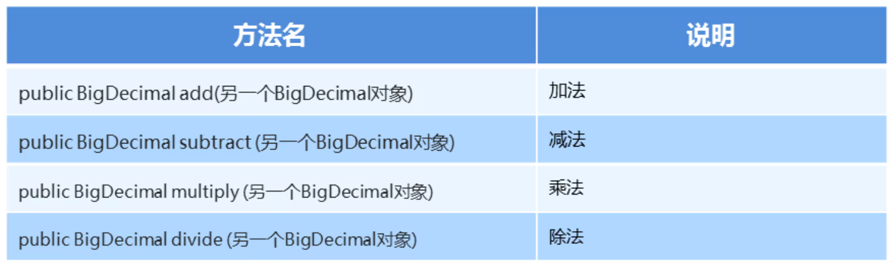
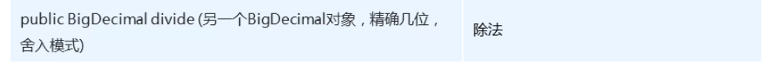
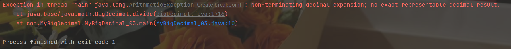

### 1.BIgDecimal类的常用方法

##### 作用：可以精确计算



#### 示例代码:

```java
package com.MyBigDecimal;

import java.math.BigDecimal;

public class MyBigDecimal_02 {
    public static void main(String[] args) {
        //如果相应进行精确运算，那么请使用字符串的构造
        BigDecimal bd1 = new BigDecimal("0.1");
        BigDecimal bd2 = new BigDecimal("0.2");

        // public BigDecimal add(另一个BigDecimal对象)  加法
        BigDecimal add = bd1.add(bd2);
        System.out.println(add);

        // public BigDecimal subtract(另一个BigDecimal对象)  减法
        BigDecimal subtract = bd1.subtract(bd2);
        System.out.println(subtract);

        // public BigDecimal multiply(另一个BigDecimal对象)  乘法
        BigDecimal multiply = bd1.multiply(bd2);
        System.out.println(multiply);

        // public BigDecimal divide(另一个BigDecimal对象)  除法
        BigDecimal divide = bd1.divide(bd2);
        System.out.println(divide);


    }
}
```

### 注意点：

```java
package com.MyBigDecimal;

import java.math.BigDecimal;

public class MyBigDecimal_03 {
    public static void main(String[] args) {
        BigDecimal bd1 = new BigDecimal("10.0");
        BigDecimal bd2 = new BigDecimal("3.0");

        BigDecimal  dvi = bd1.divide(bd2);
        System.out.println(dvi);
    }
}
```



bd1.divide(bd2)；除不尽 系统会报异常

#### 解决方法：


#### 示例代码：

```java
package com.MyBigDecimal;

import java.math.BigDecimal;

public class MyBigDecimal_03 {
    public static void main(String[] args) {
        BigDecimal bd1 = new BigDecimal("10.0");
        BigDecimal bd2 = new BigDecimal("3.0");

//        BigDecimal  dvi = bd1.divide(bd2);
        /*
            public BigDecimal divide(另一个BigDecimal对象,精确几位,舍入模式)
            参数一：表示参数运算的另一个对象
            参数二：表示小数点后精确到多少位
            参数三：舍入模式
                  进一法：BigDecimal.ROUND_UP
                  去尾法：BigDecimal.ROUND_FLOOR
                  四舍五入：BigDecimal.ROUND_HALF_UP
         */
        BigDecimal dvi = bd1.divide(bd2, 2, BigDecimal.ROUND_HALF_UP);
        System.out.println(dvi);
    }
}
```

##### 总结：

1. BigDecimal是用来进行精确计算的
2. 创建BigDecimal的对象，构造方法使用参数类型为字符串的
3. 四则运算中的除法，如果除不尽请使用divide的三个参数的方法