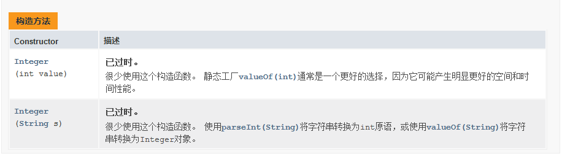
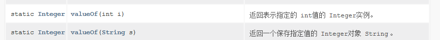

### 1.Integer类的概述和使用

​		Integer：该对象中包装了一个基本数据类型int值

### 2.Integer构造方法



### 3.静态方法：



#### 示例代码：

```java
package com.MyInteger;

public class MyInteger_02 {
    public static void main(String[] args) {
        //public Integer(int value)     根据int创建Integer对象（过时）
        Integer i1 = new Integer(10);
        System.out.println(i1);

        //public Integer(String s)  根据String值创建Integer对象（过时）
        Integer i2 = new Integer("101");
        System.out.println(i2);

        //public static integer valueOf(int i) 返回表示指定的int值的Integer实例
        Integer i3 = Integer.valueOf(88);
        System.out.println(i3);

        //public static integer valueOf(String s) 返回一个保存指定值得Integer对象String
        Integer i4 = Integer.valueOf("99");
        System.out.println(i4);

    }
}

```

