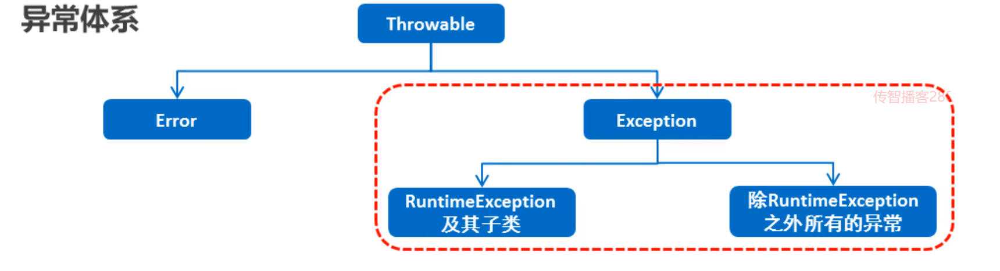

### 1.异常概述

​		异常：就是程序出现了不正常的情况，程序在执行过程中，出现的非正常的情况，最终会导致JVM的非正常停止。

##### 注意点：语法错误不算在异常体系中



Error：严重问题，通过代码无法处理，比如：内存溢出

Exception：称为异常类，它表示程序本身可以处理的问题

- RuntimeException及其子类：运行时异常。（空指针异常，数组索引越界异常）
- 除RuntimeException之外所有的异常：编译期必须处理的，否则程序不能通过编译。（日期格式化异常）

##### 示例代码：

```java
package com.Exception;

import java.text.SimpleDateFormat;

public class ExceptionDemo {
    public static void main(String[] args) {
//        int[] arr = {1,2,3,4,5};
//        System.out.println(arr[10]);    //.ArrayIndexOutOfBoundsException

//        String s = null;
//        System.out.println(s.equals("hello"));  //NullPointerException

//        SimpleDateFormat sdf = new SimpleDateFormat("yyyy年MM月dd日");
//        sdf.parse("2048-1月1日"); //ParseException

    }
}
```