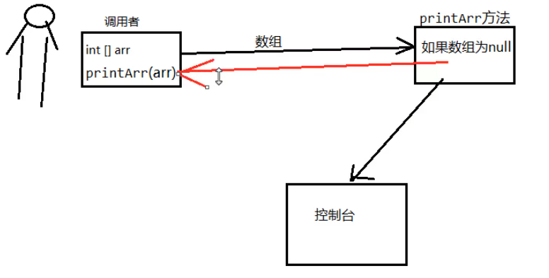

### 1.throw抛出异常

##### 格式：

```java
throw new 异常();
```

##### 注意：这个格式是在方法内的，表示当前代码手动抛出一个异常，下面的代码不用再执行了

#### throws：

- 用在方法声明后面，跟的是异常类名
- 表示声明异常，调用该方法有可能出现这样的异常

#### throw:

- 用在方法体内，跟的是异常对象名
- 表示手动抛出异常对象，由方法体内的语句处理

### 2.抛出处理异常的意义

1. 在方法中，当传递的参数有误，没有继续运行下去的意义了，则采取抛出处理，表示该方法结束运行
2. 告诉调用者方法中出现了问题

#### 示例代码：

```java
package com.Exception;

import java.text.ParseException;

public class ExceptionDemo5 {
    public static void main(String[] args) throws ParseException {
//        int [] arr = {1,2,3,4,5};
        int[] arr = null;
        printArr(arr);  //就会，接收到一个异常
                        //我们还需要自己处理一下异常
    }
    private static void printArr(int[] arr){
        if (arr == null){
            //调用者不知道成功打印了吗
            //System.out.println("参数不能为null")
            throw new NullPointerException();   //当参数为null的时候
                                                //手动创建了一个异常对象，抛给了调用者
        }else {
            for (int i = 0; i < arr.length; i++) {
                System.out.println(arr[i]);
            }
        }
    }

}
```

