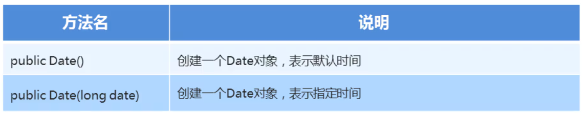
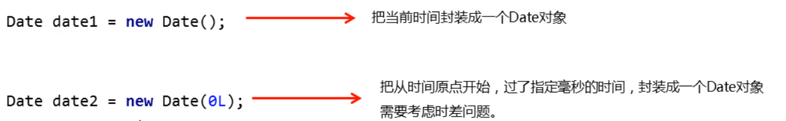

### 1.Date类的概述	

​		Date代表了一个特定的时间，精确到毫秒

- 北京时间需要在世界标准实际上加8小时
- 1秒 = 1000毫秒
- 计算机中的时间原点为：1970年1月1日00：00：00

### 2.Date类的构造方法



#### 示例代码：

```java
package com.Date;

import java.util.Date;

public class DateDemo_02 {
    public static void main(String[] args) {
        //public Date 创建一个Date对象，表示默认时间
        //public Date (long date) 创建一个Date对象，表示指定时间

        //这个时间表示电脑中的当前时间
        Date date1 = new Date();
        System.out.println(date1);  // Tue Jul 12 20:07:16 CST 2022

        //从计算机的时间原点开始，过了指定毫秒的那个时间
        Date date2 = new Date(0L);
        System.out.println(date2);  // Thu Jan 01 08:00:00 CST 1970
        //从时间原点开始，过了0毫秒
        //因为我们是在中国，我们实在东八区需要+8小时

        //1970年1月1日 上午9点
        Date date3 = new Date(3600L * 1000);
        System.out.println(date3);  //Thu Jan 01 09:00:00 CST 1970

    }
}
```

#### 小结：

