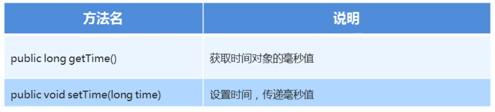

### 1.Date类的常用方法



#### 示例代码：

```java
package com.Date;

import java.util.Date;

public class DateDemo_02 {
    public static void main(String[] args) {
        //public long getTime() 获取事件对象的毫秒值
        //public void setTime(long time) 设置时间，传递毫秒值

        //method();
        Date date1 = new Date();
        date1.setTime(0L);
        System.out.println(date1); // Thu Jan 01 08:00:00 CST 1970

    }

    private static void method() {
        //把当前时间封装成一个date对象
        Date date1 = new Date();
        //获取这个date对象的毫秒值   --- 获取当前时间的毫秒值
        long time = date1.getTime();
        System.out.println(time);

        long time2 = System.currentTimeMillis();
        System.out.println(time2);
    }
}
```