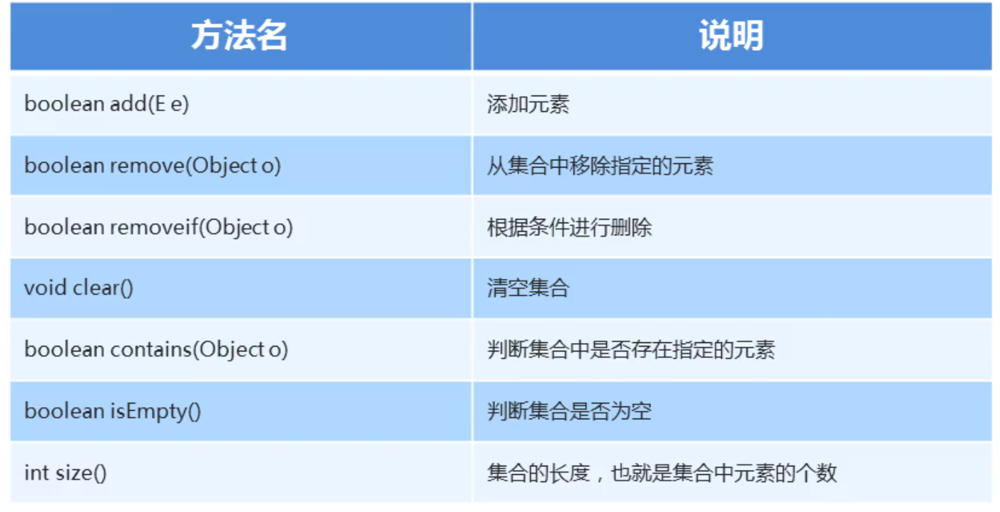

### 1.Collection集合概述和使用

##### Collection集合概述

- 是单例集合的顶层接口，它表示一组对象，这些对象也称为Collection的元素
- JDK不提供次接口的任何直接实现，它提供更具体地子接口（Set和List）实现

创建Collection集合地对象

- 多态的方式
- 具体的实现类ArrayList

### 2.Collection集合常用方法



##### 示例代码：

```java
package com.Collection;

import java.util.ArrayList;
import java.util.Collection;

public class Demo_02 {
    public static void main(String[] args) {
        Collection collection = new ArrayList();
        // bollean add(E e)     添加元素
        collection.add("a");
        collection.add("b");
        collection.add("c");
        collection.add("d");
        collection.add("e");
        System.out.println(collection); //[a, b, c, d, e]
        //boolean remove(Object o)  从集合中移除指定的元素

        collection.remove("a"); //如果删除成功了返回true，如果返回失败了则返回false
        System.out.println(collection); //[b, c, d, e]

        //boolean removeif(Object o) 根据条件进行删除
        /*
            removeif底层会遍历集合，得到集合中的每一个元素
            s 依次表示集合中的每一个元素
            就会把这个每一个元素都到Lambda表达式中去判断一下
            如果返回的是true，则删除
            如果返回的是false，则保留不删除
        */
        collection.removeIf(s-> "e".equals(s));
        System.out.println(collection); //[b, c, d]

        //boolean contains(Object o) 判断集合中是否存在指定的元素
        System.out.println(collection.contains("c"));   //true
        System.out.println(collection.contains("g"));   //false

        //boolean isEmpty() 判断集合是否为空
        System.out.println(collection.isEmpty());   //false
        System.out.println(new ArrayList<>().isEmpty()); //true

        //int size()    集合的长度，也就是集合中元素的个数
        System.out.println(collection.size());  //3
        System.out.println(new ArrayList<>().size());   //0

        //void clear()  清空集合
        collection.clear();
        System.out.println(collection); // []
    }
}

```