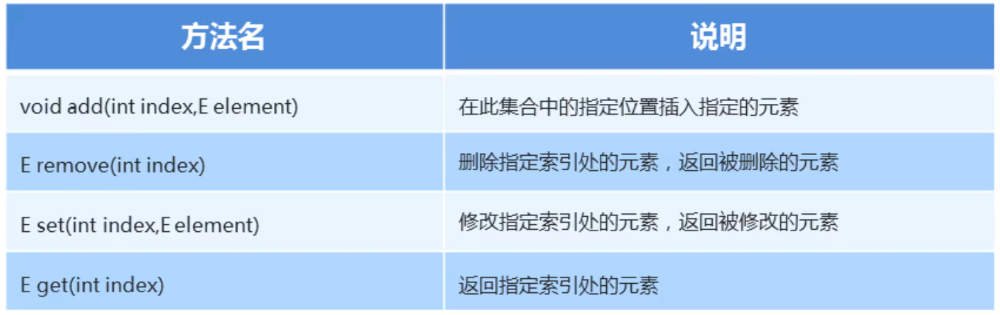

### 1.List集合特有方法



##### 示例代码：

```java
package com.List;

import java.util.ArrayList;
import java.util.List;

public class MyListDemo_02 {
    public static void main(String[] args) {
        List<String> list = new ArrayList<>();
        list.add("aaa");
        list.add("bbb");
        list.add("ccc");
        list.add("ddd");
        System.out.println(list);
        System.out.println("========================");

        // void add (int index,E element) 在此集合中的指定位置插入指定的元素
        list.add(0, "eee");
        System.out.println(list);
        System.out.println("========================");

        // E remove(int index) 删除指定索引处的元素，返回被删除的元素
        // 在List集合中有两个删除的方法
        // 第一个 删除指定的元素，返回值表示当前元素是否删除成功
        // 第二个 删除指定元素的索引，返回值表示时间删除的元素
        System.out.println(list.remove(2));
        System.out.println(list);
        System.out.println("========================");

        // E set(int index,E element) 修改指定索引处的元素，返回被修改的元素
        list.set(3, "fff");
        System.out.println(list);
        System.out.println("========================");

        // E get(int index) 返回指定索引处的元素
        System.out.println(list.get(3));
        System.out.println(list);
        System.out.println("========================");
    }
}
```