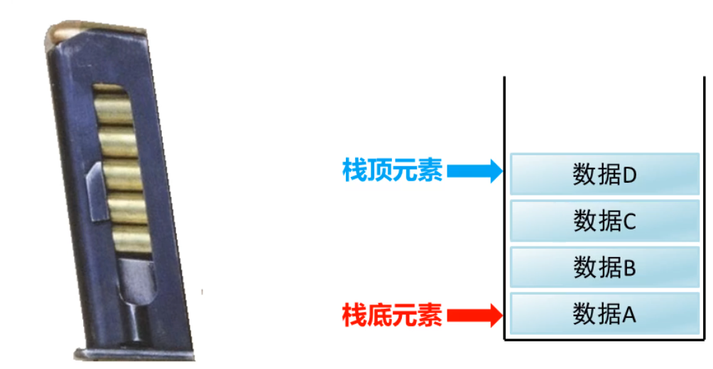
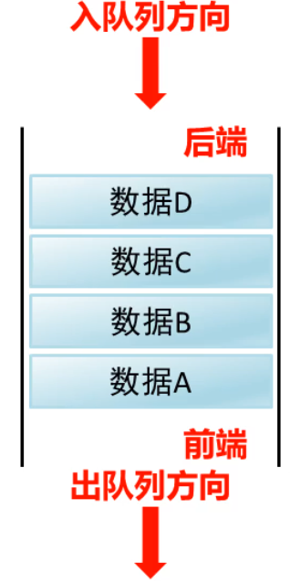

### 1.数据结构

​		数据结构是计算机存储、组织数据的方式。是指相互之间存在一种或多种特定关系的数据元素的集合，通常情况下，精心选择的数据结构可以带来更高的运行或者存储效率。

##### 常见数据结构之栈：

​	栈是一种数据先进后出的模型

数据进入栈模型的过程称为：压/进栈

数据离开栈模型的过程为：弹/出栈

##### 常见数据结构之队列：

队列是一种数据先进先出的模型

数据从后端进入队列模型的过程称为：入队列

数据从前端离开队列模型的过程称为：出队列

