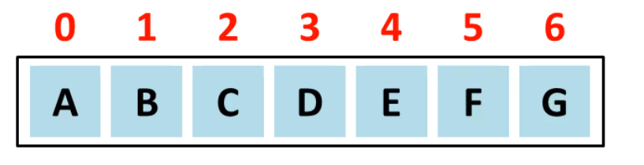
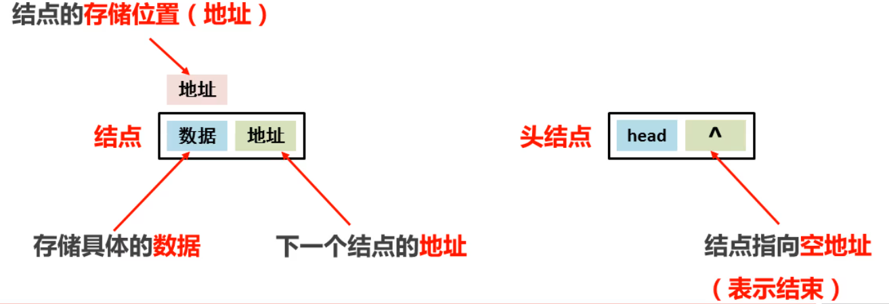
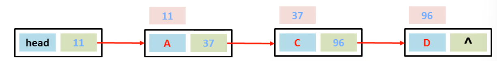
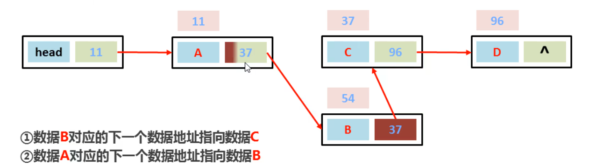
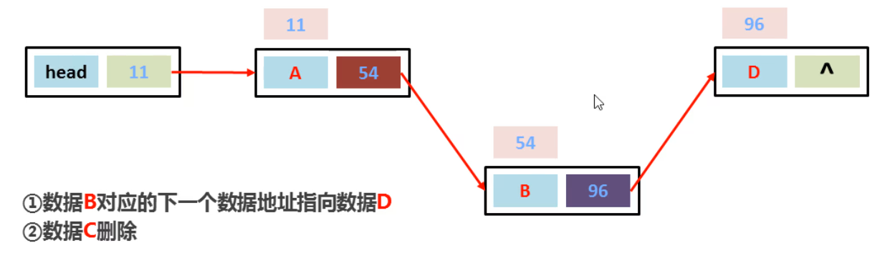
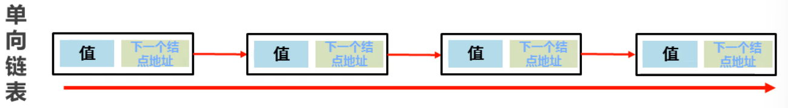
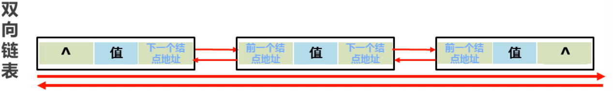

#### 常见数据结构之数组：

##### 

查询数据通过地址值和索引定位，查询任意数据耗时相同，**查询速度快**

删除数据时，要将原始数据删除，同时后面每个数据前移，**删除效率低**

添加数据时，添加位置后的每个数据后移，在添加元素，**添加效率极低**

##### 数组是一种查询快，增删慢的模型。

#### 常见数据结构之链表：

##### 添加数据

##### 插入数据:在数据AC之间添加一个数据B

##### 删除数据：删除BD之间的数据C

##### 链表是一种增删快的模型（对比数组）

##### 链表是一种查询慢的模型（对比数组）

##### 单向链表：查询数据，必须从头（head）开始查询

##### 双向链表：查询数据，会判断离头近还是离尾近，在开始查询

