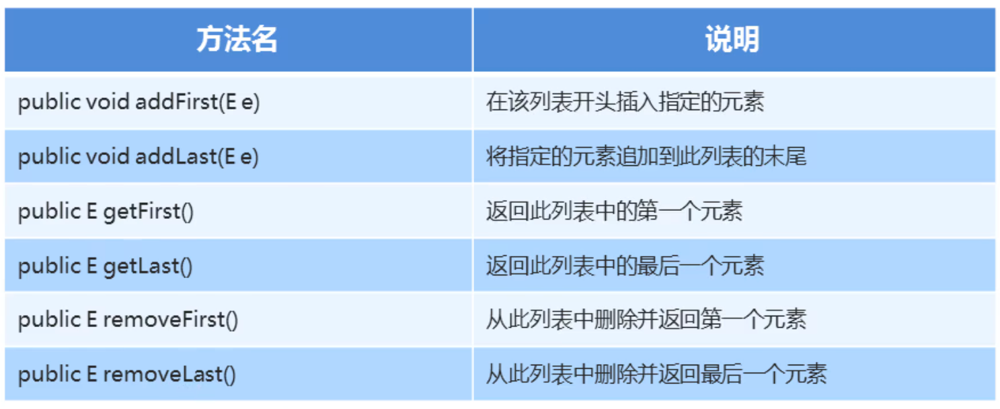

### 1.LinkedList集合的特有功能



##### 示例代码：

```java
package com.List;

import java.util.LinkedList;

public class MyListDemo_03 {
    public static void main(String[] args) {
        LinkedList list = new LinkedList();
        list.add("武大郎");
        list.add("戴瑞年");
        list.add("潘金莲");

        //pubic void addFirst(E e) 在该列表开头插入指定元素
        list.addFirst("武松");
        System.out.println(list);
        System.out.println("======================================");

        //public void addLast(E e) 将指定的元素追加到此列表的末尾
        list.addLast("鲁智深");
        System.out.println(list);
        System.out.println("======================================");

        //public E getFirst()   返回此列表中的第一个元素
        System.out.println(list.getFirst());
        System.out.println(list);
        System.out.println("======================================");

        //public E getLast  返回此列表中最后一个元素
        System.out.println(list.getLast());
        System.out.println(list);
        System.out.println("======================================");

        //public E removeFirest()       从此列表删除并返回第一个元素
        list.removeFirst();
        System.out.println(list);
        System.out.println("======================================");

        //public E removeLast()  从此列表中删除并返回最后一个元素
        System.out.println(list.removeLast());
        System.out.println(list);
    }
}
```