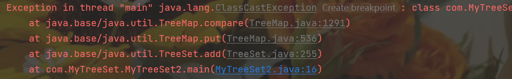

### 1.TreeSet集合概述和特点

TreeSet集合特点

- 不包含重复元素的集合
- 没有带索引的方法
- 可以将元素按照规则进行排序

##### TreeSet集合练习

- 存储Integer类型的整数，并遍历

```java
package com.MyTreeSet;

import java.util.TreeSet;

public class MyTreeSet1 {
    public static void main(String[] args) {
        /*
            TreeSet集合存储Integer类型
         */
        TreeSet<Integer> list = new TreeSet<>();
        list.add(11);
        list.add(33);
        list.add(22);

        list.forEach(s-> System.out.println(s));
    }
}
```

##### console:

11
22
33

- 存储学生对象，并遍历

  ```java
  package com.MyTreeSet;
  //学生类
  public class Student {
      private String name;
      private int age;
  
      public Student() {
      }
  
      public Student(String name, int age) {
          this.name = name;
          this.age = age;
      }
  
      public String getName() {
          return name;
      }
  
      public void setName(String name) {
          this.name = name;
      }
  
      public int getAge() {
          return age;
      }
  
      public void setAge(int age) {
          this.age = age;
      }
  
      @Override
      public String toString() {
          return "Student{" +
                  "name='" + name + '\'' +
                  ", age=" + age +
                  '}';
      }
  }
  ```

```java
package com.MyTreeSet;

import java.time.temporal.Temporal;
import java.util.TreeSet;

public class MyTreeSet2 {
    public static void main(String[] args) {
        /*
            TreeSet集合存储Student类型
         */
        TreeSet<Student> list = new TreeSet<>();
        Student stu1 = new Student("小花",11);
        Student stu2 = new Student("小花花",33);
        Student stu3 = new Student("小花红",22);

        list.add(stu1);
        list.add(stu2);
        list.add(stu3);

        //遍历
        for (Student student : list) {
            System.out.println(student);
        }
    }
}
```



##### 报错原因：想要使用TreeSet，需要制定排序规则