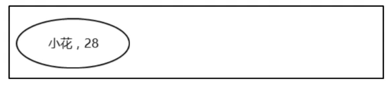
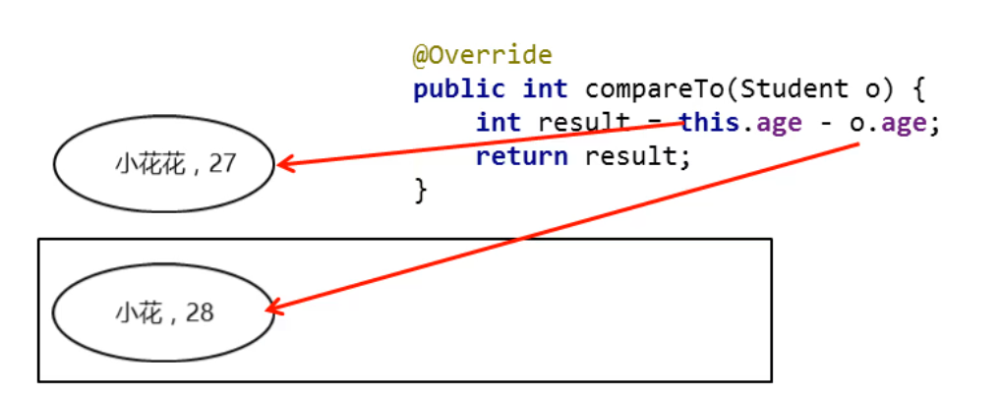
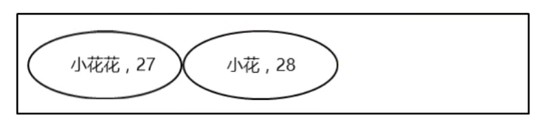
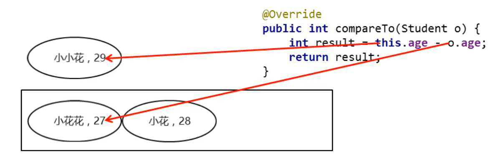
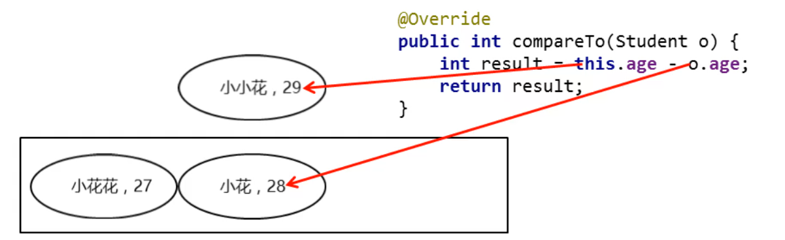

### 1.自然排序Comparable的使用

- 使用空参构造创建TreeSet集合
- 自定义的Student类实现Comparable接口
- 重写里面的CompareTo方法

##### 示例代码：

```java
package com.MyTreeSet;
//学生类
//实现 Comparable接口 泛型类型和数据类型一致
public class Student implements Comparable<Student>{
    private String name;
    private int age;

    public Student() {
    }

    public Student(String name, int age) {
        this.name = name;
        this.age = age;
    }

    public String getName() {
        return name;
    }

    public void setName(String name) {
        this.name = name;
    }

    public int getAge() {
        return age;
    }

    public void setAge(int age) {
        this.age = age;
    }

    @Override
    public String toString() {
        return "Student{" +
                "name='" + name + '\'' +
                ", age=" + age +
                '}';
    }


    @Override
    public int compareTo(Student o) {		//重写 Comparable接口compareTo 方法
        int result = this.age - o.age;
        return result;
    }
}
```

```java
package com.MyTreeSet;

import java.time.temporal.Temporal;
import java.util.TreeSet;

public class MyTreeSet2 {
    public static void main(String[] args) {
        /*
            TreeSet集合存储Student类型
            报错原因：想要使用TreeSet，需要制定排序规则
         */
        TreeSet<Student> list = new TreeSet<>();
        Student stu1 = new Student("小花",28);
        Student stu2 = new Student("小花花",27);
        Student stu3 = new Student("小小花",29);

        list.add(stu1);
        list.add(stu2);
        list.add(stu3);

        //遍历
        for (Student student : list) {
            System.out.println(student);
        }
    }
}
```

### 2.自然排序简单原理图

- 如果返回值为负数，表示当前存入的元素是较小值，存左边
- 如果返回值为0，表示当前存入的元素跟集合中元素重复了，不存
- 如果返回值为正数，表示当前存入的元素是较大值，存右边

##### 此时集合没有内容，小花就直接进去



##### 此时两个对象就需要比较了，27 - 28 = -1 结果为负数 小花花放在左边





##### 小小花和小花花进行比较，29 - 27 = 2 结果为正数，小小花放在左边



##### 此时左边有对象，继续比较，29 - 28 = 1，结果为正数，小小花放在左边




#### 练习：

需求：改下刚刚的学生案例

要求：按照年龄从小到大排，如果年龄一样，则按照姓名首字母排序，如果姓名和年龄一样，才认为是同一个对象，不存入

##### 示例代码：

```java
package com.MyTreeSet;
//学生类
public class Student implements Comparable<Student>{
    private String name;
    private int age;

    public Student() {
    }

    public Student(String name, int age) {
        this.name = name;
        this.age = age;
    }

    public String getName() {
        return name;
    }

    public void setName(String name) {
        this.name = name;
    }

    public int getAge() {
        return age;
    }

    public void setAge(int age) {
        this.age = age;
    }

    @Override
    public String toString() {
        return "Student{" +
                "name='" + name + '\'' +
                ", age=" + age +
                '}';
    }


    @Override
    public int compareTo(Student o) {
        //主要判断条件  按照对象的年龄进行排序
        int result = this.age - o.age;
        //次要判断条件  this.name.compareTo() 字符串里的compareTo方法 返回值 int  作用：按字典顺序比较两个字符串
        result = result == 0 ? this.name.compareTo(o.getName()) : result;
        return result;
    }
}
```

```java
package com.MyTreeSet;

import java.time.temporal.Temporal;
import java.util.TreeSet;

public class MyTreeSet2 {
    public static void main(String[] args) {
        /*
            TreeSet集合存储Student类型
            报错原因：想要使用TreeSet，需要制定排序规则
         */
        TreeSet<Student> list = new TreeSet<>();
        Student stu1 = new Student("zhangsan",28);
        Student stu2 = new Student("lisi",27);
        Student stu3 = new Student("wangwu",29);
        Student stu4 = new Student("zhaoliu",28);

        list.add(stu1);
        list.add(stu2);
        list.add(stu3);
        list.add(stu4);

        //遍历
        for (Student student : list) {
            System.out.println(student);
        }
    }
}
```

```java
package com.MyTreeSet;

public class MyTreeSet3 {
    public static void main(String[] args) {
        String s1 = "aaa";
        String s2 = "ab";

        /*
            首先比较第一个字母，如果第一个字母是一样的，那么继续比较后面的字母
            当不一样的时候，就拿着对应的码表值97，减去b的码表值 98  == -1
            认为a是比b要小的
        */
        System.out.println(s1.compareTo(s2));
    }
}
```