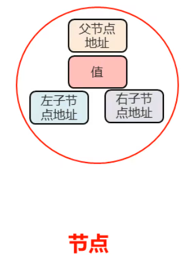
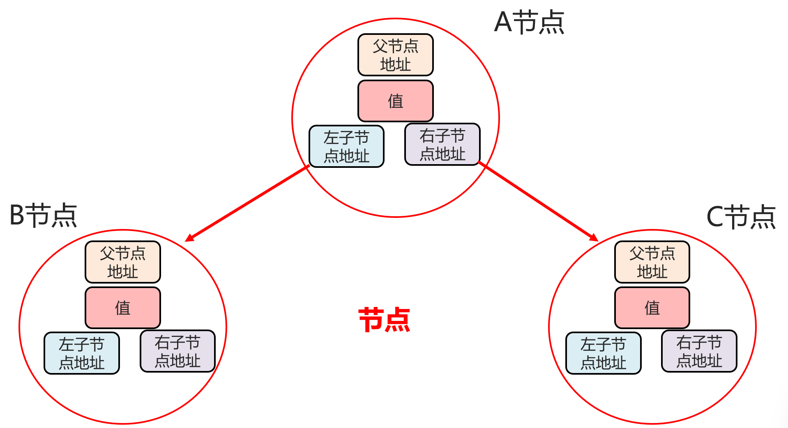
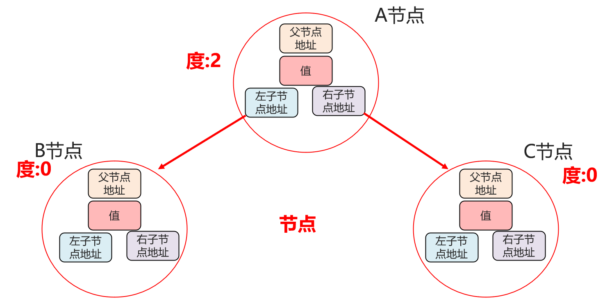
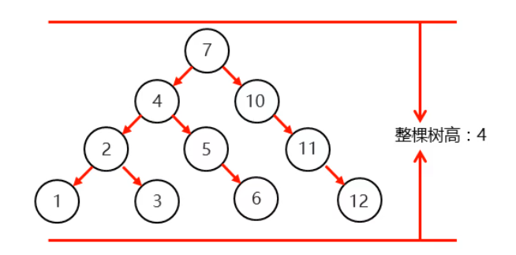
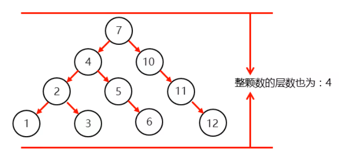
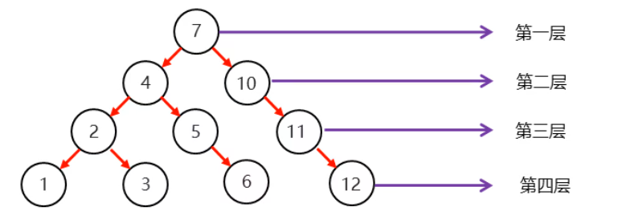
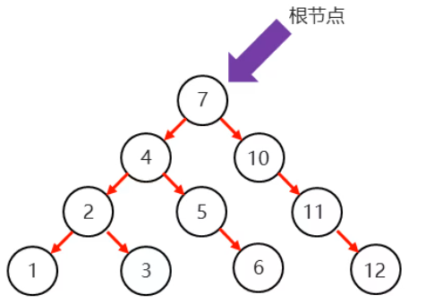
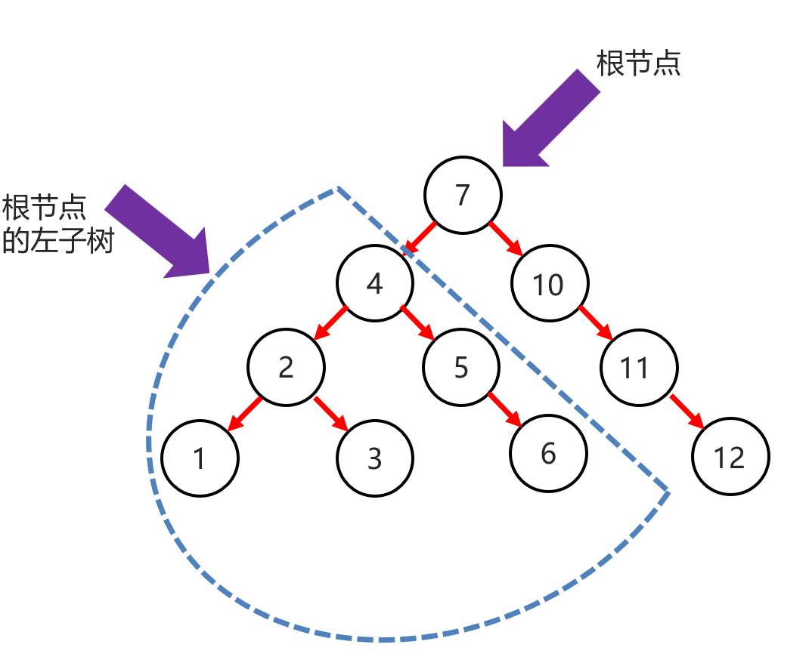
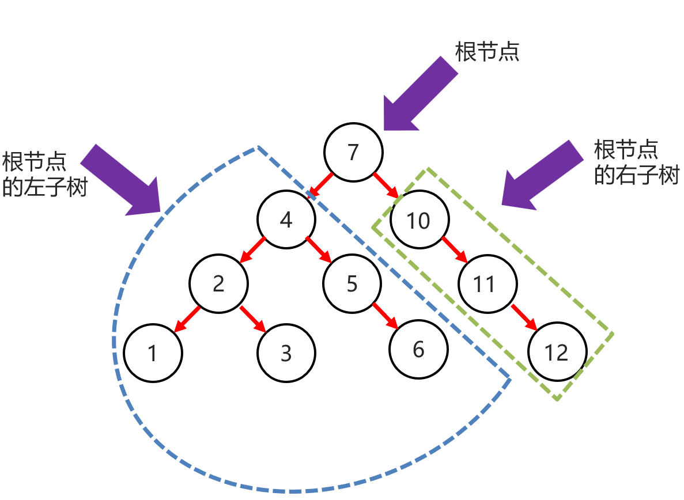

### 1.数据结构—二叉树

​	在树结构中元素我们会称之为节点，在每一个节点分为4个部分组成（父节点地址、值、左子节点地址、右子节点地址）

​    A节点是BC的父节点，BC是A的子节点，A节点的左子节点地址记录的是B节点的地址值，A节点的右子节点地址记录的是C节点的地址值，所以B节点是A节点的左子节点，C节点是A节点的右子节点，B节点的父节点地址记录的是A节点的地址值，C父节点地址记录的是A节点的地址值，一个节点如果没有父节点或者子节点，那么这个节点对应的位置即为null。

在树结构中每个节点的子节点数量称之为度,A节点度：2，B节点度：0，C节点度：0，二叉树中，任意一个节点的度要小于等于2

树高为4

整颗树的层数也为：4

总层数就是这颗树的高度

最顶层的为：根节点

4节点是7节点的左子节点

10节点为7节点的右子节点

蓝色虚线：跟节点的左子树

根节点的左子树高：3

绿色虚线：跟节点的右子树

根节点的左子树高：3

