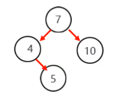

### 1.二叉查找树添加节点

##### 规则：

- 小的存左边
- 大的存右边
- 一样的不存

将下面的节点按照二叉查找树的规则存入

添加7节点，此时没有节点，7节点就是根节点

然后添加4这个节点，4 比 7 小 所以4节点此时要存入7节点的左边，4节点就是7节点的左子节点

然后添加10节点，10 比 7 大 所以10节点此时要存入7节点的右边，10节点就是7节点的右子节点

此时再添加一个5节点，5 比 10 小 所以5节点此时要存入7节点的左边，

此时发现7节点左子节点有4节点了，5节点就和4节点进行比较，5 比 4 大此时要存入4节点的右边，5节点就是4节点的右子节点

每一个节点再存入的时候，都是按照这个规则进行比较的，当子节点越来越多的时候，就渐渐的变成了一个树的形状，这个就是二叉查找树！

