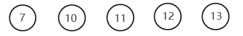
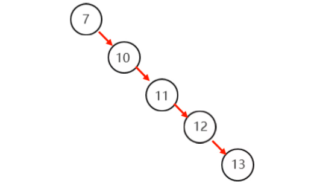
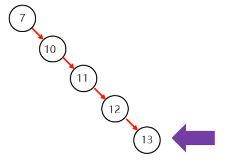
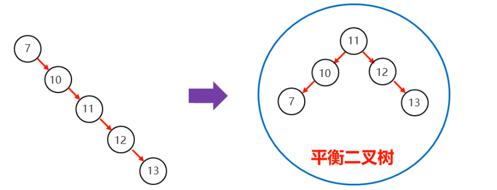
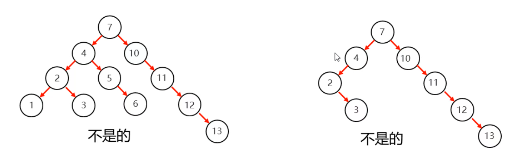
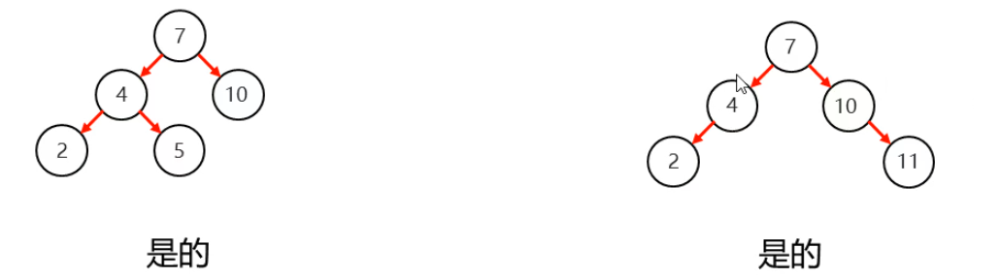

### 1.平衡二叉树

##### 将上面的节点按照二叉查找树的规则存入：

此时我们查找13的时候从根节点开始要查找五次才能找到13，效率比较慢

在二叉查找树的基础上，让左右子树的长度尽量相同，我们称为平衡二叉树

- 二叉树左右两个子树的高度差不超过1
- 任意节点的左右两个子树都是一个平衡二叉树

图1：10节点右子树高度为3，左子树高度为0，不是二叉平衡树   |图二： 四节点左子树高度为2 右子树高度为0不是二叉平衡树，10节点左子树高度为0，右子树高度为3

