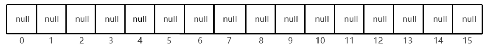
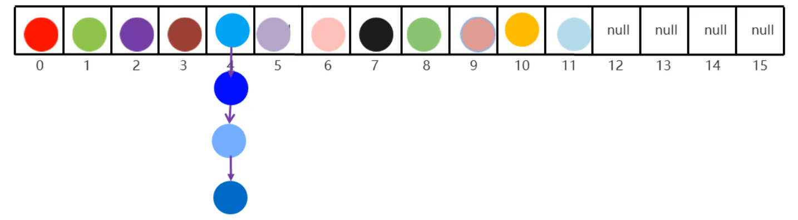

### 1.常见数据结构之哈希表

哈希表：

- JDK8之前，底层采用数组+链表实现。
- JDK8以后，底层进行了优化。由数组+链表+红黑树实现

### 2.HashSet1.7版本原理解析

```java
HashSet<String> hm = new HashSet<>();
```



1. 创建一个默认长度16，默认加载因子为0.75的数组，数组名table
2. 根据元素的哈希值跟数组的长度计算出应存入的位置
3. 判断当前位置是否null，如果是null直接存入
4. 如果应该存入的位置不为null，表示有元素，则调用equals方法比较属性值
5. 如果一样，则不存，如果不一样，则存入数组，老元素挂在新元素下面
6. 当数组里面存了16*0.75 = 12个元素的时候，数组就会扩容为原先得两倍

