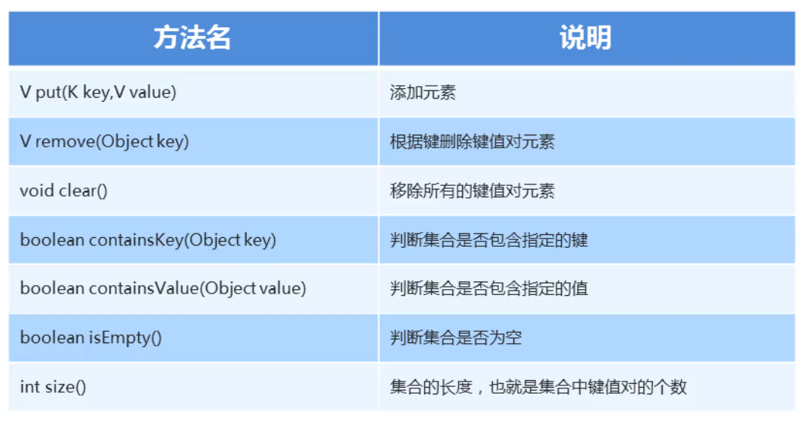

### 1.Map集合的常用方法



##### 示例代码：

```java
package com.mymap;

import java.util.HashMap;
import java.util.Map;

public class MyMap2 {
    public static void main(String[] args) {
        Map<String,String> map = new HashMap();
        // V put(K key,V value) 添加元素
        map.put("001","小美");
        map.put("002","小明");
        map.put("003","李华");
        map.put("004","小红");
        map.put("005","迈克");
        System.out.println(map); // {001=小美, 002=小明, 003=李华, 004=小红, 005=迈克}

        // V remove(Object key) 根据键删除键值对元素
        map.remove("002");
        System.out.println(map); // {001=小美, 003=李华, 004=小红, 005=迈克}


        // boolean containsKey(Object key) 判断集合是否包含指定的键
        System.out.println(map.containsKey("003")); //true


        // boolean containsValue(Object value) 判断集合是否包含指定的值
        System.out.println(map.containsValue("李华")); //true


        // boolean isEmpty() 判断集合是否为空
        System.out.println(map.isEmpty()); //false


        // int size()   集合的长度，也就是集合中键值对的个数
        System.out.println(map.size()); //4

        // void clear() 移除所有的键值对元素
        map.clear();
        System.out.println(map); //{}
    }
}
```

