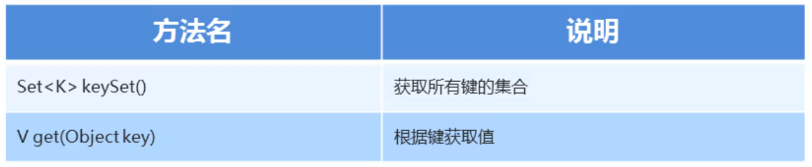
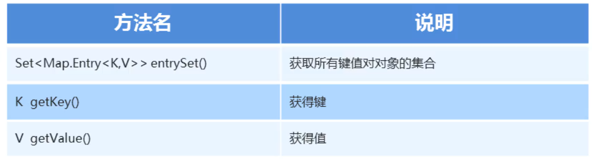

### 1.Map的第一种遍历方式



##### 示例代码：

```java
package com.mymap;

import java.util.HashMap;
import java.util.Map;
import java.util.Set;

//遍历Map

//Set<K> keySet()   获取所有键的集合
//V get(Object key) 根据键获取值
public class MyMap3 {
    public static void main(String[] args) {
        Map<String, String> map = new HashMap<>();

        map.put("001", "小美");
        map.put("002", "小明");
        map.put("003", "李华");
        map.put("004", "小红");
        map.put("005", "迈克");

        //获取所有的键
        Set<String> keys = map.keySet();
        //遍历Set集合得到每一个键
        for(String key:keys){
            //通过每一个键key，来获取对应的值
            String value = map.get(key);
            System.out.println(key + "-----" + value);
        }
    }
}
```

### 2.Map的第二种遍历方式



##### 示例代码：

```java
package com.mymap;

import java.util.HashMap;
import java.util.Map;
import java.util.Set;

//遍历Map的第二种方式

//Set<Map.Entry<K,V>> entrySet()   获取所有键值对象的集合
//K getKey()    获得键
//V getValue( ) 获得值
public class MyMap4 {
    public static void main(String[] args) {
        Map<String, String> map = new HashMap<>();

        map.put("001", "小美");
        map.put("002", "小明");
        map.put("003", "李华");
        map.put("004", "小红");
        map.put("005", "迈克");

        //获取所有键值对对象
        Set<Map.Entry<String, String>> entries = map.entrySet();
        //遍历Set集合得到每个键值对对象
        for (Map.Entry<String, String> entry : entries) {
            //键
            String key = entry.getKey();
            //值
            String vaulue = entry.getValue();
            //输出
            System.out.println(key +"-----"+ vaulue);
        }
    }
}
```