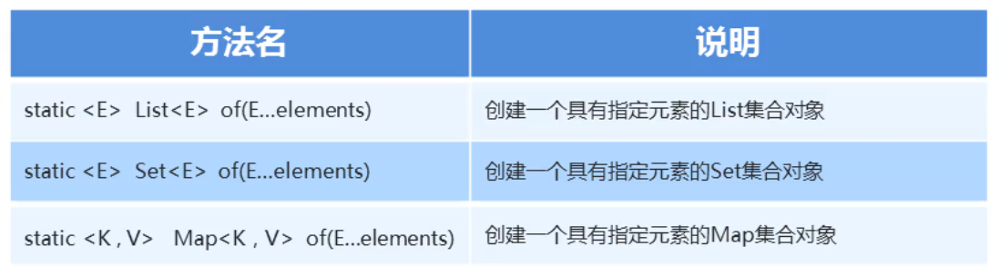

### 1.创建不可变集合



- 再List、Set、Map接口中，都存在of方法，可以创建一个不可变的集合
- 这个集合不能添加，不能删除，不能修改
- 但是可以结合集合的带参构造，实现集合的批量添加
- 在Map接口中，还有一个ofEntries方法可以提高代码的阅读性
- 首先会把键值对封装成一个Entry对象，再把这个Entry对象添加到集合当中

##### 示例代码：

```java
package com.variableparameter;

import java.util.ArrayList;
import java.util.List;
import java.util.Map;
import java.util.Set;

//不可变集合
public class Demo1 {
    public static void main(String[] args) {
        //static <E> List<E> of(E...elements)   创建一个具有指定元素的List集合对象
        /*
        List<String> list = List.of("a", "b", "c", "d", "e");
        //list.add("f");  //UnsupportedOperationException
        //list.remove("a"); //UnsupportedOperationException
        //list.set(2,"A");        //UnsupportedOperationException
        //System.out.println(list);

        //添加数据需要一个一个手动添加
        ArrayList<String> list2 = new ArrayList<>();
        list2.add("aa");
        list2.add("bb");
        list2.add("cc");
        list2.add("dd");
        System.out.println(list2);

        //集合的批量添加
        //首先通过调用List.of方法来创建一个不可变的集合，of方法的形参就是一个可变参数
        //再创建一个ArrayList集合，并把这个不可变的集合中所有的数据，都添加到ArrayList中
        ArrayList<String> list3 = new ArrayList<>(List.of("a", "b", "c", "d", "e"));
        System.out.println(list3);
        */


        //static <E> Set<E> of(E...elements)    创建一个具有指定元素的Set集合对象
        /*
        传递的参数当中，不能存在重复的元素
        Set<String> set = Set.of("a", "b", "c", "d", "e", "a");   //IllegalArgumentException
        System.out.println(set);
        */

        //static <K , V> Map(K, V) of(E...elements)  创建一个具有指定元素的Map集合对象
        Map<String,String> map = Map.of("zhangsan","上海","lisi","天津","wangwu","云南");
        System.out.println(map);

        Map<String,Integer> map1 = Map.ofEntries(
                Map.entry("小花",22),
                Map.entry("大花",25));
        System.out.println(map1);
    }
}
```