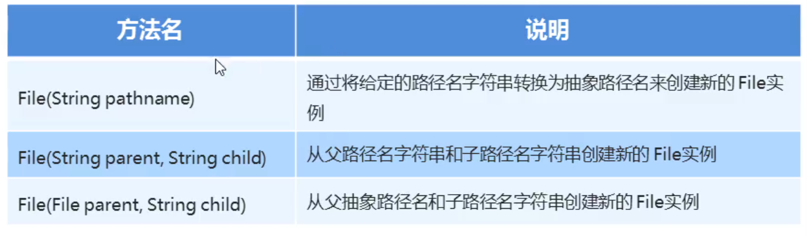

### 1.File类概述和构造方法

File：它是文件和目录路径名的抽象表示

- 文件和目录可以通过File封装成对象
- File封装的对象仅仅是一个路径名，它可以是存在的，也可以是不存在的



##### 实例代码：

```java
package com.myfile;

import java.io.File;

public class fileDemo1 {
    public static void main(String[] args) {
        //File(String pathname) 通过将给定的路径名字字符串转换为抽象路径名来创建新的File实例
        String path = "D:\\aaa\\a.txt";
        File file = new File(path);
        System.out.println(file);   //D:\aaa\a.txt
        //问题：为什么要把字符串表示形式的路径变成File对象
        //是为了使用File类里面的方法


        //File(String parent,String child)  从父路径名字字符串和子路径名字字符串创建新的File实例
        String path1 = "D:\\aaa";
        String path2 = "a.txt";
        File file1 = new File(path1, path2); //把两个路径拼接起来
        System.out.println(file1);  //D:\aaa\a.txt

        //File(File parent,String child)    从父抽象路径名和子路径名字字符串创建新的File实例

        File file3 = new File("D:\\aaa");
        String path3 = "a.txt";
        File file4 = new File(file3,path3);
        System.out.println(file4);  //D:\aaa\a.txt

    }
}
```