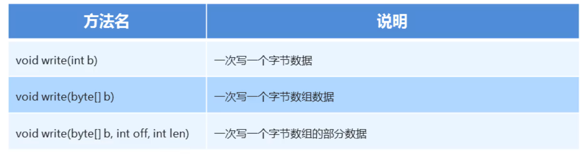

### 1.字节流写数据的3种方式



```java
package com.io;

import java.io.File;
import java.io.FileOutputStream;
import java.io.IOException;

public class Demo2 {
    public static void main(String[] args) throws IOException {
        FileOutputStream fos = new FileOutputStream(new File("D:\\a.txt"));

        /* 一次写一个字节数组
             byte[] bytes = {99,99,100,101,102,103};
             fos.write(bytes);
        */
        byte[] bytes = {99,99,100,101,102,103};
        fos.write(bytes,1,2);
        //off: 从第一个索引开始写
        //len: 写几个数据
        //3.释放资源 每次使用完流必须要释放资源
        fos.close();
    }
}
```