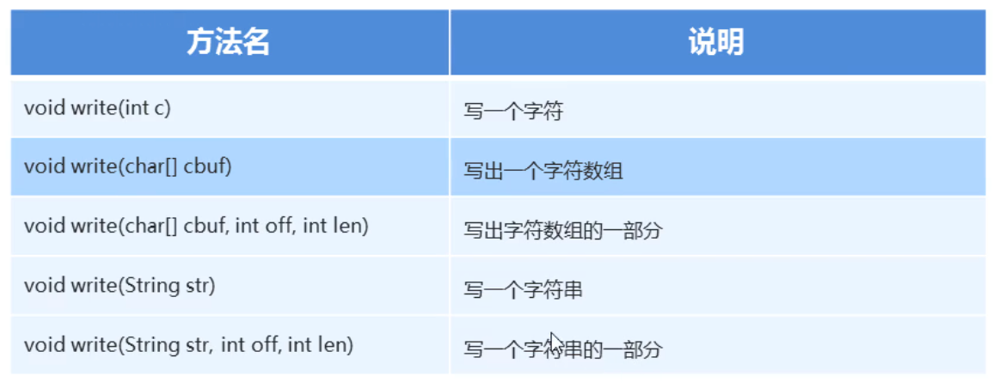

### 1.字符流写数据的5种方式



##### 示例代码：

```java
package com.charstream;

import java.io.File;
import java.io.FileWriter;
import java.io.IOException;

public class CharStreamDemo1 {
    public static void main(String[] args) throws IOException {

        //1.创建字符输出流的对象
        //FileWriter fw = new FileWriter(new File("day20\\a.txt"));
        FileWriter fw = new FileWriter("day20\\a.txt");

        //2.写数据 （四种方式）

        /*//void write (int c)    写一个字符
        fw.write(97);
        fw.write(98);
        fw.write(99);*/


       /* //void write (char[] cbuf)  写出一个字符数组
        char[] chars = {97, 98, 99, 100, 101};
        fw.write(chars);*/

        /*//void write (char[] cbuf ,int off,int len)   写出字符数组的一部分
        char[] chars = {97, 98, 99, 100, 101};
        fw.write(chars,1,2);*/

        /*//void write (Strinf str)     写一个字符串
        String s = "为实现中华民族伟大复兴的中国梦而努力奋斗！";
        fw.write(s);*/

       /* //void write (Strinf str,int off,int len)   写一个字符串的一部分
        String s = "国家尚未富强，岂能儿女情长！";
        fw.write(s,7,7);*/


        //3.释放资源
        fw.close();

    }
}
```

### 2.字符输出流-注意事项

步骤：

1. 创建字符输出流对象
   - 注意事项：
     - 如果文件不存，就创建，但是要保证父级路径存在
     - 如果文件存在就清空
2. 写数据
   - 注意事项
     - 写出int类型的整数，实际写出的是整数在码表中对应的字母
     - 写出字符串数据，是把字符串本身原样写出
3. 释放资源
   - 注意事项
     - 每次使用完流必须要释放资源

