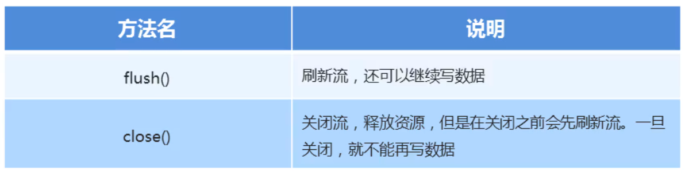

### 1.flush和close方法



##### 示例代码：

```java
package com.charstream;


import java.io.FileWriter;
import java.io.IOException;

public class CharStreamDemo2 {
    public static void main(String[] args) throws IOException {
        //flush()刷新流，刷新完毕之后，还可以继续写数据
        //close()关闭流，释放资源。一旦关闭，就不能写数据

        //创建字符输出流对象
        FileWriter fw = new FileWriter("day20\\a.txt");

        //写数据
        fw.write("为实现中华民族伟大复兴的中国梦而努力奋斗！");
        //没有释放资源前，数据还没有真正写到文件，使用flush()方法可以将数据刷新到本地文件当中，使用完可以继续写数据
        fw.flush();
        fw.write("总要有人去振兴中华的！");
        fw.flush();

        //释放资源
        //关闭流，在关闭之前，也会执行刷新操作，数据也会刷新到本地文件当中，流一旦被关闭了就不可以在写数据了
        fw.close();
        fw.write("111");  //Stream close 
    }
}
```