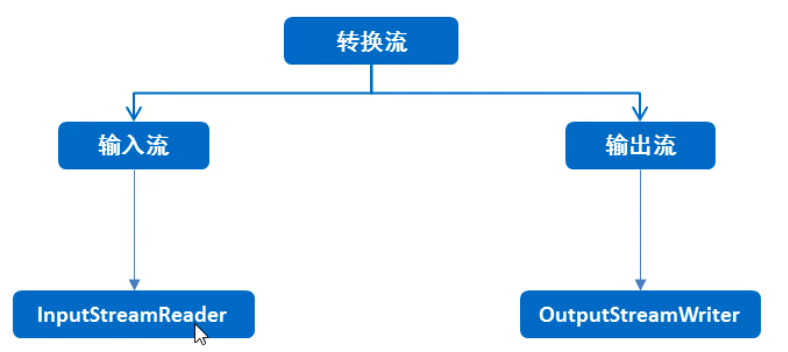
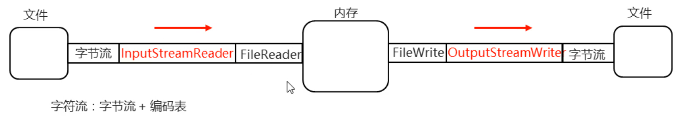

### 1.转换流

- InputStreamReader是从字节流到字符流的桥梁：它读取字节，并使用指定的charset将其解码为字符。  它使用的字符集可以由名称指定，也可以被明确指定，或者可以接受平台的默认字符集。

- OutputStreamWriter是从字符流到字节流的桥梁：使用指定的charset将写入的字符编码为字节。  它使用的字符集可以由名称指定，也可以被明确指定，或者可以接受平台的默认字符集。

##### 图解：

