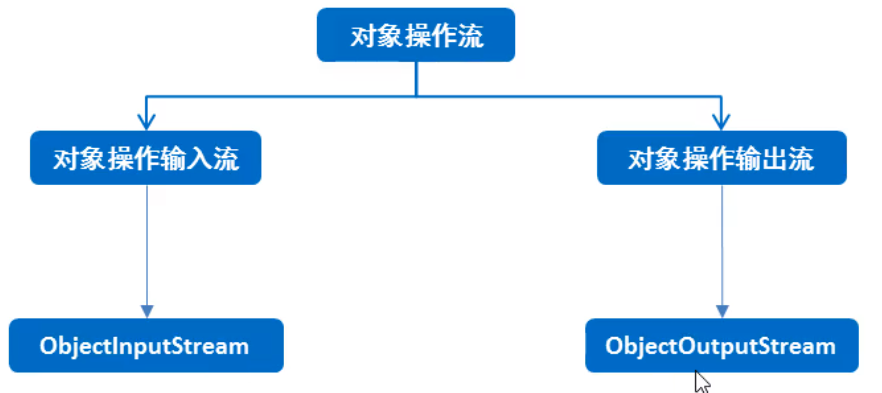

#### 1.对象操作流

可以对象以字节的形式写到本地文件，直接打开文件，是读不懂得，需要再次用对象操作流读到内存中，



对象操作流分为两类：对象操作输入流和对象操作输出流

- 对象操作输出流（对象序列化流）：就是将对象写到本地文件中，或者网络中传输对象
- 对象操作输出流（对象反序列化流）：把写到本地文件中得对象读到内存中，或者接收网络中传输的对象

```java
package com.convertedio;

import java.io.Serializable;

//如果想要这个类的对象能被序列化，那么这个类必须要实现一个接口 Serializable
//Serializable 接口的意义
//称之为是一个标记性接口，里面没有任何的抽象方法
//只要一个类实习了这个Serializable接口，那么就表示这个类的对象可以被序列化
public class User implements Serializable {
    private String username;
    private String password;

    public User() {
    }

    public User(String username, String password) {
        this.username = username;
        this.password = password;
    }

    public String getUsername() {
        return username;
    }

    public void setUsername(String username) {
        this.username = username;
    }

    public String getPassword() {
        return password;
    }

    public void setPassword(String password) {
        this.password = password;
    }

    @Override
    public String toString() {
        return "User{" +
                "username='" + username + '\'' +
                ", password='" + password + '\'' +
                '}';
    }
}
```

```java
package com.convertedio;

import java.io.FileOutputStream;
import java.io.IOException;
import java.io.ObjectOutputStream;

public class ConvertedDemo2 {
    public static void main(String[] args) throws IOException {
        //创建对象
        User user = new User("张三", "123456");
        //创建对象输出流对象
        ObjectOutputStream oos = new ObjectOutputStream(new FileOutputStream("a.txt"));

        //写入数据
        oos.writeObject(user);
        //释放资源
        oos.close();
    }
}
```

```java
package com.convertedio;

import java.io.FileInputStream;
import java.io.IOException;
import java.io.ObjectInputStream;

public class ConvertedDemo3 {
    public static void main(String[] args) throws IOException, ClassNotFoundException {
        //创建输入流对象
        ObjectInputStream ois = new ObjectInputStream(new FileInputStream("a.txt"));
        //读取数据 不管是什么对象读进来都是Object类型
        //使用强制类型转换
        User o = (User) ois.readObject();
        //打印数据
        System.out.println(o);
        //释放资源
        ois.close();
    }
}
```