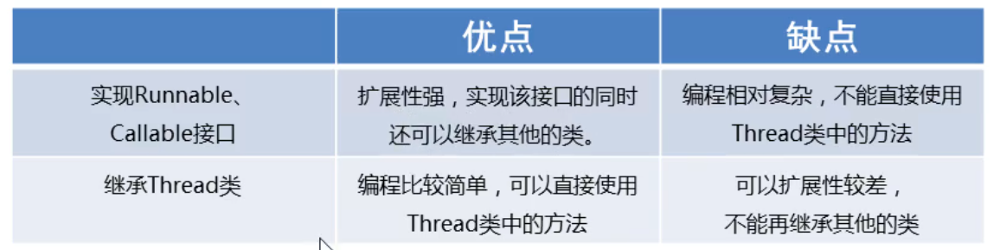

### 1.多线程的实现方案

- 继承Thread类的方式进行实现
- 实现Runnable接口的方式进行实现
- 利用Callable和Future接口方式实现

#### Thread类常用方法：

##### 获取线程的名字：

- String getName()：返回此线程的名称

##### Thread类中设置线程的名字：

- void setName(String name)：将此线程的名称更改为等于参数name
- 通过构造方法也可以设置线程名称

##### 获得当前线程的对象：

- public static Thread currentThread()：返回当前对正在执行的线程对象的引用

##### 线程休眠：

- public static void sleep(long time)：让线程休眠指定所谓时间，单位为毫秒

##### 线程的优先级：

多线程的并发运行：

​	计算机的CPU，在任意时刻只能执行一条机器指令，每个线程只有获得CPU的使用权才能执行代码，各个线程轮流获得CPU的使用权，分别执行各自的任务

线程有两种调度模型：

1. 分时调度模型：所有线程轮流使用CPU的使用权，平均分配每个线程占用CPU的时间片
2. 抢占式调度模型：优先让优先级高的线程使用CPU，如果线程的优先级相同，那么随机选择一个，优先级高的线程获取的CPU时间片相对多一些

- public final void setPriority(int newPriority)  设置线程的优先级
- public final int getPriority()     获取线程的优先级

#### 方案一：继承Thread类

- 定义一个MyThread继承Thread类
- 在MyThread类中重写run()方法
- 创建MyThread类的对象
- 启动线程

##### 示例代码：

```java
package com.threadstartdemo;
//继承的弊端：只能单继承
public class MyThread extends Thread{
    //重写run方法
    //run方法中写就是业务逻辑
    //getName() 当前执行任务线程的名字
    @Override
    public void run() {
        //代码就是线程在开启之后执行的代码
        for (int i = 0; i < 100; i++) {
            System.out.println(getName()+":我开始执行了"+i);
        }
    }
}

```

```java
package com.threadstartdemo;

public class MyThreadDemo {
    public static void main(String[] args) {
        //创建线程对象
        MyThread myThread1 = new MyThread();
        MyThread myThread2 = new MyThread();

        //开启多线程，不能直接调用run方法,要使用start方法
            //start 方法是开启多线程任务
            //run方法只是执行一个普通的任务
            //setName(参数) 给线程设置一个名字，不设置系统会有默认的名字
        //给线程起个名字
        myThread1.setName("法外狂徒戴瑞年");
        myThread2.setName("罗翔");

        //开启线程
        myThread1.start();
        //开启第二条线程
        myThread2.start();
        
        /*myThread1.run();
        myThread2.run();*/
    }
}
```

注意点：

- 多线程程序涉及到CPU的切换，CPU在多个线程做切换是随机的，每次的运行结果是有可能不同的
- 线程是有默认名字的，格式：Thread-编号
- 优先级的范围是1~10 ，默认优先级5，线程的优先级越高，只是抢占CPU的几率更高

##### 两个小问题：

- 为什么要重写run()方法
  - 因为run()是用来封装被线程执行的代码
- run()方法和start()方法的区别？
  - run()：封装线程执行的代码，直接调用，相当于普通方法的调用，并没有开启线程
  - start()：启动线程；然后由JVM调用此线程的run方法

#### 方案二：实现Runnable接口

- 定义一个类MyRunnable实现Runnable接口
- 在MyRunnable类中重写run()方法
- 创建MyRunnable类的对象
- 创建Thread类的的对象，把MyRunnable对象作为构造方法的参数
- 启动线程

##### 示例代码：

```java
package com.threadstartdemo;

public class MyRunnable implements Runnable {
    //实现接口的时候获取线程名字
    //Thread thread = Thread.currentThread(); 获取当前正在执行任务的线程对象
    //thread.getName(); 获取线程的名字
    @Override
    public void run() {
        //线程启动后执行的代码
        for (int i = 0; i < 100; i++) {
            System.out.println(Thread.currentThread().getName() + "我开始执行:" + i);
        }
    }
}

```

```java
package com.threadstartdemo;

public class MyRunnableDemo {
    public static void main(String[] args) {
        //创建了一个参数对象
        MyRunnable myRunnable = new MyRunnable();
        //通过Tread类去开启线程
        //创建了一个线程对象，并把参数传递给这个线程
        //在线程启动后，执行的就是参数里面的run方法
        Thread thread1 = new Thread(myRunnable);
        Thread thread2 = new Thread(myRunnable);
        //给当前执行任务的现在起名字
        thread1.setName("罗翔老师");
        thread2.setName("法外狂徒戴瑞年");

        //开启线程
        thread1.start();
        thread2.start();

    }
}
```

#### 方案三：Callable和Future

- 定义一个类MyCallable实现Callable接口
- 在MyCallable类中重写call()方法
- 创建MyCallable类的对象
- 创建Future的实现类FutureTask对象，把MyCallable对象作为构造方法的参数
- 启动线程

##### 示例代码：

```java
package com.threadstartdemo;

import java.util.concurrent.Callable;

public class MyCallable implements Callable<String > {
    @Override
    public String call() throws Exception {
        for (int i = 1; i <= 50; i++) {
            System.out.println(Thread.currentThread().getName()+"炒西红柿炒蛋第："+i+"次");
            //让线程睡一会 sleep 毫秒
            Thread.sleep(1000);
        }
        return Thread.currentThread().getName()+"你已经炒西红柿炒蛋50次了，可以出师了！";
    }
}
```

```java
package com.threadstartdemo;

import java.util.concurrent.ExecutionException;
import java.util.concurrent.FutureTask;

public class MyCallableDemo {
    public static void main(String[] args) throws ExecutionException, InterruptedException {
        MyCallable myCallable = new MyCallable();
        //创建一个中间媒介
        FutureTask<String> futureTask1 = new FutureTask<String>(myCallable);
        FutureTask<String> futureTask2 = new FutureTask<String>(myCallable);
        //创建Thread类
        Thread thread1 = new Thread(futureTask1);
        Thread thread2 = new Thread(futureTask2);

        //开启线程
        thread1.start();
        thread2.start();

        //设置名字
        thread1.setName("法外狂徒戴瑞年");
        thread2.setName("罗翔老师");

        //get() 获取callable的返回值
        String s1 = futureTask1.get();
        String s2 = futureTask2.get();
        //输出callable的返回值
        System.out.println(s1);
        System.out.println(s2);

    }
}
```

### 三种方式的对比：



