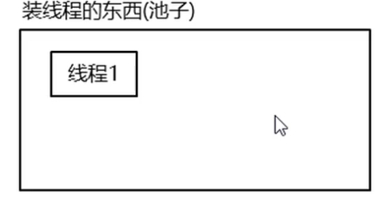
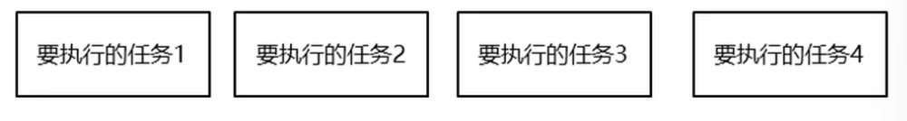

### 1.以前写多线程的弊端

```java
package com.threadstartdemo;

public class MyThread extends Thread{

    @Override
    public void run() {
        //代码就是线程在开启之后执行的代码
        for (int i = 0; i < 100; i++) {
            System.out.println(getName()+":我开始执行了"+i);
        }
    }
}
```

```java
package com.threadstartdemo;

public class MyThreadDemo {
    public static void main(String[] args) {
        //创建线程对象
        MyThread myThread1 = new MyThread();
        MyThread myThread2 = new MyThread();
        //开启线程
        myThread1.start();
        //开启第二条线程
        myThread2.start();
    }
}
```

弊端：

- 用到线程的时候就创建
- 用完以后线程消失

### 2.解决方案：





- 创建一个池子，池子是空的
- 有任务需要执行时，才会创建线程对象，当任务执行完毕，线程对象归还给池子

### 3.线程池-Executors默认线程池

```java
static ExecutorService newCathedThreadPool()  创建一个默认的线程池  
```

步骤：

- 创建一个池子，池子中是空的   ----------------------》   创建Executors中的静态方法
- 有任务需要执行时，创建线程对象，任务执行完毕，线程对象归还给池子 --------------》 submit方法 池子会自动帮我们创建对象，任务执行完毕，也会自动把线程对象归还池子
- 所有任务全部执行完毕，变比连接池 ----------------------》 shutdown方法

```java
package com.mythreadpool;

import java.util.concurrent.ExecutorService;
import java.util.concurrent.Executors;

/*
    static ExecutorService newCathedThreadPool()  创建一个默认的线程池
    static newFixedThreadPool(int nThreads) 创建一个指定最多线程数据量的线程池
*/
public class MyThreadPoolDemo {
    public static void main(String[] args) throws InterruptedException {
        //1.创建一个默认的线程池对象，池子中默认是空的，默认最多可以容纳int类型的最大值
        ExecutorService executorService = Executors.newCachedThreadPool();
        //Executors ---- 可以帮助我们创建线程池对象
        //ExecutorService  ---- 可以帮助我们控制线程池

        executorService.submit(()->{
            System.out.println(Thread.currentThread().getName() + "在执行了") ;
        });

        Thread.sleep(2000);

        executorService.submit(()->{
            System.out.println(Thread.currentThread().getName() + "在执行了") ;
        });

        executorService.shutdown();
    }
}
```

### 4.线程池Executors创建指定上限的线程池

```java
static newFixedThreadPool(int nThreads) 创建一个指定最多线程数据量的线程池  
```

```java
package com.mythreadpool;

import java.util.concurrent.ExecutorService;
import java.util.concurrent.Executors;
import java.util.concurrent.ThreadPoolExecutor;

/*
    static newFixedThreadPool(int nThreads) 创建一个指定最多线程数据量的线程池
*/
public class MyThreadPoolDemo2 {
    public static void main(String[] args) throws InterruptedException {
        //参数不是初始值，而是最大值
        ExecutorService executorService = Executors.newFixedThreadPool(10);

        ThreadPoolExecutor pool = (ThreadPoolExecutor) executorService;
        System.out.println(pool.getPoolSize()); // 0

        executorService.submit(()->{
            System.out.println(Thread.currentThread().getName() + "在执行了") ;
        });


        executorService.submit(()->{
            System.out.println(Thread.currentThread().getName() + "在执行了") ;
        });

        System.out.println(pool.getPoolSize()); // 2

        executorService.shutdown();
    }
}
```

### 5.线程池-ThreadPoolExecutor

```java
ThreadPoolExecutor pool = new ThreadPoolExecutor(核心线程数量,最大线程数,空闲线程最大存活时间,时间单位,任务队列,创建线程工厂,任务的拒绝策略);
```

##### 示例代码：

```java
package com.mythreadpool;


import java.util.concurrent.ArrayBlockingQueue;
import java.util.concurrent.Executors;
import java.util.concurrent.ThreadPoolExecutor;
import java.util.concurrent.TimeUnit;

public class MyThreadPoolDemo3 {
/*
        参数一：核心线程数量  ---> 不能小于0
        参数二：最答线程数 ---> 不能小于等于0，最大数量>=核心线程数量
        参数三：空闲线程最大存活时间 --->  不能小于0
        参数四：时间单位 --->  时间单位 ---> TimeUnit
        参数五：任务队列  ---> 不能为null ---> 让任务在队列中等着，等有线程空闲了，再从这个队列中获取任务并执行
        参数六：创建线程工厂  ---> 不能为null ---> 按照默认的方式创建线程对象
        参数七：任务的拒绝策略  ---> 不能为null ---> 1.什么时候拒绝任务 当提交任务 > 池子中最大线程数量 + 队列容量
                                                2.如何拒绝
*/
    public static void main(String[] args) {
        ThreadPoolExecutor pool = new ThreadPoolExecutor(2,5,2, TimeUnit.SECONDS,
                new ArrayBlockingQueue<>(10), Executors.defaultThreadFactory(),new ThreadPoolExecutor.AbortPolicy());

    pool.submit(new MyRunnable());

    pool.submit(new MyRunnable());

    pool.shutdown();
    }
}
```

```java
package com.mythreadpool;


import java.util.concurrent.ArrayBlockingQueue;
import java.util.concurrent.Executors;
import java.util.concurrent.ThreadPoolExecutor;
import java.util.concurrent.TimeUnit;

public class MyThreadPoolDemo4 {
    /*
     参数七：任务的拒绝策略  ---> 不能为null ---> 1.什么时候拒绝任务 当提交任务 > 池子中最大线程数量 + 队列容量
                                               2.如何拒绝
        ThreadPoolExecutor.AbortPolicy：丢弃任务并抛出RejectedExecutionException异常，是默认的策略
        ThreadPoolExecutor.DiscardPolicy：丢弃任务，但是不抛出异常，这是不推荐的做法
        ThreadPoolExecutor.DiscardOldestPolicy：抛弃队列中等待最久的任务，然后把当前任务加入队列中
        ThreadPoolExecutor.CallerRunsPolicy：调用任务的run()方法绕过线程池直接执行

    */
    public static void main(String[] args) {
        ThreadPoolExecutor pool = new ThreadPoolExecutor(2, 5, 2, TimeUnit.SECONDS,
                new ArrayBlockingQueue<>(10), Executors.defaultThreadFactory(), new ThreadPoolExecutor.AbortPolicy());

        for (int i = 0; i < 16; i++) {
            pool.submit(new MyRunnable());

        }

        pool.shutdown();
    }
}
```

#### 非默认任务拒绝策略：

```java
package com.mythreadpool;


import java.util.concurrent.ArrayBlockingQueue;
import java.util.concurrent.Executors;
import java.util.concurrent.ThreadPoolExecutor;
import java.util.concurrent.TimeUnit;

public class MyThreadPoolDemo5 {
    /*
        ThreadPoolExecutor.DiscardPolicy：丢弃任务，但是不抛出异常，这是不推荐的做法
    */
    public static void main(String[] args) {
        ThreadPoolExecutor pool = new ThreadPoolExecutor(2, 2, 2,
                TimeUnit.SECONDS,
                new ArrayBlockingQueue<>(5),
                Executors.defaultThreadFactory(),
                new ThreadPoolExecutor.DiscardPolicy());

        for (int i = 0; i < 16; i++) {
            pool.submit(new MyRunnable());

        }
        pool.shutdown();
    }
}
```

```java
package com.mythreadpool;


import java.util.concurrent.ArrayBlockingQueue;
import java.util.concurrent.Executors;
import java.util.concurrent.ThreadPoolExecutor;
import java.util.concurrent.TimeUnit;

public class MyThreadPoolDemo6 {
    /*
        ThreadPoolExecutor.DiscardOldestPolicy：抛弃队列中等待最久的任务，然后把当前任务加入队列中
    */
    public static void main(String[] args) {
        ThreadPoolExecutor pool = new ThreadPoolExecutor(2, 2, 2,
                TimeUnit.SECONDS,
                new ArrayBlockingQueue<>(1),
                Executors.defaultThreadFactory(),
                new ThreadPoolExecutor.DiscardOldestPolicy());

        for (int i = 0; i < 16; i++) {
            int y = i;
            pool.submit(()->{
                System.out.println(Thread.currentThread().getName()+"----"+y);
            });
        }
        pool.shutdown();
    }
}
```

```java
package com.mythreadpool;


import java.util.concurrent.ArrayBlockingQueue;
import java.util.concurrent.Executors;
import java.util.concurrent.ThreadPoolExecutor;
import java.util.concurrent.TimeUnit;

public class MyThreadPoolDemo7 {
    /*
         ThreadPoolExecutor.CallerRunsPolicy：调用任务的run()方法绕过线程池直接执行
    */
    public static void main(String[] args) {
        ThreadPoolExecutor pool = new ThreadPoolExecutor(2, 2, 2,
                TimeUnit.SECONDS,
                new ArrayBlockingQueue<>(1),
                Executors.defaultThreadFactory(),
                new ThreadPoolExecutor.CallerRunsPolicy());

        for (int i = 0; i < 16; i++) {
            int y = i;
            pool.submit(()->{
                System.out.println(Thread.currentThread().getName()+"----"+y);
            });
        }
        pool.shutdown();
    }
}
```