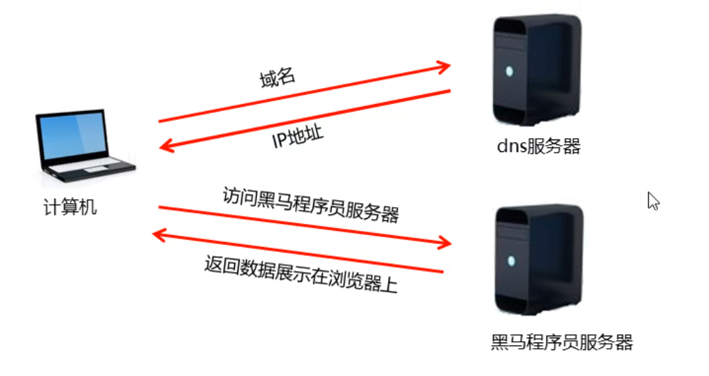
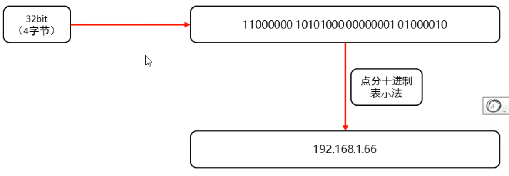
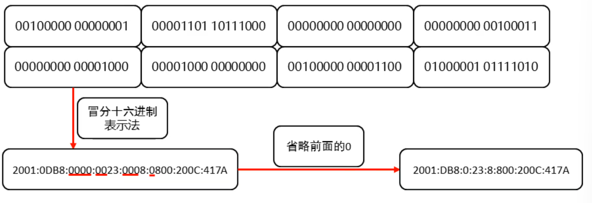
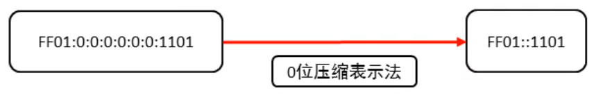

### 1.网络编程概述

网络编程：

- 在网络通信协议下，不同计算机运行的程序，可以进行数据传输

### 2.网络编程三要素：

IP地址：

- 设备在网络中的地址，是唯一的标识

端口：

- 应用程序在设备中唯一的标识

协议：

- 数据在网络中传输的规则，常见的协议有UDP协议和TCP协议

### 3.IP

IP:全称"互联网协议地址"，也称IP地址，是分配给上网设备的数字标签，常见的IP分类为：ipv4和ipv6



- IPv4：



- IPv6：由于互联网的蓬勃发展，IP地址的需求量愈来愈大，而IPv4的模式下IP的总数是有限的。采用1228为地址长度，分成8组



特殊情况：如果计算出的16进制表示形式中间有多个连续的0



#### 常用命令：

- ipconfig：查看本机地址
- ping 地址：检查网络是否连通

#### 特殊IP地址：

- 127.0.0.1：是回送地址也称本地回环地址，可以代表本机的IP地址，一般用来测试使用

### 4.InetAddress的使用

​		为了方便我们对IP地址的获取和操作，Java提供了一个类InetAddress供我们使用

```java
package com.InetAddress;

import java.net.InetAddress;
import java.net.UnknownHostException;

public class Demo1 {
    public static void main(String[] args) throws UnknownHostException {
        /*
            static InetAddress getByName(String host)  确定主机名称的IP地址。主机名称可以是机器名称，也可以是IP地址
            String getHostName()  获取此IP地址的主机名
            String getHostAddress() 返回文本显示中的IP地址字符串
        */

        InetAddress address = InetAddress.getByName("GL");

        String hostName = address.getHostName();
        System.out.println("主机名称："+hostName);
        String ip = address.getHostAddress();
        System.out.println("ip:"+ip);


    }
}
```

### 5.端口

端口：应用程序在设备中唯一的标识

端口号：用两个字节表示的整数，它的取值范围是0~65535，其中0~1023之间的端口号用于一些知名的网络服务或者应用，我们字节使用1024以上的端口号就可以了

注意点：一个端口号，只能被一个应用程序使用

### 6.协议

协议：计算机网络中，连接和通信的规则被称为网络通信协议

##### UDP协议：

- 用户数据协议（User Datagram Protocol）
- UDP是面向无连接通信协议，速度快，有大小限制一次最多发送64K，数据不安全，易丢失数据

##### TCP协议：

- 传输控制协议（Transmission Control ProtocoI）
- TCP协议是面向连接的通信协议，速度慢，没有大小限制，数据安全

### 7.小结

网络编程：就是可以让两台计算机进行数据交互

网络编程三要素：

​	IP：设备在网络中唯一的标识

​	端口号：应用程序在设备中唯一的标识

​	协议：数据在传输过程中遵守的规则