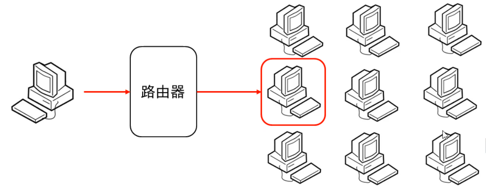
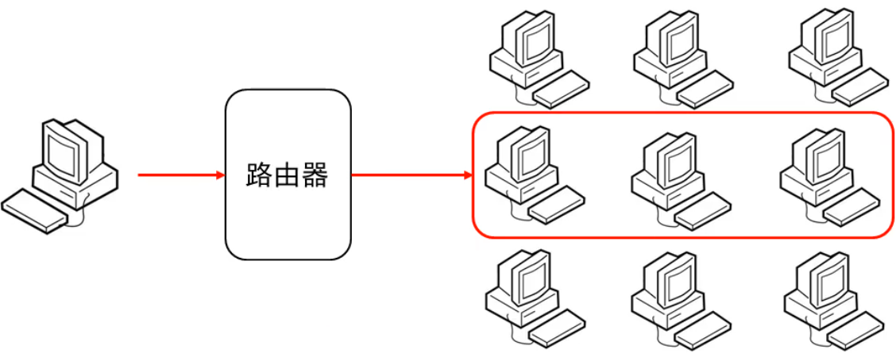
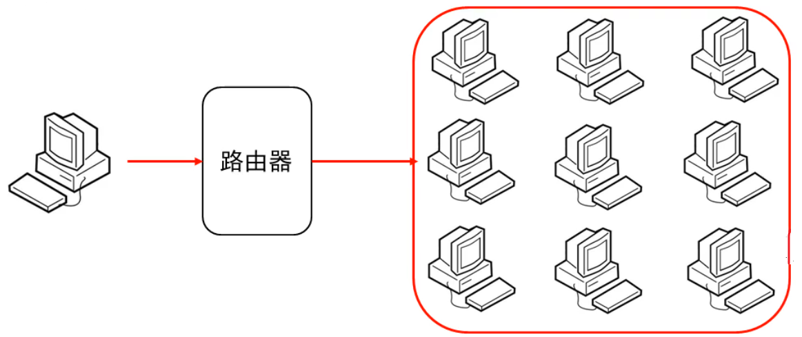

### 1.UDP的三种通信方式

- 单播：一对一
- 组播：一对多,要把接收端放到一组里面
- 广播：一对所有

#### UDP的单播:



##### 示例代码：

```java
package com.InternetPro;
//发送端

import java.io.IOException;
import java.net.*;

public class PackageSend {
    public static void main(String[] args) throws IOException {
        //1.创建发送端的Socket对象（DatagramSocket）
        DatagramSocket Socket = new DatagramSocket();
        //2.创建数据，并把数据打包（DatagramPacket）
        String data = "希望有一天你是真正的释怀，而不是一个人偷偷的难过！";
        byte[] bytes = data.getBytes();
        //接收端电脑
        InetAddress inetAddress = InetAddress.getByName("192.168.31.70");
        //端口号
        int port = 8848;
        DatagramPacket packet = new DatagramPacket(bytes, bytes.length, inetAddress, port);

        //3.调用DatagramSocket对象的方法发送数据
        Socket.send(packet);

        //4.释放资源
        Socket.close();
    }
}
```

```java
package com.InternetPro;

import java.io.IOException;
import java.net.DatagramPacket;
import java.net.DatagramSocket;
import java.net.SocketException;

//接收端
public class ClientDemo {
    public static void main(String[] args) throws IOException {
        //1.创建接收端的Socket对象（DatagramSocket）
        DatagramSocket socket = new DatagramSocket(8848);

        //2.创建一个箱子，用于接收数据
        byte[] bytes = new byte[1024];
        DatagramPacket packet = new DatagramPacket(bytes, bytes.length);
        //3.调用DatagramSocket的方法接收数据并将数据放入箱子中
        socket.receive(packet);
        //4.解析数据包，并把数据在控制台显示
        socket.receive(packet);
        System.out.println(new String(packet.getData(), 0, packet.getLength()));

        //5.释放资源
        socket.close();

    }
}
```


#### UDP的组播：



**组播地址**：244.0.0.0 ~ 239.255.255.255

​				其中224.0.0.0 ~ 224.0.0.255 为预留的组播地址

##### 示例代码：

```java
package com.zubo;

import java.io.IOException;
import java.net.*;

//发送端
public class SendDemo {
    public static void main(String[] args) throws IOException {
        //创建发送端对象
        DatagramSocket socket = new DatagramSocket();

        //发送的内容
        String data = "为实现中华民族伟大复兴的中国梦而努力奋斗！";
        byte[] bytes = data.getBytes();
        InetAddress inetAddress = InetAddress.getByName("224.0.1.0");
        //端口号
        int port = 10000;
        //打包
        DatagramPacket packet = new DatagramPacket(bytes, bytes.length, inetAddress, port);

        //发送数据
        socket.send(packet);

        //释放资源
        socket.close();
    }
}
```

```java
package com.zubo;

import java.io.IOException;
import java.net.DatagramPacket;
import java.net.InetAddress;
import java.net.MulticastSocket;

//接收端
public class ReceiverDemo {
    public static void main(String[] args) throws IOException {
        MulticastSocket ms = new MulticastSocket(10000);

        DatagramPacket packet = new DatagramPacket(new byte[1024], 1024);
        //把当前计算机绑定一个组播地址，表示添加到这一组中
        ms.joinGroup(InetAddress.getByName("224.0.1.0"));

        ms.receive(packet);

        System.out.println(new String(packet.getData(),0, packet.getLength()));

        ms.close();

    }
}
```

#### UDP的广播:



**广播地址：**255.255.255.255

##### 示例代码：

```java
package com.guangbo;

import java.io.IOException;
import java.net.*;

//发送端
public class SendDemo {
    public static void main(String[] args) throws IOException {
        //发送端对象
        DatagramSocket socket = new DatagramSocket();
        //发送内容
        String data = "总要有人去振兴中华的！";
        byte[] bytes = data.getBytes();

        //广播地址 255.255.255.255
        InetAddress address = InetAddress.getByName("255.255.255.255");

        //打包数据
        DatagramPacket packet = new DatagramPacket(bytes, bytes.length, address, 10000);
        //发送数据
        socket.send(packet);
        //释放资源
        socket.close();
    }
}
```

```java
package com.guangbo;

import java.io.IOException;
import java.net.DatagramPacket;
import java.net.DatagramSocket;

public class ReceiveDemo {
    public static void main(String[] args) throws IOException {
        //创建接收端对象
        DatagramSocket socket = new DatagramSocket(10000);
        //
        DatagramPacket packet = new DatagramPacket(new byte[1024], 1024);
        //接收数据
        socket.receive(packet);
        //输出数据
        System.out.println(new String(packet.getData(), 0, packet.getLength()));
        //释放资源
        socket.close();

    }
}
```