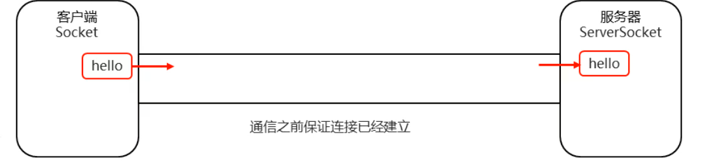
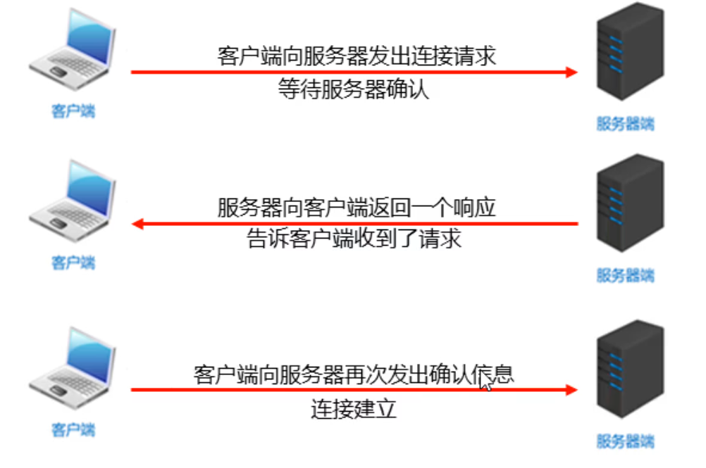
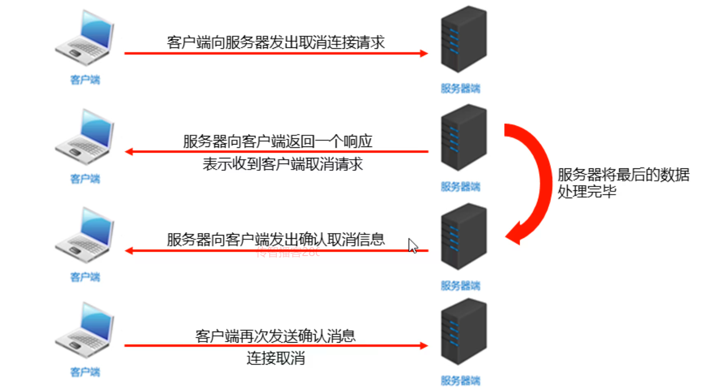

### 1.TCP通信原理

TCP通信协议是一种可靠的网络协议，它在通信的两端各建立一个Socket对象。

通信之前要保证连接已经建立

通过Socket产生的IO流来进行网络通信



##### 示例代码：

```java
package soketdemo1;
//客户端
import java.io.IOException;
import java.io.OutputStream;
import java.net.Socket;

public class ClientDemo {
    public static void main(String[] args) throws IOException {
        //1.创建一个Socket对象 host:服务器地址  port：服务器的端口号
        Socket socket = new Socket("127.0.0.1", 10000);

        //2.获取一个IO流开始写数据
        OutputStream os = socket.getOutputStream();
        os.write("hello world".getBytes());

        //3.释放资源
        os.close();
        socket.close();


    }
}
```

```java
package soketdemo1;
//服务器
import java.io.IOException;
import java.io.InputStream;
import java.net.ServerSocket;
import java.net.Socket;

public class ServerDemo {
    public static void main(String[] args) throws IOException {
        //1.创建Socket对象
        ServerSocket ss = new ServerSocket(10000);

        //等待客户端连接
        Socket accept = ss.accept();

        //3.获得输入流对象
        InputStream is = accept.getInputStream();
        //输出接收的字节流数据
        int b;
        while ((b = is.read()) != -1) {
            System.out.print((char) b);
        }

        //4.释放资源
        is.close();
        ss.close();
    }
}
```

#### 注意点：

- accept方法是阻塞的，作用就是等待客户端连接
- 客户端创建对象并连接服务器，此时是通过三次握手协议保证跟服务器之间的连接
- 针对客户端来讲，是往外写的，所以是输出流针对服务器来讲，是往里读的，所以是输入流
- read方法也是阻塞的

- 在关流的时候，还多了一个往服务器写结束标记的动作
- 最后一步断开连接，通过四次挥手协议保证连接终止

### 2.三次握手协议



### 3.四次挥手协议



