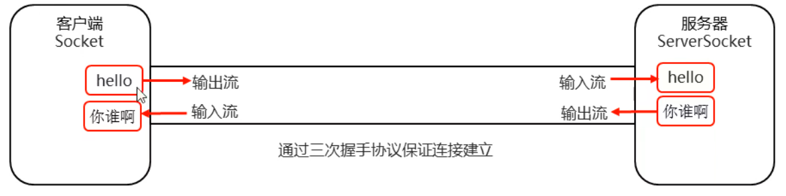
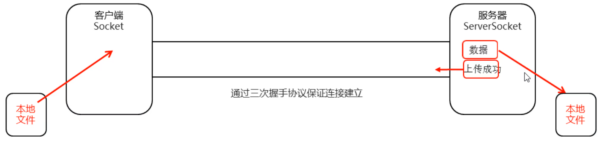

### TCP通信练习一：

- 客户端：发送数据，接收服务器反馈
- 服务器：接收数据，给出反馈



##### 示例代码：

```java
package soketdemo2;

import java.io.*;
import java.net.Socket;

//客户端
public class ClientDemo {
    public static void main(String[] args) throws IOException {
        //创建客户端Socket对象
        Socket socket = new Socket("127.0.0.1", 10000);
        //获取IO流对象写数据
        OutputStream os = socket.getOutputStream();
        os.write("hello world".getBytes());
//        os.close();  在这里关流 会导致整个Socket无法使用
        socket.shutdownOutput(); //仅仅关闭输出流，并写一个结束标记，对Socket没有任何影响！
        //使用转换流将字节流转换成字符缓冲流
        BufferedReader bf = new BufferedReader(new InputStreamReader(socket.getInputStream()));
        String s = bf.readLine();
        System.out.println(s);
        //释放资源
        os.close();
//        is.close();
        socket.close();

    }
}
```

```java
package soketdemo2;

import java.io.*;
import java.net.ServerSocket;
import java.net.Socket;

//接收端
public class ServerDemo {
    public static void main(String[] args) throws IOException {
        //创建服务器端Sockrt对象
        ServerSocket serverSocket = new ServerSocket(10000);
        //等待客户端传输数据
        Socket accept = serverSocket.accept();

        //接收数据
        InputStream is = accept.getInputStream();
        int b;
        while ((b = is.read()) != -1) {
            System.out.print((char) b);
        }

        //给出反馈
        //使用转换流将字节流转换成字符缓冲流
        BufferedWriter bw = new BufferedWriter(new OutputStreamWriter(accept.getOutputStream()));
        bw.write("你谁啊，大兄弟，一大早上给我发信息，还让不让睡觉了！");
        bw.newLine();
        //释放资源
        bw.close();
        is.close();
        serverSocket.close();


    }
}
```

### TCP通信练习二：

- 客户端：将本地文件上传到服务器。接收服务器的反馈
- 服务端：接收客户上传的文件，上传完毕之后给出反馈



##### 示例代码：

```java
package soketdemo3;

import java.io.*;
import java.net.Socket;
//客户端
public class ClientDemo {
    public static void main(String[] args) throws IOException {
        //创建客户端Socket对象
        Socket socket = new Socket("127.0.0.1", 10000);
        //本地流 ---》获取本地文件，通过网络流将文件发送到服务器
        BufferedInputStream bis = new BufferedInputStream(new FileInputStream("day23\\a.avi"));
        //写到服务器 --- 网络中的流
        BufferedOutputStream bos = new BufferedOutputStream(socket.getOutputStream());

        //读数据
        byte[] bytes = new byte[1024];
        int len;
        while ((len = bis.read(bytes)) != -1) {
            //向服务器传输数据
            bos.write(bytes, 0, len); //通过网络写到服务器中
        }
        //给服务器一个结束标记，告诉服务器文件已经传输完毕
        socket.shutdownOutput();
        //接收反馈
        BufferedReader br = new BufferedReader(new InputStreamReader(socket.getInputStream()));
        String line;
        while ((line = br.readLine()) != null) {
            System.out.println(line);
        }

        //释放资源
        br.close();
        bis.close();
        socket.close();


    }
}
```

```java
package soketdemo3;

import java.io.*;
import java.net.ServerSocket;
import java.net.Socket;
//服务器端
public class ServerDemo {
    public static void main(String[] args) throws IOException {
        //创建服务器Socket对象 port：关联端口号
        ServerSocket ss = new ServerSocket(10000);
        //等待接收数据
        Socket accept = ss.accept();
        //网络中的流，从客户端读取数据
        BufferedInputStream bis = new BufferedInputStream(accept.getInputStream());
        //本地的IO流，把数据写到本地中，实现永久化存储
        BufferedOutputStream bos = new BufferedOutputStream(new FileOutputStream("day23\\b.avi"));
        //读取数据
        byte[] bytes = new byte[1024];
        int len;
        while ((len = bis.read(bytes)) != -1) {
            //向本地写入文件
            bos.write(bytes, 0, len);
        }
        //给出反馈
        BufferedWriter bw = new BufferedWriter(new OutputStreamWriter(accept.getOutputStream()));
        bw.write("我收到了大兄弟，谢谢你的文件！");
        bw.newLine();
        bw.flush();

        //释放资源
        bw.close();
        accept.close();
        ss.close();

    }

}
```

### 服务端优化：

#### 第一个弊端：

​	服务器只能处理一个客户端请求，接收完一个图片之后，服务器就关闭了

##### 改进方式：

​	循环

##### 示例代码：

```java
package soketdemo3;

import java.io.*;
import java.net.ServerSocket;
import java.net.Socket;
//服务器端
public class ServerDemo {
    public static void main(String[] args) throws IOException {
        //创建服务器Socket对象 port：关联端口号
        ServerSocket ss = new ServerSocket(10000);
        while (true) {
            //等待接收数据
            Socket accept = ss.accept();
            //网络中的流，从客户端读取数据
            BufferedInputStream bis = new BufferedInputStream(accept.getInputStream());
            //本地的IO流，把数据写到本地中，实现永久化存储
            BufferedOutputStream bos = new BufferedOutputStream(new FileOutputStream("day23\\b.avi"));
            //读取数据
            byte[] bytes = new byte[1024];
            int len;
            while ((len = bis.read(bytes)) != -1) {
                //向本地写入文件
                bos.write(bytes, 0, len);
            }
            //给出反馈
            BufferedWriter bw = new BufferedWriter(new OutputStreamWriter(accept.getOutputStream()));
            bw.write("我收到了大兄弟，谢谢你的文件！");
            bw.newLine();
            bw.flush();

            //释放资源
            bw.close();
            accept.close();
        }
        //ss.close();

    }

}
```

#### 第二个弊端：

​	第二次上传文件的时候，会把第一次的文件给覆盖

##### 改进方式：

​	UUID.randomUUID()方法生成随机的文件名

##### 示例代码：

```java
package soketdemo3;

import java.io.*;
import java.net.ServerSocket;
import java.net.Socket;
import java.util.UUID;

//服务器端
public class ServerDemo {
    public static void main(String[] args) throws IOException {
        //创建服务器Socket对象 port：关联端口号
        ServerSocket ss = new ServerSocket(10000);
        while (true) {
            //等待接收数据
            Socket accept = ss.accept();
            //网络中的流，从客户端读取数据
            BufferedInputStream bis = new BufferedInputStream(accept.getInputStream());
            //本地的IO流，把数据写到本地中，实现永久化存储
            BufferedOutputStream bos = new BufferedOutputStream(new FileOutputStream("day23\\"+ UUID.randomUUID().toString() +".avi"));
            //读取数据
            byte[] bytes = new byte[1024];
            int len;
            while ((len = bis.read(bytes)) != -1) {
                //向本地写入文件
                bos.write(bytes, 0, len);
            }
            //给出反馈
            BufferedWriter bw = new BufferedWriter(new OutputStreamWriter(accept.getOutputStream()));
            bw.write("我收到了大兄弟，谢谢你的文件！");
            bw.newLine();
            bw.flush();

            //释放资源
            bw.close();
            accept.close();
        }
        //ss.close();

    }

}
```

#### 第三个弊端：

​	加入循环以后又引发了一个问题：

​		使用循环虽然可以让服务器处理多个客户端请求，但是还是无法同时多个客户端进行通信

##### 改进方式:

​	开始多线程处理

##### 示例代码：

```java
package soketdemo3;

import java.io.*;
import java.net.Socket;
import java.util.UUID;

public class ThreadSocket implements Runnable{
    private Socket threadAccept;
    public ThreadSocket(Socket accept) {
        this.threadAccept = accept;
    }
    BufferedWriter bw;

    @Override
    public void run() {
        try {
            //网络中的流，从客户端读取数据
            BufferedInputStream bis = new BufferedInputStream(threadAccept.getInputStream());
            //本地的IO流，把数据写到本地中，实现永久化存储
            BufferedOutputStream bos = new BufferedOutputStream(new FileOutputStream("day23\\"+ UUID.randomUUID().toString() +".avi"));
            //读取数据
            byte[] bytes = new byte[1024];
            int len;
            while ((len = bis.read(bytes)) != -1) {
                //向本地写入文件
                bos.write(bytes, 0, len);
            }
            //给出反馈
            bw = new BufferedWriter(new OutputStreamWriter(threadAccept.getOutputStream()));
            bw.write("我收到了大兄弟，谢谢你的文件！");
            bw.newLine();
            bw.flush();
        } catch (IOException e) {
            e.printStackTrace();
        } finally {
            //释放资源
            if (bw != null) {
                try {
                    bw.close();
                } catch (IOException e) {
                    e.printStackTrace();
                }
            }
            if (threadAccept != null) {
                try {
                    threadAccept.close();
                } catch (IOException e) {
                    e.printStackTrace();
                }
            }
        }
    }
}
```

```java
package soketdemo3;

import java.io.IOException;
import java.net.ServerSocket;
import java.net.Socket;

//服务器端
public class ServerDemo {
    public static void main(String[] args) throws IOException {
        //创建服务器Socket对象 port：关联端口号
        ServerSocket ss = new ServerSocket(10000);
        while (true) {
            //等待接收数据
            Socket accept = ss.accept();
            ThreadSocket ts = new ThreadSocket(accept);
            new Thread(ts).start();
        }
        //ss.close();

    }

}
```

#### 第四个弊端：

​	加入多线程以后又引发了一个问题

​			使用多线程虽然可以让服务器同时处理多个客户端请求，但是资源消耗太大。

改进方式：

​	加入线程池

##### 示例代码：

```java
package threadpool;

import java.io.IOException;
import java.net.ServerSocket;
import java.net.Socket;
import java.util.concurrent.ArrayBlockingQueue;
import java.util.concurrent.Executors;
import java.util.concurrent.ThreadPoolExecutor;
import java.util.concurrent.TimeUnit;

//服务器端
public class ServerDemo {
    public static void main(String[] args) throws IOException {

        //创建一个线程池
        ThreadPoolExecutor pool = new ThreadPoolExecutor(2,4,2, TimeUnit.SECONDS,
                new ArrayBlockingQueue<>(10),
                Executors.defaultThreadFactory(),
                new ThreadPoolExecutor.AbortPolicy());
        //创建服务器Socket对象 port：关联端口号
        ServerSocket ss = new ServerSocket(10000);
        while (true) {
            //等待接收数据
            Socket accept = ss.accept();
            ThreadSocket ts = new ThreadSocket(accept);
            pool.submit(ts);
        }
        //ss.close();

    }

}
```

​	