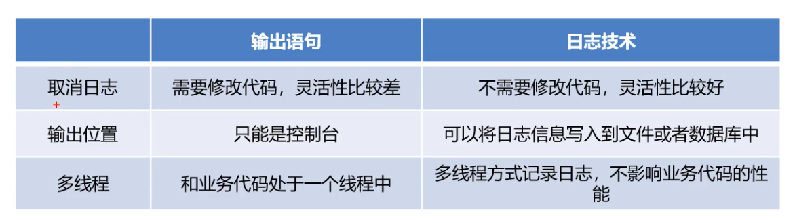

#### 思考问题：

​	想清楚的知道软件的一些运行情况，该怎么办？

#### 以前的操作方式：

#### 输出语句的弊端：

- 想取消打印语句，需要修改代码才可以完成
- 打印的内容只能打印在控制台，不能将其记录到其他的位置（文件，数据库）

### 1.什么是日志

- 生活中的日志
  - 生活中的人日志就好比日记，可以记录你生活中的点点滴滴
- 程序中的日志
  - 程序中的日志可以用来记录程序在运行的时候的点点滴滴，并可以进行永久存储

### 2.日志与输出语句的区别：

### 3.日志技术的特点：

- 通过使用日志技术，我们可以控制日志信息输送的目的地是控制台、文件等位置
- 我们也可以控制每一条日志的输出格式
- 通过定义每一条日志信息的级别，我们能够更加细致地控制日志的生成过程
- 最棒的就是，这些可以通过一个配置文件来灵活地进行配置，而不需要修改应用的代码

