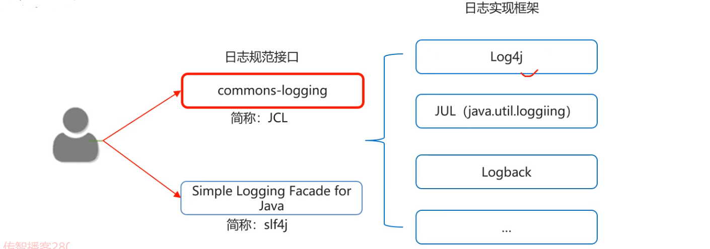

### 1.体系结构



### 2.Logback介绍

- Logback是基于slf4j的日志规范实现的框架，性能比之前使用的slf4j要好
- 官方网站：https://logbak.qos.ch/index.html 

#### Logback主要分为三个技术模块：

- logback-core：该模块为其他两个模块提供基础代码，必须有
- logback-classic：完整实现了slf4j API的模块
- logback-access：模块与Tomcat 和 Jetty等 Servlet容器集成，以提供HTTP访问日志功能


### 3.Logback快速入门

- 导入Logback的相关jar包
- 编写Logback配置文件
- 在代码中获取日志的对象
- 按照级别设置记录日志信息

步骤：

- 在项目中创建一个文件夹命名为lib，把jar拷贝进去，然后导入项目
- 将logback.xml配置文件复制到src目录下
- 获取日志对象
- 打日志

##### 示例代码：

```java
package logcode;

import org.slf4j.Logger;
import org.slf4j.LoggerFactory;

import java.util.Scanner;

public class LogDemo {
    //获取日志对象
    private static final Logger LOGGER = LoggerFactory.getLogger(LogDemo.class);


    public static void main(String[] args) {
        //打日志 ----》类似与写输出语句
        Scanner sc = new Scanner(System.in);
        System.out.println("请输入你的姓名：");
        String name = sc.next();
        LOGGER.info("用户输入的姓名为：" + name);
        System.out.println("请输入你的年纪");
        String age = sc.next();

        try {
            int ageInt = Integer.parseInt(age);
            LOGGER.info("用户输入的年龄格式正确：" + age);
        } catch (NumberFormatException e) {
            e.printStackTrace();
            LOGGER.info("用户输入的年龄格式不正确：" + age);
        }

    }
}
```


