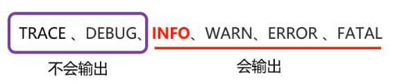

如果系统上线后只想记录一些错误的日志信息或者不想记录日志了，怎么办？

- 可以通过设置日志的输出级别来控制那些日志信息输出或者不输出

### 日志的6种级别：

- 级别程度依次是：TRACE < DEBUG < INFO < WARN < ERROR < FATAL
- 默认级别是debug（忽略大小写）
- 作用：将开发中不同的日志信息进行分类，只输出大于等于该级别的日志信息

- ALL和OFF分别是打开全部日志信息，及关闭全部日志信息