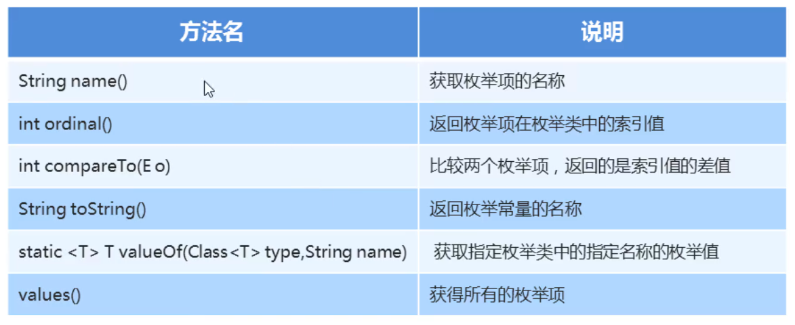

### 1.枚举

​	为了间接的表示一下固定的值，Java就给我们提供了枚举

枚举：是指将变量的值一一列出来，变量的值只限于列举出来的值的范围内。

格式：

```java
package myenum;

public enum S {
    枚举项1,枚举项2,枚举项3;
}
```

定义枚举类要用关键字enum

##### 示例代码：

```java
package myenum;

public enum Season {
    SPRING,SUMMER,AUTUMN,WINTER;
}
```

### 2.枚举的特点

- 所有枚举类都是Enum的子类
- 我们可以通过"枚举类名.枚举项名称"去访问指定的枚举项
- 每一个枚举项其实就是该枚举的一个对象
- 枚举也是一个类，也可以去定义成员变量
-  枚举类的第一行上必须是枚举项，最后一个枚举项后的分号是可以省略的，但是如果枚举类有其他的东西，这个分号就不可以省略。建议不要省略
- 枚举类可以有构造器，但必须是private的，他默认也是private的。
  - 枚举项的用法比较特殊：枚举("");
- 枚举类也可以有抽象方法，但是枚举项必须重写该方法

### 3.枚举的方法



##### 示例代码：

```java
package myenum2;

public enum Season {
    SPRING,SUMMER,AUTUMN,WINTER;
}
```

```java
package myenum2;

public class EnumDemo {
    public static void main(String[] args) {
        //String name() 获取枚举项的名称
        String name = Season.SPRING.name();
        System.out.println(name);
        System.out.println("-------------------------------");
        //int ordinal() 返回枚举想在枚举类中的索引值
        int index1 = Season.SPRING.ordinal();
        int index2 = Season.SUMMER.ordinal();
        int index3 = Season.AUTUMN.ordinal();
        int index4 = Season.WINTER.ordinal();
        System.out.println(index1);
        System.out.println(index2);
        System.out.println(index3);
        System.out.println(index4);
        System.out.println("-------------------------------");
        //int compareTO(E o) 比较两个枚举项，返回的是索引值的差值
        int result = Season.WINTER.compareTo(Season.SPRING);
        System.out.println(result);
        System.out.println("-------------------------------");

        //String toSting() 返回枚举常量的名称
        System.out.println(Season.SPRING.toString());
        System.out.println("-------------------------------");

        //static <T> T valueOf(Class<T> type,String name) 获取指定枚举类中的指定名称的枚举值
        Season spring = Enum.valueOf(Season.class, "SPRING");
        System.out.println(spring == Season.SPRING);
        System.out.println("-------------------------------");

        //values() 获得所有的枚举项
        Season[] values = Season.values();
        for (Season value : values) {
            System.out.println(value);
        }
    }
}
```