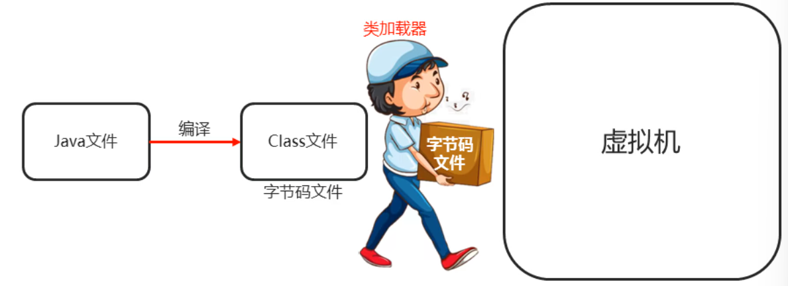
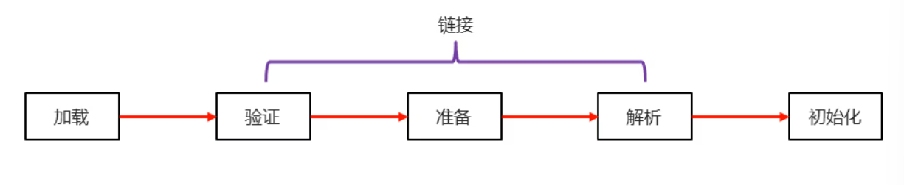
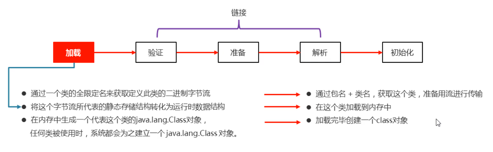
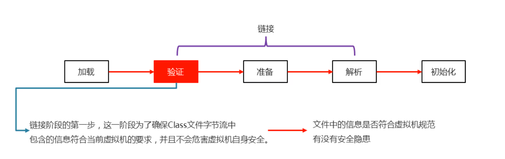
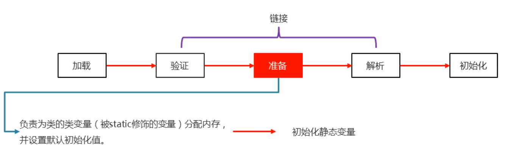
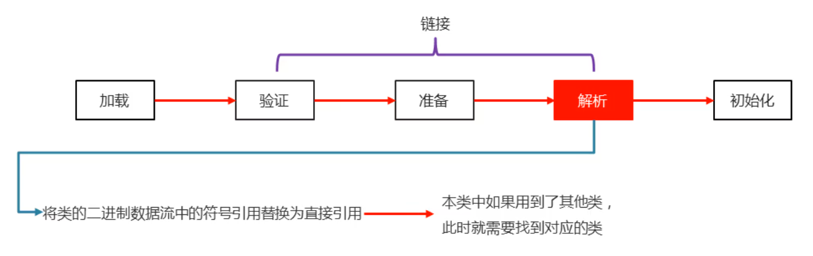
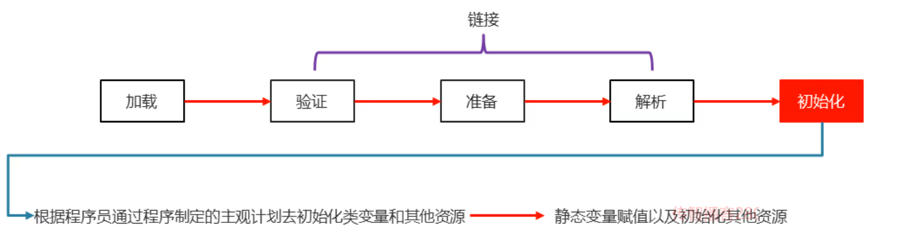
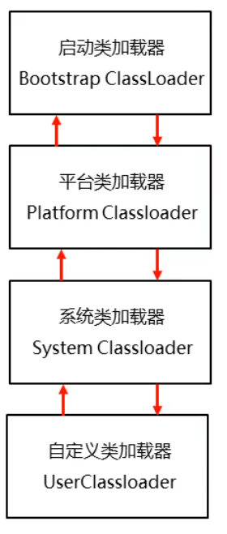
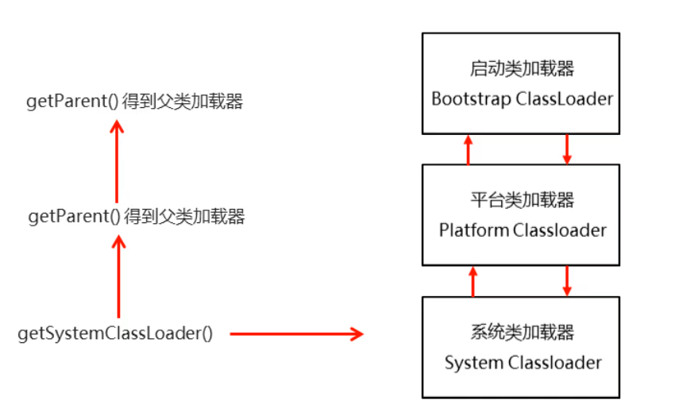

### 1.类加载器

类加载器：负责将.class文件（存储的物理文件）加载到内存中



### 2.类加载时机

- 创建类的实例（对象）

- 调用类的类方法
- 访问类或者接口的类变量，或者为该类变量赋值
- 使用反射方式来强制创建某个类或接口对应的java.lang.Class对象
- 初始化某个类的子类
- 直接使用java.exe命令某个主类

##### 总结：用到就加载，不要就不加载

### 3.类加载的过程



#### 加载：



#### 链接：





#### 初始化：



### 类加载的过程的小结:

- 当一个类被使用的时候，才会加载到内存
- 类加载的过程如下：
  - 加载、验证、解析、初始化

### 4.类加载器的分类：

启动类加载器（Bootstrap ClassLoader）:虚拟机内置的类加载器

平台类加载器（Platform Classloader）：负责加载JDK中一些特殊的模块

系统类加载器（System Classloader）：负责加载用户类路径上所指定的类库

### 5.双亲委派模型!

                                                          

​                                                                                            

##### 示例代码：

```java
package com.myclassloder;

/*
    获取类加载器
 */
public class ClassLoaderDemo1 {
    public static void main(String[] args) {
        //获取系统类加载器
        ClassLoader systemClassLoader = ClassLoader.getSystemClassLoader();

        //获取系统类加载器的父加载器 --- 平台类加载器
        ClassLoader ClassLoader1 = systemClassLoader.getParent();

        //获取平台类加载器的父加载器 --- 启动类加载器
        ClassLoader ClassLoader2 = ClassLoader1.getParent();

        System.out.println("系统类加载器" + systemClassLoader);
        System.out.println("平台类加载器" + ClassLoader1);
        System.out.println("启动类加载器" + ClassLoader2);//启动类加载器 一般都是用null表示
    }
}
```

### 6.类加载器-常用方法


##### 示例代码：

```java
package com.myclassloder;

import java.io.IOException;
import java.io.InputStream;
import java.util.Properties;

/*
    获取类加载器
 */
public class ClassLoaderDemo2 {
    public static void main(String[] args) throws IOException {
        //static ClassLoader getSystemClassLoader() 获取系统类加载器
        //InputStream getResourceAsStream(String name) 加载某一个资源文件

        //获取系统类加载器
        ClassLoader systemClassLoader = ClassLoader.getSystemClassLoader();

        //利用加载器去加载一个指定的文件
        //参数：文件的路径
        //返回值：字节流
        InputStream resourceAsStream = systemClassLoader.getResourceAsStream("prop.properties");
        Properties prop = new Properties();
        prop.load(resourceAsStream);
        System.out.println(prop);
    }
}
```