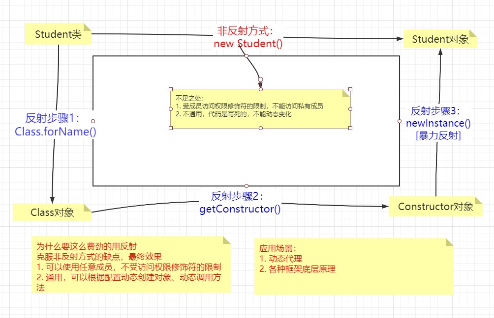
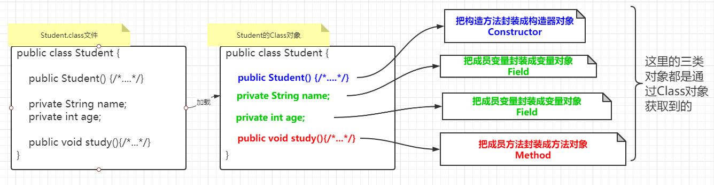
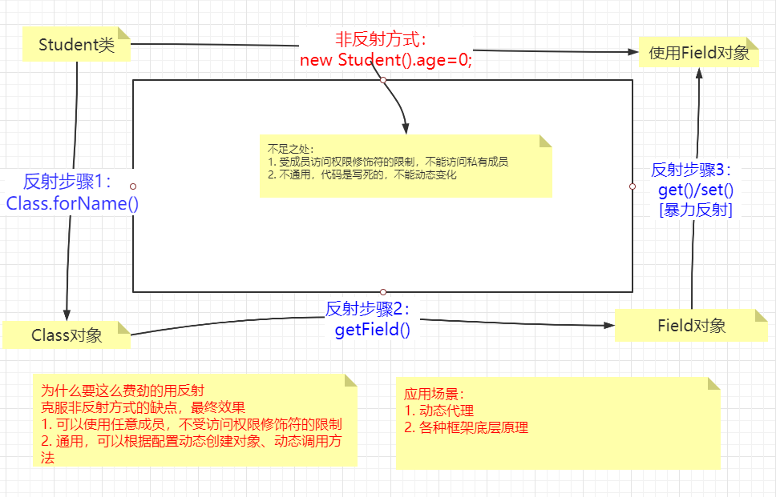
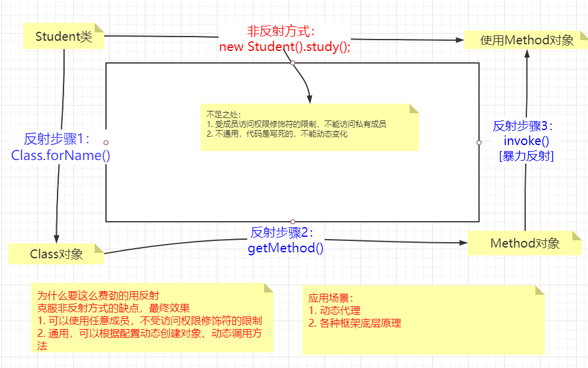

### 1.反射（理解）

​	在理解的基础上，能掌握最好；对之后框架学习有帮助。

#### 1.1概述

​		是在程序运行时，对于任意一个类，我们可以通过反射获取其任意变量、调用其任意方法；在不修改源代码的前提下，创建的对象和调用的方法可以随着当前需求(配置文件等)动态变化而变化。

##### 作用：

1. 反射可以无视访问权限修饰符而使用变量、调用方法；
2. 不修改代码的前提下实现通用逻辑：动态加载(文件、传参等)，加载之后调用；加载的内容不同，调用也就不同了而变的很通用。

**应用场景：**



#### 1.2反射中相关类体系

- 一个类的基本组成

（`java源文件/class`文件）

​	构造方法 

​	成员变量

​	成员方法

Java面向对象思想：万物皆对象


- 对应的反射的类的体系

**Class对象**，对应`class`文件 

**构造器对象**，封装**构造方法**的对象

**成员变量对象**，封装**成员变量** 对象

**成员方法对象**，封装**成员方法**的对象



- 注意

  1. `class`和`Class`不同
     1. `class`是字节码文件的后缀；也是`java`中的一个关键字，用于声明一个类
     2. `Class`表示是是一个具体的类，可以创建该类的对象；对象里面包含了对某个类的所有描述（成员）

  2. 为什么我们要首先获取这个`Class`对象？

     - 想使用反射调用类的任意成员和方法，想让编写的代码更通用（反射的两个作用），肯定不能写死，eg：	`new Student()`  或者  `stu.study()`；而是要换种方式创建对象和调用方法等。

     - 创建对象要用构造方法，调用方法要知道方法的一些参数，class文件中包含了这些所有信息，`class`文件加载到内存之后变成了`Class`对象，如果我们能获取到该对象，自然也能创建类的对象，调用其方法等等

#### 1.3获取Class对象

Class对象：class文件中加载到内存中成为一个Class对象

- 获取方式
  - 类名.class：类加载阶段，通过javaBean等任意一个类的class属性：Student.class`可以获取对应类的`Class`对象
  - `Class.forName(“全类名”)`：（类加载完成后）从类路径下加载指定的类，得到对应的类的Class对象
  - `类的对象.getClass()`：运行时阶段，通过类对象的`getClass()`方法：`new Student().getClass()`，得到对应类的Class对象。
- 特点：
  
  - 某个类有且只有一个class对象
- 关联知识点
  
- 同步静态方法的锁对象默认是所属类的字节码对象，使用这个对象绝对可以保证锁唯一
  
- 工作中怎么用？

  最常用的是通过`Class.forName()`方式获取。

- 演示代码


```java
package com.fanshe;

public class ReflectDemo1 {
    public static void main(String[] args) throws ClassNotFoundException {
        //1.class类中的静态方法forName("全类名")
        //全类名 = 包名 + 类名
        //通过Class类的静态方法forName，加载Student类的class文件成为Class对象
        Class clazz1 = Class.forName("com.fanshe.Student");
        System.out.println(clazz1);

        //2.通过Class属性来获取Student类的Class对象
        Class clazz2 = Student.class;
        System.out.println(clazz2);

        //3.使用Student对象的getClass方法来获取Student的Class对象
        //getClass方法是定义在Object类中
        Student stu = new Student();
        Class clazz3 = stu.getClass();
        System.out.println(clazz3);

        //某一个两类只能有一个Class对象，通过各种方式多次获取的都是同一个Class对象
        System.out.println(clazz1 == clazz2);
        System.out.println(clazz2 == clazz3);
        
    }
}
```

接下来的所有对象，都要使用Class对象获取，也就是在使用Class对象获取类中其他成员对象

#### 1.4获取Constructor对象

`Constructor`对象是对类中**构造方法**封装之后得到的对象

`Class`类中用于获取构**造器对象**的方法

| 方法签名                                                     | 方法说明                     |
| ------------------------------------------------------------ | ---------------------------- |
| Constructor[]  getConstructors()                             | 返回所有公共构造器对象的数组 |
| Constructor[]  getDeclaredConstructors()                     | 返回所有构造器对象的数组     |
| Constructor  getConstructor(Class... parameterTypes)         | 返回单个公共构造器对象       |
| Constructor  getDeclaredConstructor(Class... parameterTypes) | 返回单个构造器对象           |

- 获取步骤

  1. 获取`Class`对象
  2. 使用获取到的`Class`对象获取`Constructor`对象

- 注意

  获取所有构造器对象的时候不要传递任何参数

  如果要获取某一个构造器对象的时候，需要按照对应构造器的参数列表传参；类型是多个`Class`类型

- 演示代码：

```java
/**
 * 获取Constructor对象
 */

public class ReflectDemo1 {
    public static void main(String[] args) throws ClassNotFoundException, NoSuchMethodException {
        //method1();
        //method2();
        //method3();
        //method4();
    }

    private static void method4() throws ClassNotFoundException, NoSuchMethodException {
        //Constructor<T> getDeclaredConstructor​(Class<?>... parameterTypes)：
        //  返回单个构造方法对象
        //1.获取Class对象
        Class clazz = Class.forName("com.itheima.myreflect3.Student");
        Constructor constructor = clazz.getDeclaredConstructor(String.class);
        System.out.println(constructor);
    }

    private static void method3() throws ClassNotFoundException, NoSuchMethodException {
        //   Constructor<T> getConstructor​(Class<?>... parameterTypes)：
        //  返回单个公共构造方法对象
        //1.获取Class对象
        Class clazz = Class.forName("com.itheima.myreflect3.Student");
        //小括号中,一定要跟构造方法的形参保持一致.
        Constructor constructor1 = clazz.getConstructor();
        System.out.println(constructor1);

        // 参数的类型是class类型，注意参数顺序和参数个数
        Constructor constructor2 = clazz.getConstructor(String.class, int.class);
        System.out.println(constructor2);

        //因为Student类中,没有只有一个int的构造,所以这里会报错.
        Constructor constructor3 = clazz.getConstructor(int.class);
        System.out.println(constructor3);
    }

    private static void method2() throws ClassNotFoundException {
        //Constructor<?>[] getDeclaredConstructors​()：
        //  返回所有构造方法对象的数组
        //1.获取Class对象
        Class clazz = Class.forName("com.itheima.myreflect3.Student");

        Constructor[] constructors = clazz.getDeclaredConstructors();
        for (Constructor constructor : constructors) {
            System.out.println(constructor);
        }
    }

    private static void method1() throws ClassNotFoundException {
        //Constructor<?>[] getConstructors​()：
        //  返回所有公共构造方法对象的数组
        //1. 获取Class对象
        //Student student = new Studnet();
        // 标识符不能使用关键字 class
        //Class class = Class.forName("com.itheima.myreflect3.Student");
        Class clazz = Class.forName("com.itheima.myreflect3.Student");

        // 2. 通过当前类的Class对象获取当前类的构造器对象
        Constructor[] constructors = clazz.getConstructors();
        for (Constructor constructor : constructors) {
            System.out.println(constructor);
        }
    }
}
```

#### 2.5 使用Constructor对象

获取`Constructor`对象的目的：通过构造器对象，创建该构造器所属类（eg：Student）的对象 （eg：stu）

- API

  `Object newInstance(Object… arg)`

  - 属于`Constructor`类
  - 返回值：`Object`类型，所属类的对象。因为不知道通过这次反射创建的到底是哪个类的对象（eg:`Student| Teacher…`）

  - 参数：`Object`类型的可变参数；调用构造方法传递实参。不能明确具体类型，所以用`Object`；不能明确个数，所以用可变参数

  ~~`Object newInstance()`~~

  - 属于`Class`类，已被标记为过时
  - 作用：调用无参构造器对象创建该类对象`≈ new Student()`
  - 返回值：Object类型，因为不知道通过这次反射创建的到底是哪个类的对象（eg:Student| Teacher…）
  - 参数：调用空参，不需要传递实际参数

  

- 使用步骤

1. 获取当前类（`Student`）的`Class`对象
2. 通过当前类（`Student`）的`Class`对象获取当前类（`Student`）的构造方法对象
3. 使用当前类（`Student`）的`Constructor`对象的`newInstance`方法创建当前类（`Student`）的对象
   - 如果获取的`Constructor`对象是私有的，需要暴力反射获取访问权限后再使用

- 演示代码（代码中类名等参数是写死的，实战中会通过传参或者读取配置，以实现动态效果）


```java
/**
 * 获取Constructor对象并创建对象
 */

public class ReflectDemo2 {
    public static void main(String[] args) throws ClassNotFoundException, NoSuchMethodException, IllegalAccessException, InvocationTargetException, InstantiationException {
        //T newInstance​(Object... initargs)：根据指定的构造方法创建对象
        //method1();
        //method2();
        //method3();
        //method4();

    }

    private static void method4() throws ClassNotFoundException, NoSuchMethodException, InstantiationException, IllegalAccessException, InvocationTargetException {
        //获取一个私有的构造方法并创建对象
        //1.获取Student类的class对象
        Class clazz = Class.forName("com.itheima.myreflect3.Student");

        //2.获取一个私有化的构造方法.
        Constructor constructor = clazz.getDeclaredConstructor(String.class);

        //被private修饰的成员,不能直接使用的
        //如果用反射强行获取并使用,需要临时取消访问检查
        // 3.1 如果获取的Constructor对象是私有的，需要暴力反射获取访问权限后再使用
        // 暴力反射，获取访问权限
        constructor.setAccessible(true);

        //3.创建对象
        Student student = (Student) constructor.newInstance("zhangsan");

        System.out.println(student);
    }

    private static void method3() throws ClassNotFoundException, InstantiationException, IllegalAccessException {
        //简写格式
        //1.获取class对象
        Class clazz = Class.forName("com.itheima.myreflect3.Student");

        //2.在Class类中,有一个newInstance​方法,可以利用空参直接创建一个对象
        Student student = (Student) clazz.newInstance();//这个方法现在已经过时了,了解一下

        System.out.println(student);
    }

    private static void method2() throws ClassNotFoundException, NoSuchMethodException, InstantiationException, IllegalAccessException, InvocationTargetException {
        //1.获取class对象
        Class clazz = Class.forName("com.itheima.myreflect3.Student");

        //2.获取构造方法对象
        Constructor constructor = clazz.getConstructor();

        //3.利用空参来创建Student的对象
        Student student = (Student) constructor.newInstance();

        System.out.println(student);
    }

    private static void method1() throws ClassNotFoundException, NoSuchMethodException, InstantiationException, IllegalAccessException, InvocationTargetException {
        //1.获取当前类（Student）的Class对象
        Class clazz = Class.forName("com.itheima.myreflect3.Student");

        //2.通过当前类（Student）的Class对象获取当前类（Student）的构造方法对象
        //1.获取当前类（Student）的Class对象
        //2.通过当前类（Student）的Class对象获取当前类（Student）的构造方法对象
        //3.利用当前类（Student）的Constructor对象的newInstance​方法创建当前类（Student）的对象

        Constructor constructor = clazz.getConstructor(String.class, int.class);

        //3.利用当前类（Student）的Constructor对象的newInstance​方法创建当前类（Student）的对象
        Student student = (Student) constructor.newInstance("zhangsan", 23);

        System.out.println(student);
    }
}
```

- 总结图示：


- 如果能看懂是上面的图示，就能举一反三的轻松学会获取并使用`Field`对象、`Method`对象的内容。


不同之处：无非是反射步骤2、3调用的方法稍有不一样。

#### 1.6 获取Field对象

`Feild`对象是把某个类的某个属性封装成的对象

- API

  `Field[] getFields()`：返回所有公共成员变量对象的数组

  - 返回值：所有的公共成员变量的封装对象

  `Field[] getDeclaredFields()`：返回所有成员变量对象的数组

  - 返回值：所有的成员变量（含私有）的封装对象

  `Field   getField(String name)`：返回单个公共成员变量对象

  - 参数：属性名，不存在则报错`NoSuchFieldException`
  - 返回值：指定名称的成员变量的封装对象

  `Field   getDeclaredField(String name)`：返回单个成员变量对象

  - 参数：方法名，不存在则报错`NoSuchFieldException`
  - 返回值：指定名称的成员变量的封装对象

  

- 注意两点

  1. 获取的变量必须是存在的
  2. 私有的变量需要通过暴力反射获取


- 使用步骤

  1. 获取当前类（`Student`）的`Class`对象

  2. 通过当前类（`Student`）的`Class`对象获取当前类（`Student`）的属性`Filed`对象


```java
**
 * 获取Field对象
 */

public class ReflectDemo1 {
    public static void main(String[] args) throws ClassNotFoundException, NoSuchFieldException {
        method1();
        //method2();
        //method3();
        //method4();


    }

    private static void method4() throws ClassNotFoundException, NoSuchFieldException {
        //        Field getDeclaredField​(String name)：返回单个成员变量对象
        //1.获取class对象
        Class clazz = Class.forName("com.itheima.myreflect4.Student");

        //2.获取money成员变量
        Field field = clazz.getDeclaredField("money");

        //3.打印一下
        System.out.println(field);
    }

    private static void method3() throws ClassNotFoundException, NoSuchFieldException {
        //        Field getField​(String name)：返回单个公共成员变量对象
        //想要获取的成员变量必须是真实存在的
        //且必须是public修饰的.
        //1.获取class对象
        Class clazz = Class.forName("com.itheima.myreflect4.Student");

        //2.获取name这个成员变量
        //Field field = clazz.getField("name");
        //Field field = clazz.getField("name1");
        Field field = clazz.getField("money");

        //3.打印一下
        System.out.println(field);
    }

    private static void method2() throws ClassNotFoundException {
        //        Field[] getDeclaredFields​()：返回所有成员变量对象的数组
        //1.获取class对象
        Class clazz = Class.forName("com.itheima.myreflect4.Student");

        //2.获取所有的Field对象
        Field[] fields = clazz.getDeclaredFields();

        //3.遍历
        for (Field field : fields) {
            System.out.println(field);
        }
    }

    private static void method1() throws ClassNotFoundException {
        //        Field[] getFields​()：返回所有公共成员变量对象的数组

        //1.获取class对象
        Class clazz = Class.forName("com.itheima.myreflect4.Student");

        //2.获取Field对象.
        Field[] fields = clazz.getFields();

        //3.遍历
        for (Field field : fields) {
            System.out.println(field);
        }
    }
}
```

#### 1.7使用Field对象

获取`Field`对象的目的：使用该属性（获取值/设置值，eg：stu.age = 23）


- API

  `Object get(Object instance)`

  - 属于`Field`类

  - 作用：获取某个对象的某个属性的值
  - 返回值：属性的值，因为不确定属性的类型，所以是Object

  - 参数：对象。因为不确定该属性属于哪个对象，所以用Object

  `void set(Object obj, Object value)`

  - 属于`Field`类

  - 作用：设置某个对象的某个属性的值
  - 返回值：没有返回值

  - 参数1：对象。因为不确定该属性属于哪个对象，所以用Object
  - 参数2：属性的值。因为不确定属性的类型，所以用Object

  


- 使用步骤
  1. 获取当前类（`Student`）的Class对象
  2. 通过当前类（`Student`）的`Class`对象获取当前类（`Student`）的属性对象
  3. 利用当前类（`Student`）的属性对象的`get/set`方法获取属性值或者为属性赋值
     - 如果获取的属性对象是私有的，需要暴力反射获取访问权限后再使用

- 演示代码：

```java
/**
 * 利用Field对象,获取值或者修改值
 */

public class ReflectDemo2 {
    public static void main(String[] args) throws ClassNotFoundException, NoSuchFieldException, IllegalAccessException, InstantiationException {
//        Object get​(Object obj) 返回由该 Field表示的字段在指定对象上的值。
        //method1();
        //method2();

    }

    private static void method2() throws ClassNotFoundException, NoSuchFieldException, InstantiationException, IllegalAccessException {
        //1.获取class对象
        Class clazz = Class.forName("com.itheima.myreflect4.Student");

        //2.获取成员变量Field的对象
        Field field = clazz.getDeclaredField("money");

        //3.取消一下访问检查
        field.setAccessible(true);

        //4.调用get方法来获取值
        //4.1创建一个对象
        Student student = (Student) clazz.newInstance();
        //4.2获取指定对象的money的值
        Object o = field.get(student);

        //5.打印一下
        System.out.println(o);
    }

    private static void method1() throws ClassNotFoundException, NoSuchFieldException, InstantiationException, IllegalAccessException {
        //        void set​(Object obj, Object value)：给obj对象的成员变量赋值为value
        //1.获取class对象
        Class clazz = Class.forName("com.itheima.myreflect4.Student");

        //2.获取name这个Field对象
        Field field = clazz.getField("name");

        //3.利用set方法进行赋值.
        //3.1先创建一个Student对象
        Student student = (Student) clazz.newInstance();
        //3.2有了对象才可以给指定对象进行赋值
        field.set(student,"zhangsan");

        System.out.println(student);
    }
}
```

- 总结图示




#### 1.8获取Method对象

`Method`对象是把某个类的某个方法封装成的对象


- API

  `Method[] getMethods()`：返回所有公共的方法对象数组

  - 返回值：返回所有公共的方法（包含从父类继承的方法）对象数组

  `Method[] getDeclaredMethods()`：返回所有的方法对象数组

  - 返回值：返回所有公共的方法（含私有，不含从父类继承的方法）对象数组

  `Method[] getMethod(String methodName, Class... args)`：返回单个公共的方法对象

  - 参数1：方法名，如果不存在，报错`NoSuchMethodException`
  - 参数2：调用方法的实参class类型列表。因为不确定多少个实参，所以用可变参数。
  - 返回值：单个公共的方法对象

  `Method[] getDeclaredMethod(String methodName, Class... args)`：返回单个方法对象

  - 参数1：方法名，如果不存在，报错`NoSuchMethodException`
  - 参数2：调用方法的实参class类型列表。因为不确定多少个实参，所以用可变参数。
  - 返回值：单个方法对象

  

- 注意两点

  1. 获取的方法必须是存在的
  2. 私有的方法需要通过暴力反射获取


- 使用步骤

  1. 获取当前类（Student）的`Class`对象

  2. 通过当前类（`Student`）的`Class`对象获取当前类（`Student`）的某个方法对象


- 演示代码：

```java
/**
 * 获取Method对象
 */

public class ReflectDemo1 {
    public static void main(String[] args) throws ClassNotFoundException, NoSuchMethodException {
        //method1();
        //method2();
        //method3();
        //method4();
        //method5();


    }

    private static void method5() throws ClassNotFoundException, NoSuchMethodException {
        //        Method getDeclaredMethod​(String name, Class<?>... parameterTypes)：
//                                返回单个成员方法对象
        //1.获取class对象
        Class clazz = Class.forName("com.itheima.myreflect5.Student");
        //2.获取一个成员方法show
        Method method = clazz.getDeclaredMethod("show");
        //3.打印一下
        System.out.println(method);
    }

    private static void method4() throws ClassNotFoundException, NoSuchMethodException {
        //1.获取class对象
        Class clazz = Class.forName("com.itheima.myreflect5.Student");
        //2.获取一个有形参的方法function2
        Method method = clazz.getMethod("function2", String.class);
        //3.打印一下
        System.out.println(method);
    }

    private static void method3() throws ClassNotFoundException, NoSuchMethodException {
        //        Method getMethod​(String name, Class<?>... parameterTypes) ：
//                                返回单个公共成员方法对象
        //1.获取class对象
        Class clazz = Class.forName("com.itheima.myreflect5.Student");
        //2.获取成员方法function1
        Method method1 = clazz.getMethod("function1");
        //3.打印一下
        System.out.println(method1);
    }

    private static void method2() throws ClassNotFoundException {
        //        Method[] getDeclaredMethods​()：
//                                返回所有成员方法对象的数组，不包括继承的
        //1.获取class对象
        Class clazz = Class.forName("com.itheima.myreflect5.Student");

        //2.获取Method对象
        Method[] methods = clazz.getDeclaredMethods();
        //3.遍历一下数组
        for (Method method : methods) {
            System.out.println(method);
        }
    }

    private static void method1() throws ClassNotFoundException {
        //        Method[] getMethods​()：返回所有公共成员方法对象的数组，包括继承的
        //1.获取class对象
        Class clazz = Class.forName("com.itheima.myreflect5.Student");
        //2.获取成员方法对象
        Method[] methods = clazz.getMethods();
        //3.遍历
        for (Method method : methods) {
            System.out.println(method);
        }
    }
}
```

#### 1.9使用Method对象

获取`Method`对象的目的：调用其封装的方法（eg:stu.study()）

- API

  `Object invoke(Object instance, Object... args)`

  - 属于`Method`类

  - 作用：调用某个对象的某个方法
  - 返回值：方法执行完的返回值。因为不确定该方法返回值类型，所以用Object。

  - 参数1：调用者对象。因为不确定该方法属于哪个对象，所以用Object。
  - 参数2：调用时传递的参数实参列表。不确定参数类型和个数，所以使用`Object`可变参数。

  


- 使用步骤
  1. 获取当前类（`Student`）的`Class`对象
  2. 通过当前类（`Student`）的`Class`对象获取当前类（`Student`）的某个方法`Method`对象
  3. 利用当前类（`Student`）的`Method`对象的`invoke`方法，反射调用目标方法
  4. 3.1 如果获取的Method对象是私有的，需要暴力反射获取访问权限后再使用
  5. 3.2 如果方法有返回值，会通过invoke方法的返回值来体现

- #### 演示代码：

```java
/**
 * 获取Method对象并运行
 */
public class ReflectDemo2 {
    public static void main(String[] args) throws ClassNotFoundException, NoSuchMethodException, IllegalAccessException, InstantiationException, InvocationTargetException {
//        Object invoke​(Object obj, Object... args)：运行方法
//        参数一：用obj对象调用该方法
//        参数二：调用方法的传递的参数（如果没有就不写）
//        返回值：方法的返回值（如果没有就不写）

        //1.获取class对象
        Class clazz = Class.forName("com.itheima.myreflect5.Student");
        //2.获取里面的Method对象  function4
        Method method = clazz.getMethod("function4", String.class);
        
        // 暴力反射，之后就可以调用private方法了
        //method.setAccessible(true);
        
        //3.运行function4方法就可以了
        //3.1创建一个Student对象,当做方法的调用者
        Student student = (Student) clazz.newInstance();
        //3.2运行方法
        Object result = method.invoke(student);
        //4.打印一下返回值
        System.out.println(result);
    }
}
```

