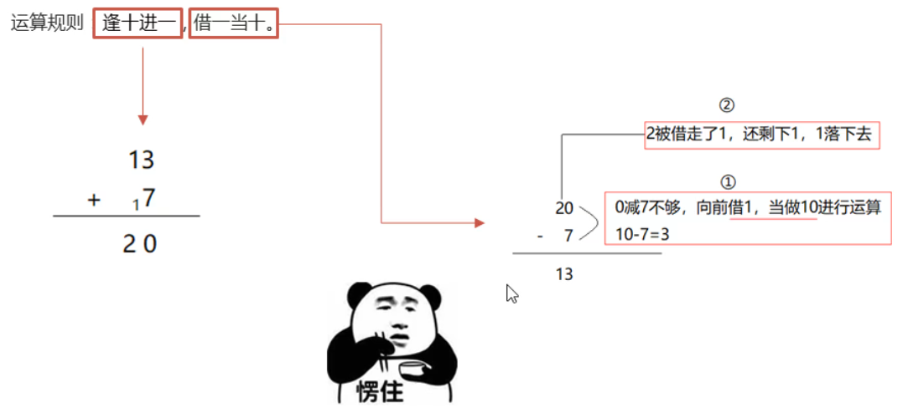
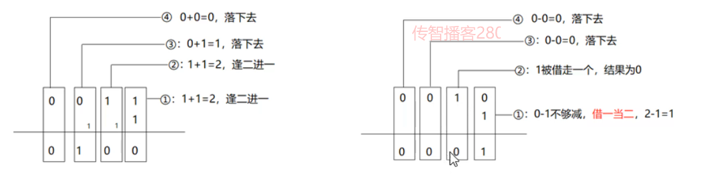

### 1.进制介绍

​	**进制:**指进位制,是人们规定的一直进位方式,表示某一位置上的数,运算时逢X进一位.

​	十进制是逢十进一,二进制就是逢二进一,八进制就是逢八进一

​    **常见进制:**二进制 , 八进制 , 十进制 , 十六进制

### 2.为什么学习进制

​	**原因:**计算机数据在底层运算的时候 , 都是以二进制形式 , 也有数据是以八进制 , 十进制 ,或者十六进制进行存储或运算 , 了解不同的进制 , 便于我们对数据的运算过程理解的更加深刻

#### 十进制:



#### 二进制:

​	**介绍:**二进制数据是用0和1两个数码来表示,例如0101000,

​	**进位规则:**" 逢二进一" , 借位规则"借一当二"

#### 八进制和十六进制:

​	**八进制介绍:**采用0,1,2,3,4,5,6,7八个数字,逢8进1

​	**十六进制介绍:**用数字0到9和字母A到F(或a~f)表示,其中A~F表示10~15,这些,逢16进1


### 3.不同进制的书写格式:

**十进制:**Java中,数值默认都是10进制,不需要加任何修饰
**二进制:**数值面前以0b开头,b大小写都可以
**八进制:**数值面前以0开头
**十六进制:**数值面前以0x开头,x大小写都可以
**注意点:**
		1.书写的时候,虽然加入了进制的标识,但打印在控制台展示的都是十进制数据
		2.以上内容是jdk7版本之后才被支持.

#### 示例代码:

```java
package itheima04;

public class Demo01JinZhi {
    public static void main(String[] args) {
        System.out.println(10);         //10
        System.out.println("二进制数据0b10的十进制表示为:"+0b10);
         System.out.println("八进制数据010的十进制表示为:"+010);
        System.out.println("十六进制数据0x10的十进制表示为:"+0x10);

    }
}
```